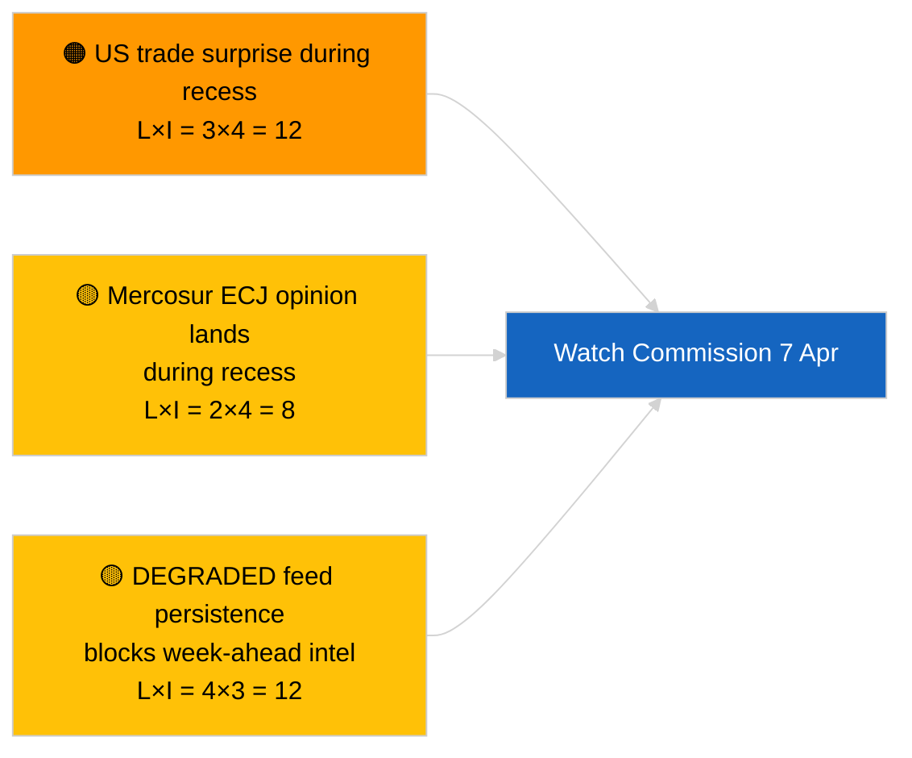

<!-- SPDX-FileCopyrightText: 2026 Hack23 AB -->
<!-- SPDX-License-Identifier: Apache-2.0 -->

# 执行简报 — 下周展望 | 2026-04-03

**分类：** OSINT | 公开议会记录
**可信度：** 🟡 中等（面向未来；空分类输出限制了深度）
**生成时间：** 2026-04-03T00:00:00Z（回溯简报）
**文章类型：** 下周展望
**运行ID：** `d2e395b4-2fc9-4924-8b79-554b0453c034`
**来源：** 欧洲议会开放数据门户

---

## 🎯 BLUF

**2026年4月6日至12日将是一个安静的复活节休假周 — 无全体会议，无正式委员会会议，委员会周二活动有限。** 运行 `d2e395b4-2fc9-4924-8b79-554b0453c034` 返回了**«在0个已识别政治维度上的定量风险评分»**，无分类行为者。本周最值得关注的机构性事件是委员会周二会议（4月7日），这是复活节后的首次合议庭展示，可能产生新提案或贸易政策通报。欧洲议会委员会工作将于下周（4月13日至17日）名义上恢复。**🟡 中等可信度**（「安静周」预测因EP API降级状态限制了前瞻信号）；**🟢 高可信度**（未安排全体会议或正式委员会投票）。

---

## 🧭 本简报支持的3项决策

| # | 决策 | 决策者 | 截止日期 | 依据 |
|:-:|------|--------|:--------:|------|
| 1 | **编辑：** 以4月7日委员会为重点发布「安静周」视角 | 编辑 | +24小时 | 日程表 + 委员会节奏 |
| 2 | **监测：** 在专用探测器中捕获委员会4月7日输出 | 分析员 | 2026-04-07 | 复活节后首次合议庭展示 |
| 3 | **前瞻：** 全体会议前情报周期于4月13日启动 | 分析主管 | 2026-04-13 | 委员会工作周 |

---

## 📰 60秒速读

- 🔴 **无欧洲议会全体会议**（2026年4月6日至12日）；复活节4月12日。(🟢 高)
- 🟠 **委员会周二2026年4月7日**是唯一确认的具有情报价值的机构间事件。(🟢 高)
- 🟢 **本次运行中0个行为者被分类** — 下周综合分析在结构上不足。(🟢 高)
- 🟡 **API降级状态**从2026-04-03/breaking-2持续 — 下周探测器也可能受到影响。(🟢 高)
- 🔵 **经济背景：** IMF四月WEO发布窗口与下周重叠；财政压力数据可能影响全体会议期间的MFF辩论。(🟢 高)
- 🟣 **交叉参考：** 参见2026-04-03/breaking、breaking-2、breaking-3的实质性周五内容。(🟢 高)
- 🩷 **干扰向量：** 复活节周的美国贸易公告可能迫使委员会快速程序提案。(🟡 中等)
- ⚪ **移交：** 跟踪波兰司法动态，关注布劳恩先例的后续案件。

---

## 🗂️ 主要事件/触发因素 — 2026年4月6日至12日

| 排名 | 事件 | 日期 | 重要性 | 可信度 |
|:----:|------|------|:------:|:------:|
| 1 | 委员会周二会议 | 4月7日 | 7.0 | 🟢 HIGH |
| 2 | 复活节（日程标记） | 4月12日 | 3.0 | 🟢 HIGH |
| 3 | 复活节星期一（休假结束T-1） | 4月13日 | 5.0 | 🟢 HIGH |
| 4 | 无EP委员会会议 | 全周 | 0.0 | 🟢 HIGH |
| 5 | 无EP全体会议 | 全周 | 0.0 | 🟢 HIGH |

---

## ⚠️ 风险与威胁快照

| 风险 | 可 | 影 | 得分 | 触发因素 | 来源 | 海军式评估 |
|------|:-:|:-:|:----:|---------|------|:---------:|
| 休会期间美国贸易意外 | 3 | 4 | 12 | 美国公告 | TA-10-2026-0096 | A1 |
| 休会期间南方共同市场欧盟法院意见 | 2 | 4 | 8 | 司法公告 | TA-10-2026-0008 | A2 |
| 数据源降级持续 | 4 | 3 | 12 | 4月14日后 | 姐妹运行 `breaking-2` | A1 |
| 波兰司法后续案件 | 3 | 3 | 9 | 新调查 | TA-10-2026-0088 | A2 |

---

## 🔮 最重要的前瞻触发因素

**委员会周二会议2026年4月7日。** 复活节后首次合议庭展示将设定4月27日至30日斯特拉斯堡全体会议的主题结构；缺乏贸易或机构改革展示将意味着刻意的场景C权重（经济/工业）。

---

## 🛡️ 信息来源质量评估

- **主要来源：** 运行 `d2e395b4-2fc9-4924-8b79-554b0453c034`；EP日程表；委员会节奏。
- **数据限制：** 在数据源降级状态下的前瞻推断；下周探测器将不可靠。
- **可信度：** 🟢 高（日程事实）；🟡 中等（事件密度预测）。

---

## 📎 链接

| 链接 | 路径 |
|------|------|
| 文章 | `./article.md` |
| 姐妹运行 | `analysis/daily/2026-04-03/breaking/`、`breaking-2/`、`breaking-3/`、`committee-reports/`、`motions/`、`propositions/` |
| 清单 | `./manifest.json` |

---

**文档管理**
- **模板：** `/analysis/templates/executive-brief.md`
- **工件路径：** `analysis/daily/2026-04-03/week-ahead/executive-brief.md`
- **分类：** 公开
- **回溯生成：** 回填会话。
