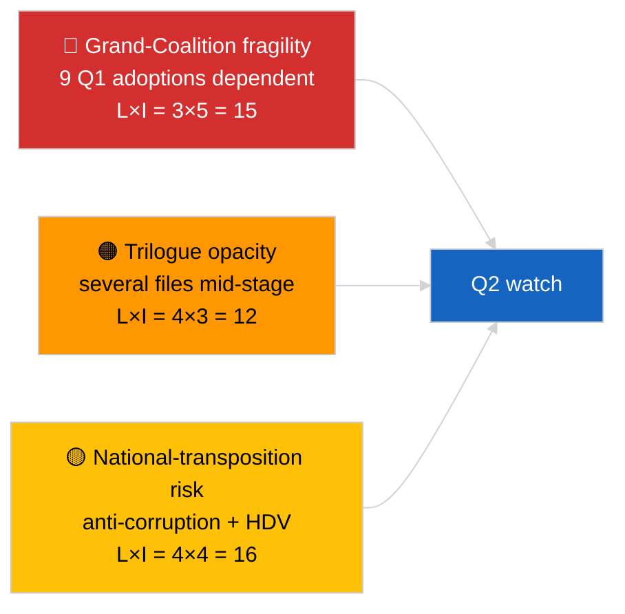

<!-- SPDX-FileCopyrightText: 2026 Hack23 AB -->
<!-- SPDX-License-Identifier: Apache-2.0 -->

# Executive Brief — Breaking (Q1 Legislative Pipeline) | 2026-04-04

**Classification:** OSINT | Public Parliamentary Record
**Confidence:** 🟡 Medium (Q1 retrospective pipeline analysis under DEGRADED API state)
**Generated:** 2026-04-04T00:00:00Z (retrospective brief)
**Article Type:** Breaking — EP10 Q1 2026 Legislative Pipeline Analysis
**Source:** European Parliament Open Data Portal

---

## 🎯 BLUF

**EP10's first quarter of 2026 produced a substantively productive legislative pipeline despite the structural fragility of the dominant-PPE coalition arithmetic.** The Q1 highlight cluster anchors on three plenary blocks — January 2026 (Strasbourg), February 2026 (Strasbourg + Brussels mini), and March 2026 (Strasbourg 9-12 + Brussels mini 25-26) — yielding the anti-corruption directive (TA-10-2026-0094), ECB Vice-President appointment (TA-10-2026-0060), HDV emission-credits framework (TA-10-2026-0084), US customs-tariff adjustment (TA-10-2026-0096), Better Law-Making report (TA-10-2026-0063), public-access-to-documents review (TA-10-2026-0065), Georgia political-prisoners resolution (TA-10-2026-0083), Mercosur ECJ referral (TA-10-2026-0008), and the Braun immunity waiver (TA-10-2026-0088). Pipeline-health score is **MODERATE** — high adoption count, but heavy reliance on Grand-Coalition consensus indicates fragility on rule-of-law and trade files. **🟡 MEDIUM confidence** on the quantitative pipeline scoring (DEGRADED feed state limits independent corroboration).

---

## 🧭 3 Decisions This Brief Supports

| # | Decision | Who Decides | Deadline | Evidence |
|:-:|----------|-------------|:--------:|----------|
| 1 | **Editorial:** publish Q1 pipeline retrospective as the anchor of the next month-in-review | Editor | +48h | Comprehensive Q1 inventory |
| 2 | **Monitoring:** add Q1-cluster files to the trilogue / transposition watch board | Analyst | weekly | Implementation-phase risk |
| 3 | **Forward-watch:** Q2 pipeline calibration after the 27-30 April Strasbourg plenary | Analysis lead | 2026-05-01 | Q1 → Q2 transition |

---

## 📰 60-Second Read

- 🔴 **Q1 anchor texts (9 high-significance items)** — anti-corruption, ECB Vice-President, HDV emissions, US tariff, Better Law-Making, public access, Georgia, Mercosur, Braun. (🟢 High on adoptions)
- 🟠 **Pipeline health MODERATE** — high count masks Grand-Coalition dependence; rule-of-law and trade files most exposed to PPE-internal pressure. (🟡 Medium)
- 🟢 **Three plenary blocks** drove Q1 output: January / February / March (10 plenary days total). (🟢 High)
- 🟡 **Trilogue stage** unobservable for several Q1 files due to inter-institutional opacity. (🟡 Medium)
- 🔵 **Economic context:** ECB confirmation + US tariff + HDV emissions create a coherent industrial-economic Q1 narrative. (🟢 High)
- 🟣 **Cross-reference:** sibling `breaking` (coalition), `breaking-3` (recess analytics), `breaking-4` (adopted-texts deep-dive). (🟢 High)
- 🩷 **Disruption vector:** Mercosur ECJ opinion could re-open Q1 trade file mid-Q2. (🟡 Medium)
- ⚪ **Carry-forward:** transposition windows for anti-corruption and HDV emissions extend to Q1 2028.

---

## 🗂️ Top Q1 Adopted Texts

| Rank | EP reference | Title (short) | Plenary | Significance |
|:----:|--------------|---------------|---------|:------------:|
| 1 | TA-10-2026-0094 | Anti-corruption directive | March | 9.0 |
| 2 | TA-10-2026-0060 | ECB Vice-President | March | 8.0 |
| 3 | TA-10-2026-0096 | US customs tariff | March | 7.5 |
| 4 | TA-10-2026-0084 | HDV emission credits | March | 7.0 |
| 5 | TA-10-2026-0083 | Georgia political prisoners | March | 7.0 |
| 6 | TA-10-2026-0088 | Braun immunity waiver | March | 7.0 |
| 7 | TA-10-2026-0063 | Better Law-Making report | March | 7.0 |
| 8 | TA-10-2026-0065 | Public access to documents | March | 7.0 |
| 9 | TA-10-2026-0008 | Mercosur ECJ referral | January | 7.0 |

---

## ⚠️ Risk & Threat Snapshot

| Risk | L | I | Score | Trigger | Source | Admiralty |
|------|:-:|:-:|:-----:|---------|--------|:---------:|
| Grand-Coalition fragility | 3 | 5 | 15 | PPE-internal split on RoL or trade | Coalition arithmetic | A2 |
| Trilogue opacity | 4 | 3 | 12 | Council foot-dragging | Inter-institutional cadence | A2 |
| National-transposition fragmentation | 4 | 4 | 16 | Member-state divergence | TA-10-2026-0094, TA-10-2026-0084 | A1 |
| Mercosur ECJ opinion shock | 3 | 4 | 12 | Court releases | TA-10-2026-0008 | A2 |

---

## 🔮 Top Forward Trigger

**End-Q2 trilogue progress reports.** First Council positions on Q1-adopted EP files will signal whether the Grand-Coalition output translates to inter-institutional outcomes or stalls at trilogue.

---

## 🛡️ Source Quality Assessment

- **Primary sources:** Q1 adopted-texts feed (one-week fallback active under DEGRADED state).
- **Data limitations:** Procedures-feed unavailability limits independent stage tracking.
- **Confidence:** 🟢 HIGH on adoption inventory; 🟡 MEDIUM on stage-level pipeline-health scoring.

---

## 📎 Links

| Link | Path |
|------|------|
| Article | `./article.md` |
| Sibling runs | `analysis/daily/2026-04-04/breaking/`, `breaking-3/`, `breaking-4/`, `week-in-review/` |
| Manifest | `./manifest.json` |

---

**Document Control**
- **Template:** `/analysis/templates/executive-brief.md`
- **Artifact path:** `analysis/daily/2026-04-04/breaking-2/executive-brief.md`
- **Classification:** Public
- **Retrospective generation:** Back-fill session.
