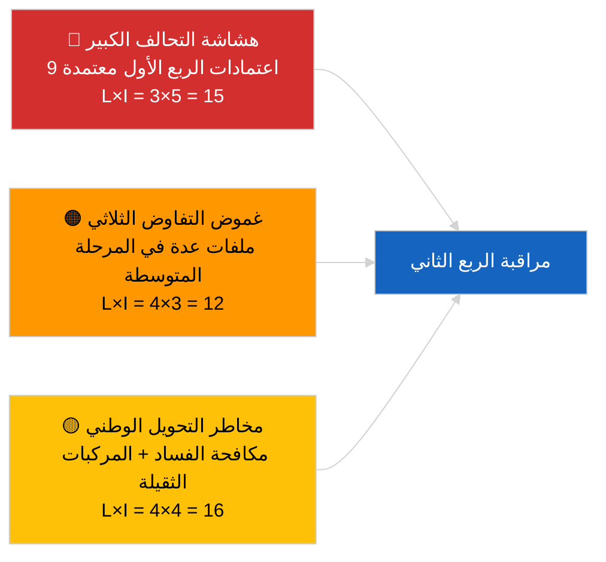

<!-- SPDX-FileCopyrightText: 2026 Hack23 AB -->
<!-- SPDX-License-Identifier: Apache-2.0 -->

# نظرة عامة على النشاط — خط أنابيب التشريعات الربع الأول (آخر الأخبار) | 2026-04-04

**التصنيف:** OSINT | سجلات برلمانية عامة
**مستوى الثقة:** 🟡 متوسط (تحليل استرجاعي لخط أنابيب الربع الأول في حالة API متدهورة)
**تاريخ الإنشاء:** 2026-04-04T00:00:00Z (تقرير استرجاعي)
**نوع المقال:** آخر الأخبار — تحليل خط أنابيب التشريعات الربع الأول 2026 لـ EP10
**المصدر:** بوابة البيانات المفتوحة للبرلمان الأوروبي

---

## 🎯 BLUF

**حقق الربع الأول من عام 2026 للبرلمان EP10 إنتاجاً تشريعياً ملموساً على الرغم من الهشاشة الهيكلية التي تُظهرها حسابات تحالف PPE المهيمن.** يرتكز مجموعة أبرز الأحداث في الربع الأول على ثلاث جلسات عامة — يناير 2026 (ستراسبورغ)، وفبراير 2026 (ستراسبورغ + جلسة بروكسل المصغرة)، ومارس 2026 (ستراسبورغ 9–12 + بروكسل مصغرة 25–26) — وأسفرت عن توجيه مكافحة الفساد (TA-10-2026-0094)، وتعيين نائب رئيس البنك المركزي الأوروبي (TA-10-2026-0060)، وإطار ائتمانات انبعاثات المركبات الثقيلة (TA-10-2026-0084)، وتعديلات الرسوم الجمركية الأمريكية (TA-10-2026-0096)، وتقرير التحسين التشريعي (TA-10-2026-0063)، ومراجعة حق الوصول العام إلى الوثائق (TA-10-2026-0065)، وقرار جورجيا بشأن السجناء السياسيين (TA-10-2026-0083)، وإحالة ميركوسور إلى محكمة العدل الأوروبية (TA-10-2026-0008)، ورفع حصانة براون (TA-10-2026-0088). مؤشر صحة خط الأنابيب **معتدل** — أعداد اعتماد مرتفعة لكن الاعتماد الشديد على توافق التحالف الكبير يُشير إلى هشاشة في ملفات سيادة القانون والتجارة. **🟡 ثقة متوسطة** للتقييم الكمي لخط الأنابيب (حالة التدفق المتدهورة تُحدّ من التحقق المستقل).

---

## 🧭 3 Decisions This Brief Supports

| # | القرار | جهة القرار | الموعد النهائي | الدليل |
|:-:|--------|------------|:--------------:|--------|
| 1 | **تحريري:** نشر التقرير الاستعراضي لخط أنابيب الربع الأول كمرساة للمراجعة الشهرية القادمة | رئيس التحرير | +48 ساعة | مخزون شامل للربع الأول |
| 2 | **مراقبة:** إضافة ملفات مجموعة الربع الأول إلى لوحة متابعة المفاوثات الثلاثية/التحويل | المحلل | أسبوعي | مخاطر التنفيذ |
| 3 | **استشراف:** معايرة خط أنابيب الربع الثاني بعد الجلسة العامة لستراسبورغ 27–30 أبريل | القيادة التحليلية | 2026-05-01 | الانتقال من الربع الأول إلى الثاني |

---

## 📰 60-Second Read

- 🔴 **نصوص مرساة الربع الأول (9 إدخالات عالية الأهمية)** — مكافحة الفساد، نائب رئيس البنك المركزي الأوروبي، انبعاثات المركبات الثقيلة، الرسوم الجمركية الأمريكية، التحسين التشريعي، الوصول العام، جورجيا، ميركوسور، براون. (🟢 مرتفع للاعتمادات)
- 🟠 **صحة خط الأنابيب معتدلة** — الأرقام المرتفعة تُخفي الاعتماد على التحالف الكبير؛ ملفات سيادة القانون والتجارة الأكثر تعرضاً للضغط الداخلي لـ PPE. (🟡 متوسط)
- 🟢 **ثلاثة كتل للجلسات العامة** دفعت إنتاج الربع الأول: يناير / فبراير / مارس (10 أيام عامة إجمالاً). (🟢 مرتفع)
- 🟡 **مرحلة التفاوض الثلاثي** غير قابلة للرصد لعدة ملفات في الربع الأول بسبب الغموض المؤسسي البيني. (🟡 متوسط)
- 🔵 **السياق الاقتصادي:** تأكيد البنك المركزي الأوروبي + الرسوم الأمريكية + انبعاثات المركبات الثقيلة تخلق رواية صناعية اقتصادية متماسكة للربع الأول. (🟢 مرتفع)
- 🟣 **الإسناد المتقاطع:** جلسات شقيقة `breaking` (التحالف)، `breaking-3` (تحليل العطلة التشريعية)، `breaking-4` (تعمق في النصوص المعتمدة). (🟢 مرتفع)
- 🩷 **ناقل الاضطراب:** رأي محكمة العدل الأوروبية حول ميركوسور قد يُعيد فتح ملف التجارة في الربع الأول منتصف الربع الثاني. (🟡 متوسط)
- ⚪ **الاستمرار:** نوافذ تحويل مكافحة الفساد والانبعاثات تمتد حتى الربع الأول 2028.

---

## 🗂️ Top Q1 Adopted Texts

| الترتيب | مرجع البرلمان الأوروبي | العنوان (مختصر) | الجلسة العامة | الأهمية |
|:-------:|----------------------|----------------|--------------|:--------:|
| 1 | TA-10-2026-0094 | توجيه مكافحة الفساد | مارس | 9.0 |
| 2 | TA-10-2026-0060 | نائب رئيس البنك المركزي الأوروبي | مارس | 8.0 |
| 3 | TA-10-2026-0096 | رسوم الاستيراد الأمريكية | مارس | 7.5 |
| 4 | TA-10-2026-0084 | ائتمانات انبعاثات المركبات الثقيلة | مارس | 7.0 |
| 5 | TA-10-2026-0083 | سجناء جورجيا السياسيون | مارس | 7.0 |
| 6 | TA-10-2026-0088 | رفع حصانة براون | مارس | 7.0 |
| 7 | TA-10-2026-0063 | تقرير التحسين التشريعي | مارس | 7.0 |
| 8 | TA-10-2026-0065 | حق الوصول العام للوثائق | مارس | 7.0 |
| 9 | TA-10-2026-0008 | إحالة ميركوسور لمحكمة العدل | يناير | 7.0 |

---

## ⚠️ Risk & Threat Snapshot

| المخاطرة | L | I | الدرجة | المحفز | المصدر | الأدميرالية |
|----------|:-:|:-:|:------:|--------|--------|:-----------:|
| هشاشة التحالف الكبير | 3 | 5 | 15 | انقسام داخلي في PPE حول سيادة القانون أو التجارة | حسابات التحالف | A2 |
| غموض التفاوض الثلاثي | 4 | 3 | 12 | المجلس يُماطل | الإيقاع المؤسسي البيني | A2 |
| تشرذم التحويل الوطني | 4 | 4 | 16 | تباين الدول الأعضاء | TA-10-2026-0094, TA-10-2026-0084 | A1 |
| صدمة رأي محكمة العدل حول ميركوسور | 3 | 4 | 12 | المحكمة تنشر | TA-10-2026-0008 | A2 |

---

## 🔮 Top Forward Trigger

**تقرير تقدم المفاوضات الثلاثية في نهاية الربع الثاني.** المواقف الأولى للمجلس بشأن ملفات الربع الأول المعتمدة من البرلمان ستُشير إلى ما إذا كان إنتاج التحالف الكبير يتحول إلى نتائج مؤسسية بينية أو يتوقف عند مرحلة التفاوض الثلاثي.

---

## 🛡️ Source Quality Assessment

- **المصادر الأولية:** تدفق نصوص الربع الأول المعتمدة (الرجوع لأسبوع واحد نشط في الحالة المتدهورة).
- **قيود البيانات:** عدم توفر تدفق الإجراءات يُقيّد التتبع المستقل للمراحل.
- **مستوى الثقة:** 🟢 مرتفع لمخزون الاعتمادات؛ 🟡 متوسط لتقييم صحة خط الأنابيب على مستوى المرحلة.

---

## 📎 Links

| الرابط | المسار |
|--------|--------|
| المقال | `./article.md` |
| الجلسات الشقيقة | `analysis/daily/2026-04-04/breaking/`, `breaking-3/`, `breaking-4/`, `week-in-review/` |
| البيان | `./manifest.json` |

---

**ضبط الوثيقة**
- **القالب:** `/analysis/templates/executive-brief.md`
- **مسار الأثر:** `analysis/daily/2026-04-04/breaking-2/executive-brief.md`
- **التصنيف:** عام
- **الإنشاء الاسترجاعي:** جلسة ملء رجعي.
