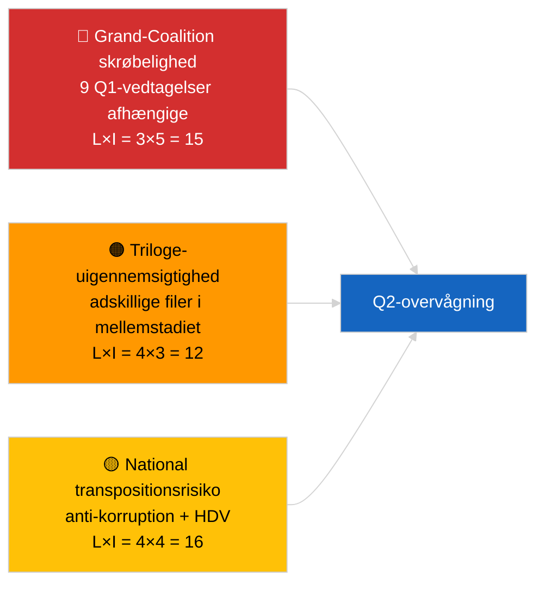

<!-- SPDX-FileCopyrightText: 2026 Hack23 AB -->
<!-- SPDX-License-Identifier: Apache-2.0 -->

# Aktivitetsoversigt — Lovgivningspipeline Q1 (Brydende) | 2026-04-04

**Klassifikation:** OSINT | Offentlig parlamentarisk optegnelse
**Tillid:** 🟡 Middel (Q1-retrospektiv pipelineanalyse under DEGRADERET API-tilstand)
**Genereret:** 2026-04-04T00:00:00Z (retrospektiv rapport)
**Artikeltype:** Brydende — EP10 Q1 2026 Lovgivningspipelineanalyse
**Kilde:** Europa-Parlamentets åbne dataportal

---

## 🎯 BLUF

**EP10's første kvartal af 2026 leverede et substantielt produktivt lovgivningspipeline på trods af den strukturelle skrøbelighed i den dominerende PPE-koalitions aritmetik.** Q1-højdepunktklyngen er forankret i tre plenarblokke — januar 2026 (Strasbourg), februar 2026 (Strasbourg + Bruxelles mini), og marts 2026 (Strasbourg 9-12 + Bruxelles mini 25-26) — og gav anti-korruptionsdirektivet (TA-10-2026-0094), ECB's vicepræsidentudnævnelse (TA-10-2026-0060), HDV-emissionskreditrammen (TA-10-2026-0084), den amerikanske toldtilpasning (TA-10-2026-0096), rapporten Bedre lovgivning (TA-10-2026-0063), gennemgangen af offentlighedens adgang til dokumenter (TA-10-2026-0065), Georgien-resolutionen om politiske fanger (TA-10-2026-0083), Mercosur EUD-remissen (TA-10-2026-0008) og Brauns immunitetsophævelse (TA-10-2026-0088). Pipeline-helbredsscore er **MODERAT** — højt antal vedtagelser, men stærk afhængighed af Grand-Coalition-konsensus indikerer skrøbelighed på retsstat- og handelsfiler. **🟡 MEDIUM tillid** til den kvantitative pipeline-scoring (DEGRADERET feedtilstand begrænser uafhængig korroboration).

---

## 🧭 3 Decisions This Brief Supports

| # | Beslutning | Hvem beslutter | Deadline | Bevis |
|:-:|------------|----------------|:--------:|-------|
| 1 | **Redaktionelt:** offentliggør Q1-pipeline-retrospektiv som ankeret i næste månedsoversigt | Redaktør | +48t | Omfattende Q1-oversigt |
| 2 | **Overvågning:** tilføj Q1-klusterfiler til trilogue-/transpositionsovervågningstavlen | Analytiker | Ugentlig | Gennemførelsesrisiko |
| 3 | **Fremadrettet:** Q2-pipeline-kalibrering efter Strasbourg-plenaret 27-30 april | Analyseleder | 2026-05-01 | Q1 → Q2-overgang |

---

## 📰 60-Second Read

- 🔴 **Q1-ankertekster (9 poster med høj signifikans)** — anti-korruption, ECB-vicepræsident, HDV-emissioner, US-told, Bedre lovgivning, offentlig adgang, Georgien, Mercosur, Braun. (🟢 Høj for vedtagelser)
- 🟠 **Pipeline-sundhed MODERAT** — højt antal skjuler Grand-Coalition-afhængighed; retsstat- og handelsfiler mest eksponeret for PPE-internt pres. (🟡 Middel)
- 🟢 **Tre plenarblokke** drev Q1-produktionen: januar / februar / marts (10 plenarsdage i alt). (🟢 Høj)
- 🟡 **Triloge-stadiet** uobserverbart for adskillige Q1-filer pga. interinstitutionel uigennemsigtighed. (🟡 Middel)
- 🔵 **Økonomisk kontekst:** ECB-bekræftelse + US-told + HDV-emissioner skaber en sammenhængende industriel-økonomisk Q1-fortælling. (🟢 Høj)
- 🟣 **Krydshenvisning:** søsterkørsler `breaking` (koalition), `breaking-3` (recess-analyse), `breaking-4` (vedtagne tekster dybopdyk). (🟢 Høj)
- 🩷 **Forstyrrelsesvektor:** Mercosur EUD-udtalelse kunne genåbne Q1-handelsfilen midt i Q2. (🟡 Middel)
- ⚪ **Videreførelse:** transpositionsvinduer for anti-korruption og HDV-emissioner strækker sig til Q1 2028.

---

## 🗂️ Top Q1 Adopted Texts

| Rang | EP-reference | Titel (kort) | Plenum | Signifikans |
|:----:|--------------|-------------|--------|:-----------:|
| 1 | TA-10-2026-0094 | Anti-korruptionsdirektivet | Marts | 9,0 |
| 2 | TA-10-2026-0060 | ECB-vicepræsident | Marts | 8,0 |
| 3 | TA-10-2026-0096 | Amerikansk importtold | Marts | 7,5 |
| 4 | TA-10-2026-0084 | HDV-emissionskreditter | Marts | 7,0 |
| 5 | TA-10-2026-0083 | Georgiens politiske fanger | Marts | 7,0 |
| 6 | TA-10-2026-0088 | Brauns immunitetsophævelse | Marts | 7,0 |
| 7 | TA-10-2026-0063 | Rapport Bedre lovgivning | Marts | 7,0 |
| 8 | TA-10-2026-0065 | Offentlig adgang til dokumenter | Marts | 7,0 |
| 9 | TA-10-2026-0008 | Mercosur EUD-remis | Januar | 7,0 |

---

## ⚠️ Risk & Threat Snapshot

| Risiko | L | I | Score | Udløser | Kilde | Admiralitet |
|--------|:-:|:-:|:-----:|---------|-------|:-----------:|
| Grand-Coalition skrøbelighed | 3 | 5 | 15 | PPE-intern splittelse om RoL eller handel | Koalitionsaritmetik | A2 |
| Triloge-uigennemsigtighed | 4 | 3 | 12 | Rådet trækker på benene | Interinstitutionel kadence | A2 |
| National transpositionsfragmentering | 4 | 4 | 16 | Medlemsstatsdivergens | TA-10-2026-0094, TA-10-2026-0084 | A1 |
| Mercosur EUD-udtalelse chok | 3 | 4 | 12 | Retten offentliggør | TA-10-2026-0008 | A2 |

---

## 🔮 Top Forward Trigger

**Rapport om triloge-fremskridt i slutningen af Q2.** Rådets første positioner om Q1-vedtagne EP-filer vil signalere, om Grand-Coalitions produktion oversættes til interinstitutionelle resultater eller stopper ved trilogen.

---

## 🛡️ Source Quality Assessment

- **Primærkilder:** Q1-feed for vedtagne tekster (en-uges tilbagefald aktiv under DEGRADERET tilstand).
- **Databegrænsninger:** Manglende adgang til procedure-feed begrænser uafhængig stadiesporning.
- **Tillid:** 🟢 HIGH for vedtagelsesoversigten; 🟡 MEDIUM for stadium-niveau pipeline-sundhedsscore.

---

## 📎 Links

| Link | Sti |
|------|-----|
| Artikel | `./article.md` |
| Søsterkørsler | `analysis/daily/2026-04-04/breaking/`, `breaking-3/`, `breaking-4/`, `week-in-review/` |
| Manifest | `./manifest.json` |

---

**Dokumentkontrol**
- **Skabelon:** `/analysis/templates/executive-brief.md`
- **Artefaktsti:** `analysis/daily/2026-04-04/breaking-2/executive-brief.md`
- **Klassifikation:** Offentlig
- **Retrospektiv generering:** Backfill-session.
