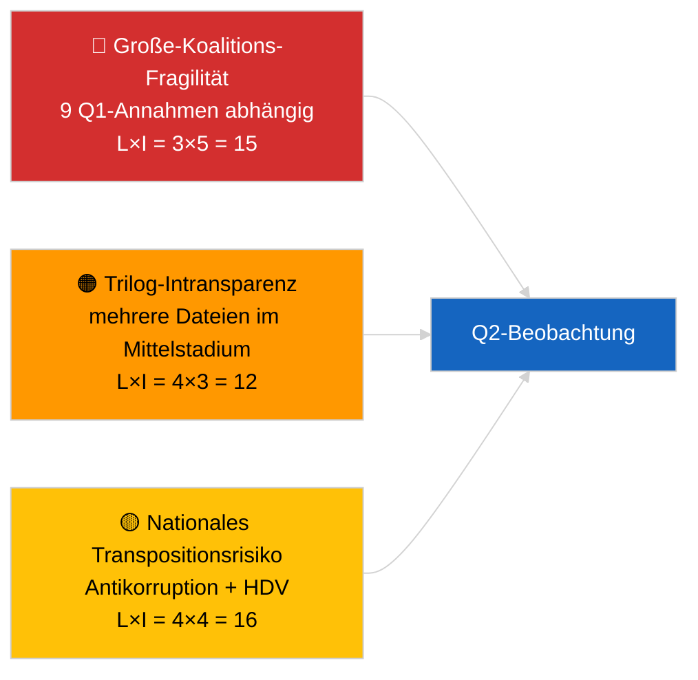

<!-- SPDX-FileCopyrightText: 2026 Hack23 AB -->
<!-- SPDX-License-Identifier: Apache-2.0 -->

# Aktivitätsübersicht — Gesetzgebungs-Pipeline Q1 (Eilmeldung) | 2026-04-04

**Klassifizierung:** OSINT | Öffentliche parlamentarische Aufzeichnungen
**Vertrauen:** 🟡 Mittel (Q1-retrospektive Pipeline-Analyse im DEGRADIERTEN API-Zustand)
**Erstellt:** 2026-04-04T00:00:00Z (retrospektiver Bericht)
**Artikeltyp:** Eilmeldung — EP10 Q1 2026 Gesetzgebungs-Pipeline-Analyse
**Quelle:** Offenes Datenportal des Europäischen Parlaments

---

## 🎯 BLUF

**Das erste Quartal 2026 von EP10 lieferte eine substantiell produktive Gesetzgebungs-Pipeline trotz der strukturellen Fragilität, die die Arithmetik der dominierenden PPE-Koalition aufzeigt.** Der Q1-Höhepunkte-Cluster ist in drei Plenarblöcken verankert — Januar 2026 (Straßburg), Februar 2026 (Straßburg + Brüssel-Mini-Plenum) und März 2026 (Straßburg 9.–12. + Brüssel-Mini 25.–26.) — und brachte die Antikorruptionsrichtlinie (TA-10-2026-0094), die EZB-Vizepräsidenten-Ernennung (TA-10-2026-0060), den HDV-Emissionsgutschriftrahmen (TA-10-2026-0084), die US-Zollanpassung (TA-10-2026-0096), den Bericht Bessere Rechtsetzung (TA-10-2026-0063), die Überprüfung des öffentlichen Zugangs zu Dokumenten (TA-10-2026-0065), die Georgien-Resolution über politische Gefangene (TA-10-2026-0083), die Mercosur EuGH-Überweisung (TA-10-2026-0008) und die Aufhebung von Brauns Immunität (TA-10-2026-0088). Der Pipeline-Gesundheitsindex steht auf **MODERAT** — hohe Annahmequoten, aber starke Abhängigkeit vom Großen-Koalitions-Konsens deutet auf Fragilität bei Rechtsstaats- und Handelsdateien hin. **🟡 MITTLERES Vertrauen** für die quantitative Pipeline-Wertung (DEGRADIERTER Feed-Zustand schränkt unabhängige Verifizierung ein).

---

## 🧭 3 Decisions This Brief Supports

| # | Entscheidung | Wer entscheidet | Frist | Beleg |
|:-:|-------------|-----------------|:-----:|-------|
| 1 | **Redaktionell:** Q1-Pipeline-Retrospektive als Ankerpunkt für den nächsten Monatsbericht veröffentlichen | Redakteur | +48h | Umfassendes Q1-Inventar |
| 2 | **Überwachung:** Q1-Cluster-Dateien in die Trilogue-/Transpositionsüberwachungstafel aufnehmen | Analyst | Wöchentlich | Umsetzungsrisiko |
| 3 | **Ausblick:** Q2-Pipeline-Kalibrierung nach dem Straßburg-Plenum 27.–30. April | Analyseführung | 2026-05-01 | Q1 → Q2-Übergang |

---

## 📰 60-Second Read

- 🔴 **Q1-Ankertexte (9 Einträge mit hoher Signifikanz)** — Antikorruption, EZB-Vizepräsident, HDV-Emissionen, US-Zoll, Bessere Rechtsetzung, öffentlicher Zugang, Georgien, Mercosur, Braun. (🟢 Hoch für Annahmen)
- 🟠 **Pipeline-Gesundheit MODERAT** — hohe Zahlen verbergen Große-Koalitions-Abhängigkeit; Rechtsstaats- und Handelsdateien am stärksten dem PPE-internen Druck ausgesetzt. (🟡 Mittel)
- 🟢 **Drei Plenarblöcke** trieben die Q1-Produktion an: Januar / Februar / März (insgesamt 10 Plenartage). (🟢 Hoch)
- 🟡 **Trilog-Stadium** für mehrere Q1-Dateien aufgrund interinstitutioneller Intransparenz nicht beobachtbar. (🟡 Mittel)
- 🔵 **Wirtschaftlicher Kontext:** EZB-Bestätigung + US-Zoll + HDV-Emissionen erzeugen eine kohärente industriell-wirtschaftliche Q1-Erzählung. (🟢 Hoch)
- 🟣 **Querverweis:** Schwestersitzungen `breaking` (Koalition), `breaking-3` (Rückblick-Analyse), `breaking-4` (Tiefenanalyse angenommener Texte). (🟢 Hoch)
- 🩷 **Störungsvektor:** Mercosur EuGH-Gutachten könnte die Q1-Handelsdatei Mitte Q2 wieder öffnen. (🟡 Mittel)
- ⚪ **Übertragung:** Transpositionsfenster für Antikorruption und HDV-Emissionen erstrecken sich bis Q1 2028.

---

## 🗂️ Top Q1 Adopted Texts

| Rang | EP-Referenz | Titel (Kurzform) | Plenum | Signifikanz |
|:----:|-------------|-----------------|--------|:-----------:|
| 1 | TA-10-2026-0094 | Antikorruptionsrichtlinie | März | 9,0 |
| 2 | TA-10-2026-0060 | EZB-Vizepräsident | März | 8,0 |
| 3 | TA-10-2026-0096 | US-Importzoll | März | 7,5 |
| 4 | TA-10-2026-0084 | HDV-Emissionsgutschriften | März | 7,0 |
| 5 | TA-10-2026-0083 | Georgiens politische Gefangene | März | 7,0 |
| 6 | TA-10-2026-0088 | Aufhebung von Brauns Immunität | März | 7,0 |
| 7 | TA-10-2026-0063 | Bericht Bessere Rechtsetzung | März | 7,0 |
| 8 | TA-10-2026-0065 | Öffentlicher Zugang zu Dokumenten | März | 7,0 |
| 9 | TA-10-2026-0008 | Mercosur EuGH-Überweisung | Januar | 7,0 |

---

## ⚠️ Risk & Threat Snapshot

| Risiko | L | I | Punkte | Auslöser | Quelle | Admiralität |
|--------|:-:|:-:|:------:|----------|--------|:-----------:|
| Große-Koalitions-Fragilität | 3 | 5 | 15 | PPE-interne Spaltung bei RoL oder Handel | Koalitionsarithmetik | A2 |
| Trilog-Intransparenz | 4 | 3 | 12 | Rat bremst | Interinstitutionelles Tempo | A2 |
| Nationales Transpositionsfragmentierung | 4 | 4 | 16 | Mitgliedstaatsdivergenz | TA-10-2026-0094, TA-10-2026-0084 | A1 |
| Mercosur EuGH-Gutachten Schock | 3 | 4 | 12 | Gericht veröffentlicht | TA-10-2026-0008 | A2 |

---

## 🔮 Top Forward Trigger

**Bericht über Trilog-Fortschritte Ende Q2.** Die ersten Ratspositionen zu Q1-angenommenen EP-Dateien werden signalisieren, ob die Große-Koalitions-Produktion in interinstitutionelle Ergebnisse umgesetzt wird oder am Trilog scheitert.

---

## 🛡️ Source Quality Assessment

- **Primärquellen:** Q1-Feed für angenommene Texte (Rückfall auf eine Woche aktiv im DEGRADIERTEN Zustand).
- **Datenbeschränkungen:** Nicht verfügbarer Verfahrens-Feed schränkt unabhängiges Stadium-Tracking ein.
- **Vertrauen:** 🟢 HOCH für das Annahmeinventar; 🟡 MITTEL für Stadium-Level-Pipeline-Gesundheitswertung.

---

## 📎 Links

| Link | Pfad |
|------|------|
| Artikel | `./article.md` |
| Schwestersitzungen | `analysis/daily/2026-04-04/breaking/`, `breaking-3/`, `breaking-4/`, `week-in-review/` |
| Manifest | `./manifest.json` |

---

**Dokumentenkontrolle**
- **Vorlage:** `/analysis/templates/executive-brief.md`
- **Artefaktpfad:** `analysis/daily/2026-04-04/breaking-2/executive-brief.md`
- **Klassifizierung:** Öffentlich
- **Retrospektive Erstellung:** Backfill-Sitzung.
