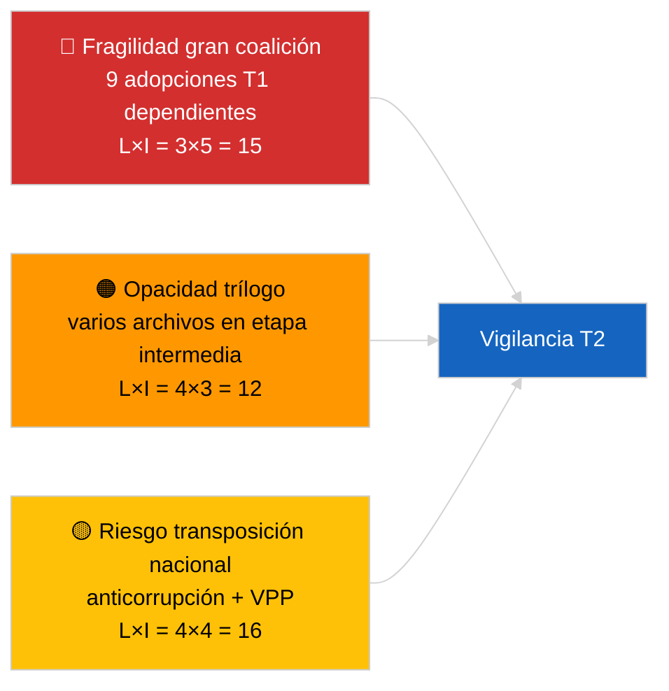

<!-- SPDX-FileCopyrightText: 2026 Hack23 AB -->
<!-- SPDX-License-Identifier: Apache-2.0 -->

# Resumen de actividad — Pipeline legislativa T1 (Última hora) | 2026-04-04

**Clasificación:** OSINT | Archivo parlamentario público
**Confianza:** 🟡 Media (análisis retrospectivo T1 de la pipeline en estado API DEGRADADO)
**Generado:** 2026-04-04T00:00:00Z (informe retrospectivo)
**Tipo de artículo:** Última hora — Análisis de la pipeline legislativa T1 2026 del PE10
**Fuente:** Portal de datos abiertos del Parlamento Europeo

---

## 🎯 BLUF

**El primer trimestre de 2026 del PE10 entregó una pipeline legislativa sustancialmente productiva a pesar de la fragilidad estructural que muestra la aritmética de la coalición PPE dominante.** El clúster de puntos destacados del T1 está anclado en tres bloques de sesión plenaria — enero 2026 (Estrasburgo), febrero 2026 (Estrasburgo + mini plenaria Bruselas) y marzo 2026 (Estrasburgo 9–12 + mini Bruselas 25–26) — y produjo la Directiva anticorrupción (TA-10-2026-0094), el nombramiento del vicepresidente del BCE (TA-10-2026-0060), el marco de créditos de emisiones de VPP (TA-10-2026-0084), la adaptación arancelaria estadounidense (TA-10-2026-0096), el informe Legislar mejor (TA-10-2026-0063), la revisión del acceso público a los documentos (TA-10-2026-0065), la resolución sobre Georgia y los presos políticos (TA-10-2026-0083), la remisión Mercosur al TJUE (TA-10-2026-0008) y el levantamiento de la inmunidad de Braun (TA-10-2026-0088). El índice de salud de la pipeline es **MODERADO** — alta tasa de adopciones, pero fuerte dependencia del consenso de la gran coalición señalando fragilidad en los expedientes de Estado de Derecho y comerciales. **🟡 CONFIANZA MEDIA** para la puntuación cuantitativa de la pipeline (estado de flujo DEGRADADO limitando la corroboración independiente).

---

## 🧭 3 Decisions This Brief Supports

| # | Decisión | Quién decide | Plazo | Evidencia |
|:-:|----------|-------------|:-----:|-----------|
| 1 | **Editorial:** publicar la retrospectiva T1 de la pipeline como ancla de la próxima revisión mensual | Editor | +48h | Inventario T1 completo |
| 2 | **Seguimiento:** añadir los archivos del clúster T1 al panel de vigilancia de trílogos/transposición | Analista | Semanal | Riesgo de implementación |
| 3 | **Prospectiva:** calibración T2 de la pipeline tras el pleno de Estrasburgo del 27–30 de abril | Dirección analítica | 2026-05-01 | Transición T1 → T2 |

---

## 📰 60-Second Read

- 🔴 **Textos ancla T1 (9 entradas de alta significatividad)** — anticorrupción, vicepresidente BCE, emisiones VPP, aranceles EE. UU., Legislar mejor, acceso público, Georgia, Mercosur, Braun. (🟢 Alta para adopciones)
- 🟠 **Salud de pipeline MODERADA** — cifras altas ocultan dependencia de gran coalición; expedientes de Estado de Derecho y comerciales más expuestos a presión interna del PPE. (🟡 Media)
- 🟢 **Tres bloques plenarios** impulsaron la producción T1: enero / febrero / marzo (10 días de pleno en total). (🟢 Alta)
- 🟡 **Etapa de trílogo** no observable para varios archivos T1 por opacidad interinstitucional. (🟡 Media)
- 🔵 **Contexto económico:** confirmación BCE + aranceles EE. UU. + emisiones VPP crean una narrativa económico-industrial T1 coherente. (🟢 Alta)
- 🟣 **Referencia cruzada:** sesiones hermanas `breaking` (coalición), `breaking-3` (análisis de receso), `breaking-4` (análisis profundo de textos adoptados). (🟢 Alta)
- 🩷 **Vector de perturbación:** el dictamen del TJUE sobre Mercosur podría reabrir el expediente comercial T1 a mediados de T2. (🟡 Media)
- ⚪ **Traslado:** ventanas de transposición para anticorrupción y emisiones VPP se extienden hasta T1 2028.

---

## 🗂️ Top Q1 Adopted Texts

| Rango | Referencia PE | Título (resumen) | Pleno | Significatividad |
|:-----:|--------------|-----------------|-------|:----------------:|
| 1 | TA-10-2026-0094 | Directiva anticorrupción | Marzo | 9,0 |
| 2 | TA-10-2026-0060 | Vicepresidente BCE | Marzo | 8,0 |
| 3 | TA-10-2026-0096 | Aranceles importación EE. UU. | Marzo | 7,5 |
| 4 | TA-10-2026-0084 | Créditos emisiones VPP | Marzo | 7,0 |
| 5 | TA-10-2026-0083 | Presos políticos de Georgia | Marzo | 7,0 |
| 6 | TA-10-2026-0088 | Levantamiento inmunidad Braun | Marzo | 7,0 |
| 7 | TA-10-2026-0063 | Informe Legislar mejor | Marzo | 7,0 |
| 8 | TA-10-2026-0065 | Acceso público a documentos | Marzo | 7,0 |
| 9 | TA-10-2026-0008 | Remisión Mercosur TJUE | Enero | 7,0 |

---

## ⚠️ Risk & Threat Snapshot

| Riesgo | L | I | Puntuación | Desencadenante | Fuente | Almirantazgo |
|--------|:-:|:-:|:----------:|----------------|--------|:------------:|
| Fragilidad gran coalición | 3 | 5 | 15 | Fractura interna PPE sobre Estado de Derecho o comercio | Aritmética de coalición | A2 |
| Opacidad trílogo | 4 | 3 | 12 | Consejo frena | Cadencia interinstitucional | A2 |
| Fragmentación transposición nacional | 4 | 4 | 16 | Divergencia Estados miembros | TA-10-2026-0094, TA-10-2026-0084 | A1 |
| Choque dictamen TJUE Mercosur | 3 | 4 | 12 | Tribunal publica | TA-10-2026-0008 | A2 |

---

## 🔮 Top Forward Trigger

**Informe sobre avances del trílogo a finales de T2.** Las primeras posiciones del Consejo sobre los archivos T1 adoptados por el PE indicarán si la producción de la gran coalición se traduce en resultados interinstitucionales o se detiene en la fase de trílogo.

---

## 🛡️ Source Quality Assessment

- **Fuentes primarias:** Flujo T1 de textos adoptados (reversión a una semana activa en estado DEGRADADO).
- **Limitaciones de datos:** Indisponibilidad del flujo de procedimientos limitando el seguimiento independiente de etapas.
- **Confianza:** 🟢 ALTA para el inventario de adopciones; 🟡 MEDIA para la puntuación de salud de pipeline a nivel de etapa.

---

## 📎 Links

| Enlace | Ruta |
|--------|------|
| Artículo | `./article.md` |
| Sesiones hermanas | `analysis/daily/2026-04-04/breaking/`, `breaking-3/`, `breaking-4/`, `week-in-review/` |
| Manifiesto | `./manifest.json` |

---

**Control documental**
- **Plantilla:** `/analysis/templates/executive-brief.md`
- **Ruta de artefacto:** `analysis/daily/2026-04-04/breaking-2/executive-brief.md`
- **Clasificación:** Público
- **Generación retrospectiva:** Sesión de relleno retroactivo.
