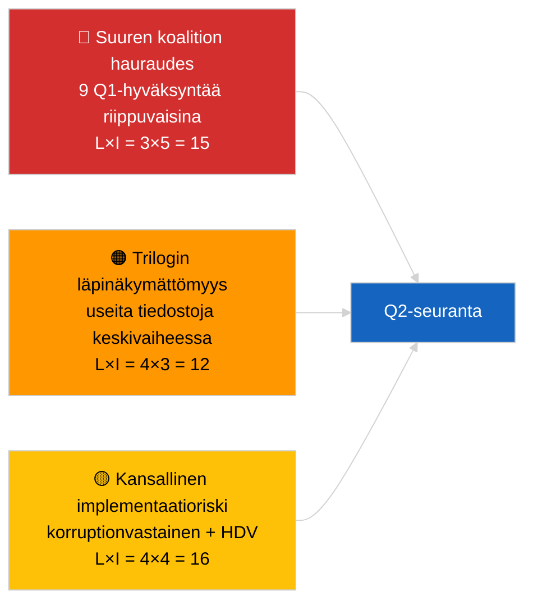

<!-- SPDX-FileCopyrightText: 2026 Hack23 AB -->
<!-- SPDX-License-Identifier: Apache-2.0 -->

# Toimintakatsaus — Q1 lainsäädäntöputkilinja (Viimeisin uutinen) | 2026-04-04

**Luokitus:** OSINT | Julkinen parlamentaarinen arkisto
**Konfidens:** 🟡 Keskitaso (Q1-retrospektiivinen putkilinja-analyysi HEIKENTYNEEN API-tilan alla)
**Luotu:** 2026-04-04T00:00:00Z (retrospektiivinen raportti)
**Artikkelityyppi:** Viimeisin uutinen — EP10 Q1 2026 lainsäädäntöputkilinja-analyysi
**Lähde:** Euroopan parlamentin avoin dataporttaali

---

## 🎯 BLUF

**EP10:n ensimmäinen vuosineljännes 2026 tuotti substantiaalisesti tuottavan lainsäädäntöputkilinjan huolimatta hallitsevan PPE-koalition aritmetiikan rakenteellisesta hauraudesta.** Q1-korostusklusterin ankkurit kolmeen täysistuntolohkoon — tammikuu 2026 (Strasbourg), helmikuu 2026 (Strasbourg + Bryssel-minitäysistunto) ja maaliskuu 2026 (Strasbourg 9–12 + Bryssel-mini 25–26) — tuottivat korruptionvastaiseen direktiivin (TA-10-2026-0094), EKP:n varapuheenjohtajan nimityksen (TA-10-2026-0060), HDV-päästöhyviterakenteen (TA-10-2026-0084), Yhdysvaltojen tullinmuutoksen (TA-10-2026-0096), raportin Parempi lainsäädäntö (TA-10-2026-0063), asiakirjojen julkista saatavuutta koskevan tarkistuksen (TA-10-2026-0065), Georgian poliittisia vankeja koskevan päätöslauselman (TA-10-2026-0083), Mercosur ECJ-remissin (TA-10-2026-0008) sekä Braunin immuniteettivapautuksen (TA-10-2026-0088). Putkilinjan terveysindeksi on **KOHTALAINEN** — korkea hyväksymisluku, mutta suuri riippuvuus suuren koalition konsensuksesta osoittaa haavoittuvuutta oikeusvaltiota ja kauppaa koskevissa tiedostoissa. **🟡 MEDIUM konfidens** kvantitatiiviselle putkilinjan pisteytyselle (HEIKENTYNYT syötetila rajoittaa riippumatonta korroborointia).

---

## 🧭 3 Decisions This Brief Supports

| # | Päätös | Kuka päättää | Määräaika | Näyttö |
|:-:|--------|--------------|:----------:|--------|
| 1 | **Toimituksellinen:** julkaise Q1-putkilinjan retrospektiivi seuraavan kuukausikatsauksen ankkurina | Toimittaja | +48t | Kattava Q1-inventaario |
| 2 | **Seuranta:** lisää Q1-klusteritiedostot trilogue-/transpositionin seurantatauluun | Analyytikko | Viikoittain | Toteutusvaiheen riski |
| 3 | **Eteenpäin katsoen:** Q2-putkilinjan kalibrointi Strasbourgin täysistunnon 27–30 huhtikuuta jälkeen | Analyysijohto | 2026-05-01 | Q1 → Q2-siirtymä |

---

## 📰 60-Second Read

- 🔴 **Q1-ankkuritekstit (9 korkean merkityksen kohtaa)** — korruptionvastainen, EKP-varapuheenjohtaja, HDV-päästöt, Yhdysvaltain tulli, Parempi lainsäädäntö, julkinen saatavuus, Georgia, Mercosur, Braun. (🟢 Korkea hyväksymisille)
- 🟠 **Putkilinjan terveys KOHTALAINEN** — korkea luku peittää suuren koalition riippuvuuden; oikeusvaltiota ja kauppaa koskevat tiedostot eniten alttiina PPE:n sisäiselle paineelle. (🟡 Keskitaso)
- 🟢 **Kolme täysistuntolohkoa** ajoi Q1-tuotantoa: tammikuu / helmikuu / maaliskuu (yhteensä 10 täysistuntopäivää). (🟢 Korkea)
- 🟡 **Trilogivaihe** ei-tarkkailtavissa useille Q1-tiedostoille toimielinten välisen läpinäkymättömyyden vuoksi. (🟡 Keskitaso)
- 🔵 **Taloudellinen konteksti:** EKP:n vahvistus + Yhdysvaltain tulli + HDV-päästöt luovat yhtenäisen teollisen-taloudellisen Q1-narratiivin. (🟢 Korkea)
- 🟣 **Ristikkäisviittaus:** sisarkokoukset `breaking` (koalitio), `breaking-3` (recess-analyysi), `breaking-4` (hyväksyttyjen tekstien syvähyppely). (🟢 Korkea)
- 🩷 **Häiriövektori:** Mercosur ECJ:n lausunto voi avata Q1-kauppatiedoston uudelleen Q2:n puolivälissä. (🟡 Keskitaso)
- ⚪ **Jatko:** korruptionvastaisen direktiivin ja HDV-päästöjen implementaatioikkunat ulottuvat Q1 2028 asti.

---

## 🗂️ Top Q1 Adopted Texts

| Sija | EP-viittaus | Otsikko (lyhyt) | Täysistunto | Merkitys |
|:----:|-------------|-----------------|-------------|:---------:|
| 1 | TA-10-2026-0094 | Korruptionvastainen direktiivi | Maaliskuu | 9,0 |
| 2 | TA-10-2026-0060 | EKP:n varapuheenjohtaja | Maaliskuu | 8,0 |
| 3 | TA-10-2026-0096 | Yhdysvaltain tulli | Maaliskuu | 7,5 |
| 4 | TA-10-2026-0084 | HDV-päästöhyvitteet | Maaliskuu | 7,0 |
| 5 | TA-10-2026-0083 | Georgian poliittiset vangit | Maaliskuu | 7,0 |
| 6 | TA-10-2026-0088 | Braunin immuniteettivapautus | Maaliskuu | 7,0 |
| 7 | TA-10-2026-0063 | Raportti Parempi lainsäädäntö | Maaliskuu | 7,0 |
| 8 | TA-10-2026-0065 | Julkinen saatavuus asiakirjoihin | Maaliskuu | 7,0 |
| 9 | TA-10-2026-0008 | Mercosur ECJ-remissi | Tammikuu | 7,0 |

---

## ⚠️ Risk & Threat Snapshot

| Riski | L | I | Pisteet | Laukaisin | Lähde | Admiraliteetti |
|-------|:-:|:-:|:-------:|-----------|-------|:--------------:|
| Suuren koalition hauraus | 3 | 5 | 15 | PPE:n sisäinen jakautuminen RoL:n tai kaupan osalta | Koalitioaritmetiikka | A2 |
| Trilogin läpinäkymättömyys | 4 | 3 | 12 | Neuvosto viivyttää | Toimielinten välinen rytmi | A2 |
| Kansallinen implementaatiofragmentointi | 4 | 4 | 16 | Jäsenvaltiohajonta | TA-10-2026-0094, TA-10-2026-0084 | A1 |
| Mercosur ECJ:n lausuntoshokki | 3 | 4 | 12 | Tuomioistuin julkaisee | TA-10-2026-0008 | A2 |

---

## 🔮 Top Forward Trigger

**Raportti trilogedin etenemisestä Q2:n lopussa.** Neuvoston ensimmäiset kannat Q1:llä hyväksytyistä EP-tiedostoista osoittavat, muuttuuko suuren koalition tuotos toimielinten välisiksi tuloksiksi vai pysähtyykö triloge-vaiheessa.

---

## 🛡️ Source Quality Assessment

- **Ensisijaiset lähteet:** Q1 hyväksyttyjen tekstien syöte (yhden viikon takautuminen aktiivinen HEIKENTYNEEN tilan alla).
- **Tietorajoitukset:** Menettelysyötteen saatavuusongelmat rajoittavat riippumatonta vaiheenseurantaa.
- **Konfidens:** 🟢 HIGH hyväksymisrekisterille; 🟡 MEDIUM vaihetason putkilinjan terveyspisteytyselle.

---

## 📎 Links

| Linkki | Polku |
|--------|-------|
| Artikkeli | `./article.md` |
| Sisarkokoukset | `analysis/daily/2026-04-04/breaking/`, `breaking-3/`, `breaking-4/`, `week-in-review/` |
| Manifest | `./manifest.json` |

---

**Asiakirjanhallinta**
- **Malli:** `/analysis/templates/executive-brief.md`
- **Artefaktipolku:** `analysis/daily/2026-04-04/breaking-2/executive-brief.md`
- **Luokitus:** Julkinen
- **Retrospektiivinen luonti:** Taustatäyttöistunto.
