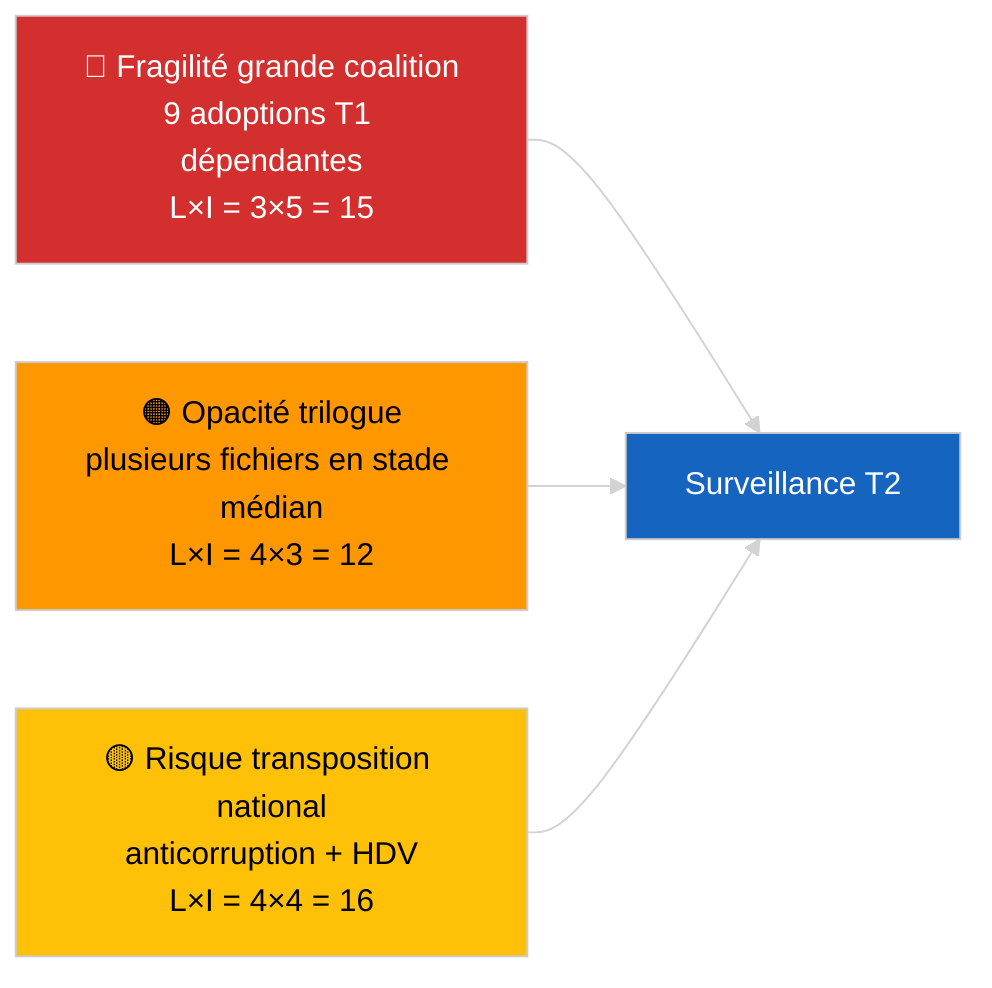

<!-- SPDX-FileCopyrightText: 2026 Hack23 AB -->
<!-- SPDX-License-Identifier: Apache-2.0 -->

# Vue d'ensemble — Pipeline législative Q1 (Dernière heure) | 2026-04-04

**Classification :** OSINT | Archives parlementaires publiques
**Confiance :** 🟡 Moyenne (analyse rétrospective Q1 de la pipeline en état API DÉGRADÉ)
**Généré le :** 2026-04-04T00:00:00Z (rapport rétrospectif)
**Type d'article :** Dernière heure — Analyse de la pipeline législative Q1 2026 de EP10
**Source :** Portail de données ouvertes du Parlement européen

---

## 🎯 BLUF

**Le premier trimestre 2026 de l'EP10 a produit une pipeline législative substantiellement productive malgré la fragilité structurelle de l'arithmétique de la coalition PPE dominante.** Le cluster des faits saillants du T1 est ancré dans trois blocs de session plénière — janvier 2026 (Strasbourg), février 2026 (Strasbourg + mini-plénière Bruxelles) et mars 2026 (Strasbourg 9–12 + mini Bruxelles 25–26) — et a livré la directive anticorruption (TA-10-2026-0094), la nomination du vice-président de la BCE (TA-10-2026-0060), le cadre de crédits d'émissions HDV (TA-10-2026-0084), l'ajustement tarifaire américain (TA-10-2026-0096), le rapport Mieux légiférer (TA-10-2026-0063), la révision de l'accès public aux documents (TA-10-2026-0065), la résolution Géorgie sur les prisonniers politiques (TA-10-2026-0083), le renvoi Mercosur à la CJUE (TA-10-2026-0008) et la levée d'immunité de Braun (TA-10-2026-0088). L'indice de santé de la pipeline est **MODÉRÉ** — nombre élevé d'adoptions, mais forte dépendance au consensus de la grande coalition signalant une fragilité sur les dossiers d'État de droit et commerciaux. **🟡 CONFIANCE MOYENNE** pour le scoring quantitatif de la pipeline (état de flux DÉGRADÉ limitant la corroboration indépendante).

---

## 🧭 3 Decisions This Brief Supports

| # | Décision | Qui décide | Délai | Preuve |
|:-:|----------|------------|:-----:|--------|
| 1 | **Éditorial :** publier la rétrospective T1 de la pipeline comme ancre de la prochaine revue mensuelle | Rédacteur en chef | +48h | Inventaire T1 complet |
| 2 | **Surveillance :** ajouter les fichiers du cluster T1 au tableau de bord trilogue/transposition | Analyste | Hebdomadaire | Risque de mise en œuvre |
| 3 | **Prospective :** calibration T2 de la pipeline après la plénière de Strasbourg du 27–30 avril | Direction analytique | 2026-05-01 | Transition T1 → T2 |

---

## 📰 60-Second Read

- 🔴 **Textes d'ancrage T1 (9 entrées à haute significativité)** — anticorruption, vice-président BCE, émissions HDV, droits de douane US, Mieux légiférer, accès public, Géorgie, Mercosur, Braun. (🟢 Élevée pour les adoptions)
- 🟠 **Santé de la pipeline MODÉRÉE** — chiffres élevés masquent la dépendance à la grande coalition ; dossiers d'État de droit et commerciaux plus exposés à la pression interne du PPE. (🟡 Moyenne)
- 🟢 **Trois blocs pléniers** ont porté la production T1 : janvier / février / mars (10 jours de plénière au total). (🟢 Élevée)
- 🟡 **Stade de trilogue** non observable pour plusieurs fichiers T1 en raison de l'opacité interinstitutionnelle. (🟡 Moyenne)
- 🔵 **Contexte économique :** confirmation BCE + droits de douane US + émissions HDV créent un récit économique industriel T1 cohérent. (🟢 Élevée)
- 🟣 **Référence croisée :** sessions sœurs `breaking` (coalition), `breaking-3` (analyse de récession), `breaking-4` (approfondissement des textes adoptés). (🟢 Élevée)
- 🩷 **Vecteur de perturbation :** l'avis de la CJUE sur Mercosur pourrait rouvrir le dossier commercial T1 à mi-T2. (🟡 Moyenne)
- ⚪ **Report :** fenêtres de transposition pour anticorruption et émissions HDV s'étendant jusqu'au T1 2028.

---

## 🗂️ Top Q1 Adopted Texts

| Rang | Référence PE | Titre (court) | Plénière | Significativité |
|:----:|-------------|--------------|----------|:---------------:|
| 1 | TA-10-2026-0094 | Directive anticorruption | Mars | 9,0 |
| 2 | TA-10-2026-0060 | Vice-président BCE | Mars | 8,0 |
| 3 | TA-10-2026-0096 | Droits de douane US | Mars | 7,5 |
| 4 | TA-10-2026-0084 | Crédits d'émissions HDV | Mars | 7,0 |
| 5 | TA-10-2026-0083 | Prisonniers politiques géorgiens | Mars | 7,0 |
| 6 | TA-10-2026-0088 | Levée d'immunité Braun | Mars | 7,0 |
| 7 | TA-10-2026-0063 | Rapport Mieux légiférer | Mars | 7,0 |
| 8 | TA-10-2026-0065 | Accès public aux documents | Mars | 7,0 |
| 9 | TA-10-2026-0008 | Renvoi Mercosur CJUE | Janvier | 7,0 |

---

## ⚠️ Risk & Threat Snapshot

| Risque | L | I | Score | Déclencheur | Source | Admirauté |
|--------|:-:|:-:|:-----:|-------------|--------|:---------:|
| Fragilité grande coalition | 3 | 5 | 15 | Fracture interne PPE sur État de droit ou commerce | Arithmétique de coalition | A2 |
| Opacité trilogue | 4 | 3 | 12 | Conseil freine | Cadence interinstitutionnelle | A2 |
| Fragmentation transposition nationale | 4 | 4 | 16 | Divergence États membres | TA-10-2026-0094, TA-10-2026-0084 | A1 |
| Choc avis CJUE Mercosur | 3 | 4 | 12 | Cour publie | TA-10-2026-0008 | A2 |

---

## 🔮 Top Forward Trigger

**Rapport sur l'avancement du trilogue fin T2.** Les premières positions du Conseil sur les fichiers T1 adoptés par le PE signaleront si la production de la grande coalition se traduit en résultats interinstitutionnels ou s'arrête au stade du trilogue.

---

## 🛡️ Source Quality Assessment

- **Sources primaires :** Flux T1 de textes adoptés (retour d'une semaine actif en état DÉGRADÉ).
- **Limites des données :** Indisponibilité du flux de procédures limitant le suivi indépendant des stades.
- **Confiance :** 🟢 ÉLEVÉE pour l'inventaire des adoptions ; 🟡 MOYENNE pour le scoring de santé de la pipeline au niveau des stades.

---

## 📎 Links

| Lien | Chemin |
|------|--------|
| Article | `./article.md` |
| Sessions sœurs | `analysis/daily/2026-04-04/breaking/`, `breaking-3/`, `breaking-4/`, `week-in-review/` |
| Manifeste | `./manifest.json` |

---

**Contrôle documentaire**
- **Modèle :** `/analysis/templates/executive-brief.md`
- **Chemin de l'artefact :** `analysis/daily/2026-04-04/breaking-2/executive-brief.md`
- **Classification :** Public
- **Génération rétrospective :** Session de remplissage rétroactif.
