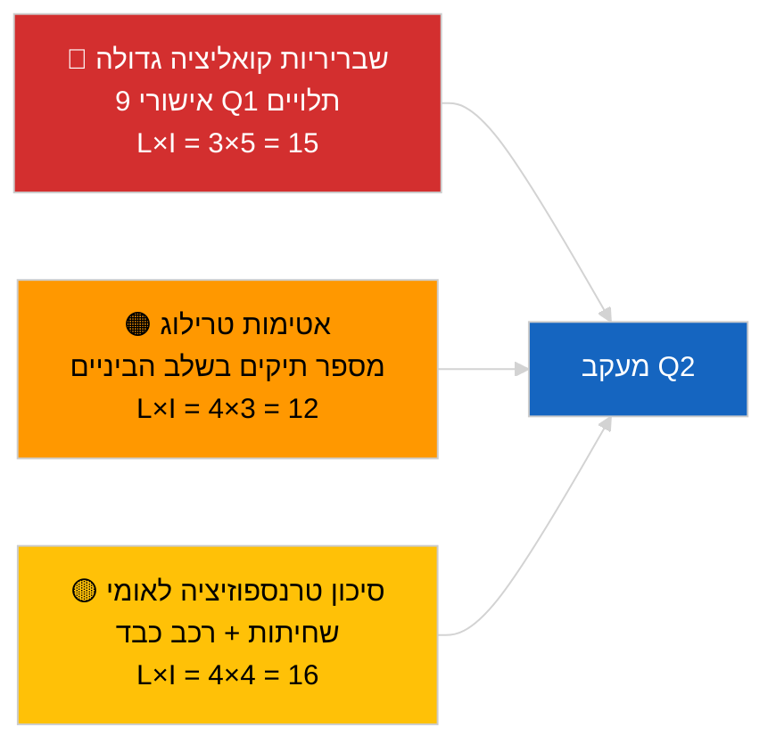

<!-- SPDX-FileCopyrightText: 2026 Hack23 AB -->
<!-- SPDX-License-Identifier: Apache-2.0 -->

# סקירת פעילות — צינור חקיקה רבעון ראשון (חדשות אחרונות) | 2026-04-04

**סיווג:** OSINT | רשומות פרלמנטריות ציבוריות
**רמת ביטחון:** 🟡 בינונית (ניתוח רטרוספקטיבי של צינור הרבעון הראשון במצב API מדורדר)
**נוצר:** 2026-04-04T00:00:00Z (דוח רטרוספקטיבי)
**סוג המאמר:** חדשות אחרונות — ניתוח צינור חקיקה רבעון ראשון 2026 של EP10
**מקור:** פורטל נתונים פתוח של הפרלמנט האירופי

---

## 🎯 BLUF

**הרבעון הראשון של שנת 2026 ב-EP10 הניב צינור חקיקתי פרודוקטיבי במידה ניכרת, למרות השבריריות המבנית שמפגינה אריתמטיקת קואליציית PPE הדומיננטית.** אשכול ה-Q1 העיקרי מעוגן בשלושה בלוקים של מושבים מליאה — ינואר 2026 (שטרסבורג), פברואר 2026 (שטרסבורג + מיני-מליאה בבריסל) ומרץ 2026 (שטרסבורג 9–12 + מיני-בריסל 25–26) — והניב את הנחיית מאבק השחיתות (TA-10-2026-0094), מינוי סגן נשיא ה-ECB (TA-10-2026-0060), מסגרת זיכויי פליטות רכב כבד (TA-10-2026-0084), ההתאמה למכסים האמריקאיים (TA-10-2026-0096), דוח חקיקה טובה יותר (TA-10-2026-0063), סקירת הגישה הציבורית למסמכים (TA-10-2026-0065), החלטת גאורגיה בדבר אסירים פוליטיים (TA-10-2026-0083), הפניית מרקוסור לבית הדין האירופי (TA-10-2026-0008) וביטול חסינות בראון (TA-10-2026-0088). מדד בריאות הצינור הוא **מתון** — שיעורי אישור גבוהים, אך תלות חזקה בקונסנזוס הקואליציה הגדולה מעידה על שבריריות בתיקי שלטון החוק והסחר. **🟡 ביטחון בינוני** לציון הכמותי של הצינור (מצב זרם מדורדר מגביל את האימות העצמאי).

---

## 🧭 3 Decisions This Brief Supports

| # | החלטה | מי מחליט | מועד אחרון | ראיה |
|:-:|-------|----------|:----------:|------|
| 1 | **מערכתי:** פרסום הרטרוספקטיבה של צינור Q1 כעוגן לסקירה החודשית הבאה | עורך ראשי | +48 שעות | מלאי Q1 מקיף |
| 2 | **מעקב:** הוספת קבצי אשכול Q1 ללוח מעקב הטרילוגים/טרנספוזיציה | אנליסט | שבועי | סיכוני יישום |
| 3 | **הסתכלות קדימה:** כיול צינור Q2 לאחר מליאת שטרסבורג 27–30 באפריל | הנהלת ניתוח | 2026-05-01 | מעבר Q1 → Q2 |

---

## 📰 60-Second Read

- 🔴 **טקסטים עוגן Q1 (9 ערכים בעלי חשיבות גבוהה)** — מאבק שחיתות, סגן נשיא ECB, פליטות כבד, מכסים אמריקאיים, חקיקה טובה יותר, גישה ציבורית, גאורגיה, מרקוסור, בראון. (🟢 גבוה עבור אישורים)
- 🟠 **בריאות צינור מתונה** — מספרים גבוהים מסתירים תלות בקואליציה הגדולה; תיקי שלטון חוק וסחר חשופים ביותר ללחץ פנימי של PPE. (🟡 בינוני)
- 🟢 **שלושה בלוקי מליאה** הניעו את ייצור Q1: ינואר / פברואר / מרץ (סה"כ 10 ימי מליאה). (🟢 גבוה)
- 🟡 **שלב הטרילוג** אינו ניתן לתצפית עבור מספר תיקי Q1 בשל אטימות בין-מוסדית. (🟡 בינוני)
- 🔵 **הקשר כלכלי:** אישור ECB + מכסים אמריקאיים + פליטות כבד יוצרים נרטיב תעשייתי-כלכלי Q1 קוהרנטי. (🟢 גבוה)
- 🟣 **הפניה צולבת:** סשיות אחיות `breaking` (קואליציה), `breaking-3` (ניתוח הפסקה), `breaking-4` (ניתוח עמוק של טקסטים מאושרים). (🟢 גבוה)
- 🩷 **וקטור שיבוש:** חוות דעת בית הדין האירופי על מרקוסור עלולה לפתוח מחדש את תיק הסחר Q1 באמצע Q2. (🟡 בינוני)
- ⚪ **המשכיות:** חלוני הטרנספוזיציה למאבק שחיתות ופליטות מתארכים עד Q1 2028.

---

## 🗂️ Top Q1 Adopted Texts

| דירוג | מזהה PE | כותרת (קצרה) | מליאה | חשיבות |
|:-----:|---------|--------------|-------|:-------:|
| 1 | TA-10-2026-0094 | הנחיית מאבק שחיתות | מרץ | 9.0 |
| 2 | TA-10-2026-0060 | סגן נשיא ECB | מרץ | 8.0 |
| 3 | TA-10-2026-0096 | מכסי ייבוא אמריקאיים | מרץ | 7.5 |
| 4 | TA-10-2026-0084 | זיכויי פליטות רכב כבד | מרץ | 7.0 |
| 5 | TA-10-2026-0083 | אסירים פוליטיים גאורגיים | מרץ | 7.0 |
| 6 | TA-10-2026-0088 | ביטול חסינות בראון | מרץ | 7.0 |
| 7 | TA-10-2026-0063 | דוח חקיקה טובה יותר | מרץ | 7.0 |
| 8 | TA-10-2026-0065 | גישה ציבורית למסמכים | מרץ | 7.0 |
| 9 | TA-10-2026-0008 | הפניית מרקוסור לבית הדין | ינואר | 7.0 |

---

## ⚠️ Risk & Threat Snapshot

| סיכון | L | I | ציון | מפעיל | מקור | אדמירליות |
|-------|:-:|:-:|:----:|--------|------|:---------:|
| שבריריות קואליציה גדולה | 3 | 5 | 15 | פיצול פנימי PPE על שלטון חוק או סחר | אריתמטיקת קואליציה | A2 |
| אטימות טרילוג | 4 | 3 | 12 | המועצה מתמהמהת | קצב בין-מוסדי | A2 |
| פיצול טרנספוזיציה לאומי | 4 | 4 | 16 | פיזור מדינות חברות | TA-10-2026-0094, TA-10-2026-0084 | A1 |
| הלם חוות דעת ECJ מרקוסור | 3 | 4 | 12 | בית הדין מפרסם | TA-10-2026-0008 | A2 |

---

## 🔮 Top Forward Trigger

**דוח התקדמות טרילוג בסוף Q2.** עמדותיה הראשונות של המועצה על תיקי Q1 שאושרו בפרלמנט יסמנו האם ייצור הקואליציה הגדולה מתורגם לתוצאות בין-מוסדיות או נעצר בשלב הטרילוג.

---

## 🛡️ Source Quality Assessment

- **מקורות ראשוניים:** זרם טקסטים מאושרים Q1 (חזרה לשבוע אחד פעילה במצב מדורדר).
- **מגבלות נתונים:** חוסר זמינות זרם ההליכים מגביל מעקב עצמאי של שלבים.
- **רמת ביטחון:** 🟢 גבוהה עבור מלאי האישורים; 🟡 בינונית לציון בריאות הצינור ברמת השלב.

---

## 📎 Links

| קישור | נתיב |
|-------|------|
| מאמר | `./article.md` |
| סשיות אחיות | `analysis/daily/2026-04-04/breaking/`, `breaking-3/`, `breaking-4/`, `week-in-review/` |
| מניפסט | `./manifest.json` |

---

**בקרת מסמך**
- **תבנית:** `/analysis/templates/executive-brief.md`
- **נתיב היצירה:** `analysis/daily/2026-04-04/breaking-2/executive-brief.md`
- **סיווג:** ציבורי
- **יצירה רטרוספקטיבית:** סשיית מילוי לאחור.
