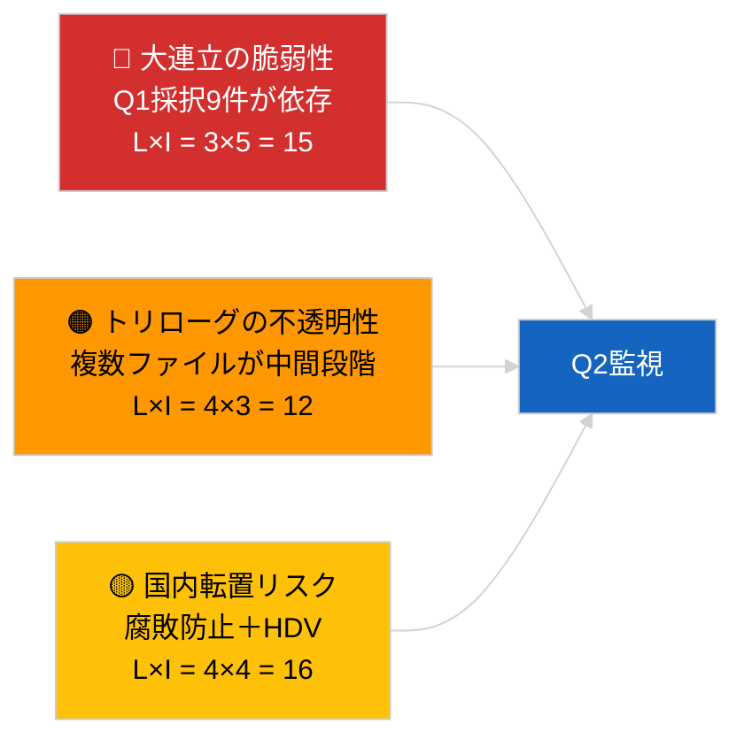

<!-- SPDX-FileCopyrightText: 2026 Hack23 AB -->
<!-- SPDX-License-Identifier: Apache-2.0 -->

# 活動概要 — 第1四半期立法パイプライン（速報ニュース）| 2026-04-04

**分類：** OSINT｜公開議会記録
**信頼度：** 🟡 中（API低下状態における第1四半期遡及パイプライン分析）
**生成日：** 2026-04-04T00:00:00Z（遡及レポート）
**記事タイプ：** 速報ニュース — EP10 2026年第1四半期立法パイプライン分析
**出典：** 欧州議会オープンデータポータル

---

## 🎯 BLUF

**EP10の2026年第1四半期は、支配的なPPE連立の計算が示す構造的脆弱性にもかかわらず、実質的に生産性の高い立法パイプラインを実現した。** Q1ハイライトクラスターは3つの本会議ブロックに集約されている：2026年1月（ストラスブール）、2026年2月（ストラスブール＋ブリュッセルミニ）、2026年3月（ストラスブール3月9〜12日＋ブリュッセルミニ3月25〜26日）。これらの会議で、腐敗防止指令（TA-10-2026-0094）、ECB副総裁任命（TA-10-2026-0060）、HDV排出クレジット枠組み（TA-10-2026-0084）、米国関税調整（TA-10-2026-0096）、法令改善報告書（TA-10-2026-0063）、文書へのパブリックアクセス見直し（TA-10-2026-0065）、ジョージア政治犯決議（TA-10-2026-0083）、メルコスールECJ付託（TA-10-2026-0008）、ブラウン免責解除（TA-10-2026-0088）が採択された。パイプライン健全性指数は**普通**——採択数は高いが大連立コンセンサスへの強い依存が法の支配・貿易ファイルの脆弱性を示す。定量的パイプラインスコアの**🟡 中程度の信頼度**（低下したフィード状態が独立的な確認を制限）。

---

## 🧭 3 Decisions This Brief Supports

| # | 決定事項 | 決定者 | 期限 | 根拠 |
|:-:|----------|--------|:----:|------|
| 1 | **編集：** Q1パイプライン振り返りを次の月次レビューのアンカーとして公開 | 編集長 | +48時間 | 包括的Q1インベントリ |
| 2 | **モニタリング：** Q1クラスターファイルをトリローグ/転置監視ダッシュボードに追加 | アナリスト | 毎週 | 実施リスク |
| 3 | **先見：** 4月27〜30日ストラスブール本会議後のQ2パイプライン較正 | 分析管理 | 2026-05-01 | Q1→Q2移行 |

---

## 📰 60-Second Read

- 🔴 **Q1アンカーテキスト（重要度の高い9件）** — 腐敗防止、ECB副総裁、HDV排出、米国関税、法令改善、公開アクセス、ジョージア、メルコスール、ブラウン。（🟢 採択に対して高）
- 🟠 **パイプライン健全性：普通** — 高い数値は大連立依存を隠す；法の支配・貿易ファイルがPPE内部圧力に最も脆弱。（🟡 中）
- 🟢 **3つの本会議ブロック**がQ1生産を牽引：1月/2月/3月（計10本会議日）。（🟢 高）
- 🟡 **トリローグ段階**は機関間不透明性のため複数のQ1ファイルで観察不能。（🟡 中）
- 🔵 **経済的文脈：** ECB確認＋米国関税＋HDV排出が一貫した産業経済的Q1ナラティブを形成。（🟢 高）
- 🟣 **クロスリファレンス：** 姉妹セッション`breaking`（連立）、`breaking-3`（休会分析）、`breaking-4`（採択テキスト詳細）。（🟢 高）
- 🩷 **混乱ベクター：** メルコスールECJ意見がQ2中盤にQ1貿易ファイルを再開する可能性。（🟡 中）
- ⚪ **継続：** 腐敗防止とHDV排出の転置ウィンドウはQ1 2028まで延長。

---

## 🗂️ Top Q1 Adopted Texts

| 順位 | EP参照番号 | タイトル（短縮） | 本会議 | 重要度 |
|:----:|-----------|----------------|--------|:------:|
| 1 | TA-10-2026-0094 | 腐敗防止指令 | 3月 | 9.0 |
| 2 | TA-10-2026-0060 | ECB副総裁 | 3月 | 8.0 |
| 3 | TA-10-2026-0096 | 米国輸入関税 | 3月 | 7.5 |
| 4 | TA-10-2026-0084 | HDV排出クレジット | 3月 | 7.0 |
| 5 | TA-10-2026-0083 | ジョージア政治犯 | 3月 | 7.0 |
| 6 | TA-10-2026-0088 | ブラウン免責解除 | 3月 | 7.0 |
| 7 | TA-10-2026-0063 | 法令改善報告書 | 3月 | 7.0 |
| 8 | TA-10-2026-0065 | 文書への公開アクセス | 3月 | 7.0 |
| 9 | TA-10-2026-0008 | メルコスールECJ付託 | 1月 | 7.0 |

---

## ⚠️ Risk & Threat Snapshot

| リスク | L | I | スコア | トリガー | 出典 | 信頼性 |
|--------|:-:|:-:|:------:|---------|------|:------:|
| 大連立の脆弱性 | 3 | 5 | 15 | 法の支配または貿易でPPE内部分裂 | 連立計算 | A2 |
| トリローグの不透明性 | 4 | 3 | 12 | 理事会が遅延 | 機関間テンポ | A2 |
| 国内転置の断片化 | 4 | 4 | 16 | 加盟国乖離 | TA-10-2026-0094, TA-10-2026-0084 | A1 |
| メルコスールECJ意見ショック | 3 | 4 | 12 | 裁判所が公表 | TA-10-2026-0008 | A2 |

---

## 🔮 Top Forward Trigger

**Q2末のトリローグ進捗報告。** Q1に採択されたEPファイルに関する理事会の最初の立場が、大連立の生産物が機関間の成果に転換するか、トリローグ段階で止まるかを示す。

---

## 🛡️ Source Quality Assessment

- **一次資料：** Q1採択テキストフィード（低下状態下で1週間遡及アクティブ）。
- **データ制約：** 手続きフィードの利用不能により独立した段階追跡が制限。
- **信頼度：** 🟢 採択インベントリに対して高；🟡 段階レベルのパイプライン健全性スコアに対して中。

---

## 📎 Links

| リンク | パス |
|--------|------|
| 記事 | `./article.md` |
| 姉妹セッション | `analysis/daily/2026-04-04/breaking/`, `breaking-3/`, `breaking-4/`, `week-in-review/` |
| マニフェスト | `./manifest.json` |

---

**文書管理**
- **テンプレート：** `/analysis/templates/executive-brief.md`
- **アーティファクトパス：** `analysis/daily/2026-04-04/breaking-2/executive-brief.md`
- **分類：** 公開
- **遡及生成：** バックフィルセッション。
