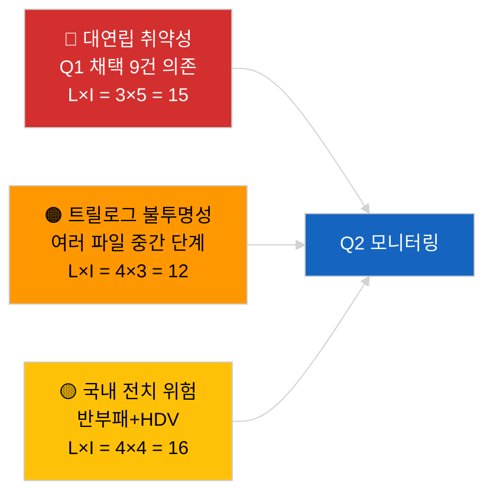

<!-- SPDX-FileCopyrightText: 2026 Hack23 AB -->
<!-- SPDX-License-Identifier: Apache-2.0 -->

# 활동 개요 — 1분기 입법 파이프라인 (속보) | 2026-04-04

**분류:** OSINT | 공개 의회 기록
**신뢰도:** 🟡 중간 (저하된 API 상태에서의 1분기 소급 파이프라인 분석)
**생성:** 2026-04-04T00:00:00Z (소급 보고서)
**기사 유형:** 속보 — EP10 2026년 1분기 입법 파이프라인 분석
**출처:** 유럽의회 공개 데이터 포털

---

## 🎯 BLUF

**EP10의 2026년 1분기는 지배적인 PPE 연립의 산술이 보여주는 구조적 취약성에도 불구하고 실질적으로 생산적인 입법 파이프라인을 이뤄냈다.** Q1 주요 사항 클러스터는 세 개의 본회의 블록에 집중되어 있다: 2026년 1월(스트라스부르), 2026년 2월(스트라스부르+브뤼셀 미니 본회의), 2026년 3월(스트라스부르 3월 9~12일+브뤼셀 미니 3월 25~26일). 이 회기에서 반부패 지침(TA-10-2026-0094), ECB 부총재 임명(TA-10-2026-0060), HDV 배출 크레딧 프레임워크(TA-10-2026-0084), 미국 관세 조정(TA-10-2026-0096), 더 나은 규제 보고서(TA-10-2026-0063), 공문서 공개 접근 검토(TA-10-2026-0065), 조지아 정치범 결의(TA-10-2026-0083), 메르코수르 ECJ 회부(TA-10-2026-0008), 브라운 면책 해제(TA-10-2026-0088)가 도출되었다. 파이프라인 건전성 지수는 **보통** — 높은 채택 수치이지만 대연립 합의에 대한 강한 의존성은 법치와 무역 파일의 취약성을 나타낸다. 정량적 파이프라인 점수에 대한 **🟡 중간 신뢰도** (저하된 피드 상태로 독립적 검증 제한).

---

## 🧭 3 Decisions This Brief Supports

| # | 결정 사항 | 결정자 | 기한 | 근거 |
|:-:|----------|--------|:----:|------|
| 1 | **편집:** Q1 파이프라인 회고록을 다음 월간 검토의 앵커로 게시 | 편집장 | +48시간 | 포괄적 Q1 인벤토리 |
| 2 | **모니터링:** Q1 클러스터 파일을 트릴로그/전치 모니터링 대시보드에 추가 | 분석가 | 매주 | 이행 위험 |
| 3 | **전망:** 4월 27~30일 스트라스부르 본회의 후 Q2 파이프라인 보정 | 분석 관리 | 2026-05-01 | Q1→Q2 전환 |

---

## 📰 60-Second Read

- 🔴 **Q1 앵커 텍스트 (중요도 높은 9건)** — 반부패, ECB 부총재, HDV 배출, 미국 관세, 더 나은 규제, 공개 접근, 조지아, 메르코수르, 브라운. (🟢 채택에 대해 높음)
- 🟠 **파이프라인 건전성 보통** — 높은 수치는 대연립 의존성을 숨긴다; 법치·무역 파일이 PPE 내부 압력에 가장 취약. (🟡 중간)
- 🟢 **세 개의 본회의 블록**이 Q1 생산을 이끌었다: 1월/2월/3월 (총 10 본회의일). (🟢 높음)
- 🟡 **트릴로그 단계**는 기관간 불투명성으로 인해 여러 Q1 파일에서 관찰 불가. (🟡 중간)
- 🔵 **경제적 맥락:** ECB 확인+미국 관세+HDV 배출이 일관된 산업-경제적 Q1 서사를 형성. (🟢 높음)
- 🟣 **교차 참조:** 자매 세션 `breaking` (연립), `breaking-3` (휴회 분석), `breaking-4` (채택 텍스트 심층 분석). (🟢 높음)
- 🩷 **혼란 벡터:** 메르코수르 ECJ 의견이 Q2 중반 Q1 무역 파일을 재개할 수 있다. (🟡 중간)
- ⚪ **지속성:** 반부패와 HDV 배출의 전치 창구는 Q1 2028까지 연장.

---

## 🗂️ Top Q1 Adopted Texts

| 순위 | EP 참조 | 제목 (약식) | 본회의 | 중요도 |
|:----:|--------|-----------|--------|:------:|
| 1 | TA-10-2026-0094 | 반부패 지침 | 3월 | 9.0 |
| 2 | TA-10-2026-0060 | ECB 부총재 | 3월 | 8.0 |
| 3 | TA-10-2026-0096 | 미국 수입관세 | 3월 | 7.5 |
| 4 | TA-10-2026-0084 | HDV 배출 크레딧 | 3월 | 7.0 |
| 5 | TA-10-2026-0083 | 조지아 정치범 | 3월 | 7.0 |
| 6 | TA-10-2026-0088 | 브라운 면책 해제 | 3월 | 7.0 |
| 7 | TA-10-2026-0063 | 더 나은 규제 보고서 | 3월 | 7.0 |
| 8 | TA-10-2026-0065 | 공문서 공개 접근 | 3월 | 7.0 |
| 9 | TA-10-2026-0008 | 메르코수르 ECJ 회부 | 1월 | 7.0 |

---

## ⚠️ Risk & Threat Snapshot

| 위험 | L | I | 점수 | 트리거 | 출처 | 신뢰성 |
|------|:-:|:-:|:----:|--------|------|:------:|
| 대연립 취약성 | 3 | 5 | 15 | 법치 또는 무역에서 PPE 내부 분열 | 연립 산술 | A2 |
| 트릴로그 불투명성 | 4 | 3 | 12 | 이사회 지연 | 기관간 속도 | A2 |
| 국내 전치 단편화 | 4 | 4 | 16 | 회원국 이탈 | TA-10-2026-0094, TA-10-2026-0084 | A1 |
| 메르코수르 ECJ 의견 충격 | 3 | 4 | 12 | 법원 발표 | TA-10-2026-0008 | A2 |

---

## 🔮 Top Forward Trigger

**Q2 말 트릴로그 진행 보고서.** Q1에 채택된 EP 파일에 대한 이사회의 첫 번째 입장은 대연립 생산물이 기관간 결과로 전환되는지, 아니면 트릴로그 단계에서 중단되는지를 나타낼 것이다.

---

## 🛡️ Source Quality Assessment

- **일차 자료:** Q1 채택 텍스트 피드 (저하 상태에서 1주 소급 활성).
- **데이터 제한:** 절차 피드 이용 불가로 독립적 단계 추적 제한.
- **신뢰도:** 🟢 채택 인벤토리에 대해 높음; 🟡 단계 수준 파이프라인 건전성 점수에 대해 중간.

---

## 📎 Links

| 링크 | 경로 |
|------|------|
| 기사 | `./article.md` |
| 자매 세션 | `analysis/daily/2026-04-04/breaking/`, `breaking-3/`, `breaking-4/`, `week-in-review/` |
| 매니페스트 | `./manifest.json` |

---

**문서 관리**
- **템플릿:** `/analysis/templates/executive-brief.md`
- **아티팩트 경로:** `analysis/daily/2026-04-04/breaking-2/executive-brief.md`
- **분류:** 공개
- **소급 생성:** 백필 세션.
