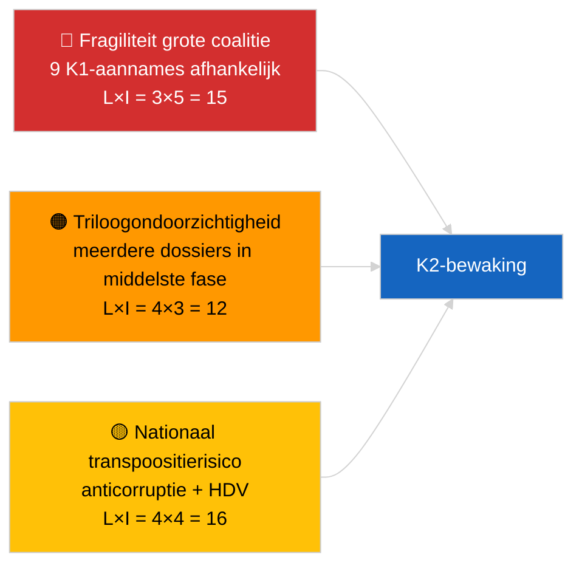

<!-- SPDX-FileCopyrightText: 2026 Hack23 AB -->
<!-- SPDX-License-Identifier: Apache-2.0 -->

# Activiteitenoverzicht — Wetgevingspijplijn K1 (Laatste nieuws) | 2026-04-04

**Classificatie:** OSINT | Openbaar parlementair archief
**Vertrouwen:** 🟡 Gemiddeld (K1-retrospectieve pijplijnanalyse in GEDEGRADEERDE API-toestand)
**Gegenereerd:** 2026-04-04T00:00:00Z (retrospectief rapport)
**Artikeltype:** Laatste nieuws — EP10 K1 2026 Wetgevingspijplijnanalyse
**Bron:** Open dataportaal van het Europees Parlement

---

## 🎯 BLUF

**Het eerste kwartaal 2026 van EP10 leverde een substantieel productieve wetgevingspijplijn ondanks de structurele fragiliteit die de rekensom van de dominante PPE-coalitie laat zien.** De K1-hoogtepuntencluster is verankerd in drie plenaire vergaderblokken — januari 2026 (Straatsburg), februari 2026 (Straatsburg + Brussel-minivergadering) en maart 2026 (Straatsburg 9–12 + Brussel-mini 25–26) — en leverde de anticorruptierichtlijn (TA-10-2026-0094), de benoeming van de ECB-vicevoorzitter (TA-10-2026-0060), het HDV-emissiekredietraamwerk (TA-10-2026-0084), de aanpassing van Amerikaanse tarieven (TA-10-2026-0096), het rapport Betere regelgeving (TA-10-2026-0063), de herziening van de openbare toegang tot documenten (TA-10-2026-0065), de Georgië-resolutie over politieke gevangenen (TA-10-2026-0083), de Mercosur HvJ-verwijzing (TA-10-2026-0008) en de opheffing van Brauns immuniteit (TA-10-2026-0088). De gezondheidsscore van de pijplijn staat op **MATIG** — hoog aantal aangenomen teksten, maar sterke afhankelijkheid van consensus van de grote coalitie duidt op fragiliteit bij rechtsstaat- en handelsdossiers. **🟡 GEMIDDELD vertrouwen** voor de kwantitatieve pijplijnscore (GEDEGRADEERDE feedtoestand beperkt onafhankelijke verificatie).

---

## 🧭 3 Decisions This Brief Supports

| # | Beslissing | Wie beslist | Deadline | Bewijs |
|:-:|------------|------------|:--------:|--------|
| 1 | **Redactioneel:** K1-pijplijnretrospectief publiceren als ankerpunt voor de volgende maandoverzicht | Redacteur | +48u | Uitgebreid K1-inventaris |
| 2 | **Monitoring:** K1-clusterdossiers toevoegen aan het trilogues-/transpositiebewakingsdashboard | Analist | Wekelijks | Implementatierisico |
| 3 | **Vooruitkijkend:** K2-pijplijnkalibrering na de Straatsburg-plenaire vergadering van 27–30 april | Analyseleidingt | 2026-05-01 | K1 → K2-overgang |

---

## 📰 60-Second Read

- 🔴 **K1-ankerteksten (9 vermeldingen met hoge significantie)** — anticorruptie, ECB-vicevoorzitter, HDV-emissies, VS-tarieven, Betere regelgeving, openbare toegang, Georgië, Mercosur, Braun. (🟢 Hoog voor aangenomen teksten)
- 🟠 **Pijplijnstatus MATIG** — hoge aantallen verbergen afhankelijkheid van grote coalitie; rechtsstaat- en handelsdossiers het meest blootgesteld aan PPE-interne druk. (🟡 Gemiddeld)
- 🟢 **Drie plenaire blokken** dreven de K1-productie: januari / februari / maart (totaal 10 plenaire dagen). (🟢 Hoog)
- 🟡 **Triloogfase** niet-observeerbaar voor meerdere K1-dossiers vanwege interinstitutionele ondoorzichtigheid. (🟡 Gemiddeld)
- 🔵 **Economische context:** ECB-bevestiging + VS-tarieven + HDV-emissies creëren een coherent industrieel-economisch K1-verhaal. (🟢 Hoog)
- 🟣 **Kruisreferentie:** zustersessies `breaking` (coalitie), `breaking-3` (recessieanalyse), `breaking-4` (diepgaande analyse aangenomen teksten). (🟢 Hoog)
- 🩷 **Verstoringsvector:** Mercosur HvJ-advies kan K1-handelsdossier halverwege K2 heropenen. (🟡 Gemiddeld)
- ⚪ **Doorlooptijd:** transposiçãovensters voor anticorruptie en HDV-emissies strekken zich uit tot K1 2028.

---

## 🗂️ Top Q1 Adopted Texts

| Rang | EP-referentie | Titel (kort) | Plenaire | Significantie |
|:----:|--------------|-------------|----------|:-------------:|
| 1 | TA-10-2026-0094 | Anticorruptierichtlijn | Maart | 9,0 |
| 2 | TA-10-2026-0060 | ECB-vicevoorzitter | Maart | 8,0 |
| 3 | TA-10-2026-0096 | VS-importtarieven | Maart | 7,5 |
| 4 | TA-10-2026-0084 | HDV-emissiekredieten | Maart | 7,0 |
| 5 | TA-10-2026-0083 | Georgische politieke gevangenen | Maart | 7,0 |
| 6 | TA-10-2026-0088 | Opheffing immuniteit Braun | Maart | 7,0 |
| 7 | TA-10-2026-0063 | Rapport Betere regelgeving | Maart | 7,0 |
| 8 | TA-10-2026-0065 | Openbare toegang tot documenten | Maart | 7,0 |
| 9 | TA-10-2026-0008 | Mercosur HvJ-verwijzing | Januari | 7,0 |

---

## ⚠️ Risk & Threat Snapshot

| Risico | L | I | Score | Trigger | Bron | Admiraliteit |
|--------|:-:|:-:|:-----:|---------|------|:------------:|
| Fragiliteit grote coalitie | 3 | 5 | 15 | PPE-interne breuk over RoL of handel | Coalitie-aritmetica | A2 |
| Triloogondoorzichtigheid | 4 | 3 | 12 | Raad traineert | Interinstitutioneel ritme | A2 |
| Nationale transpositiefragmentatie | 4 | 4 | 16 | Lidstaatdivergentie | TA-10-2026-0094, TA-10-2026-0084 | A1 |
| Mercosur HvJ-advies schok | 3 | 4 | 12 | Hof publiceert | TA-10-2026-0008 | A2 |

---

## 🔮 Top Forward Trigger

**Rapport over triloogvoortgang eind K2.** De eerste standpunten van de Raad over K1-aangenomen EP-dossiers zullen signaleren of de productie van de grote coalitie wordt omgezet in interinstitutionele resultaten of stagneert in de triloogfase.

---

## 🛡️ Source Quality Assessment

- **Primaire bronnen:** K1-feed voor aangenomen teksten (terugval van één week actief in GEDEGRADEERDE toestand).
- **Databeperkingen:** Niet-beschikbaarheid van de proceduresfeed beperkt onafhankelijke fasebewaking.
- **Vertrouwen:** 🟢 HOOG voor het aanname-inventaris; 🟡 GEMIDDELD voor fase-niveau pijplijngezondheidsscore.

---

## 📎 Links

| Link | Pad |
|------|-----|
| Artikel | `./article.md` |
| Zustersessies | `analysis/daily/2026-04-04/breaking/`, `breaking-3/`, `breaking-4/`, `week-in-review/` |
| Manifest | `./manifest.json` |

---

**Documentbeheer**
- **Sjabloon:** `/analysis/templates/executive-brief.md`
- **Artefactpad:** `analysis/daily/2026-04-04/breaking-2/executive-brief.md`
- **Classificatie:** Openbaar
- **Retrospectieve generatie:** Backfill-sessie.
