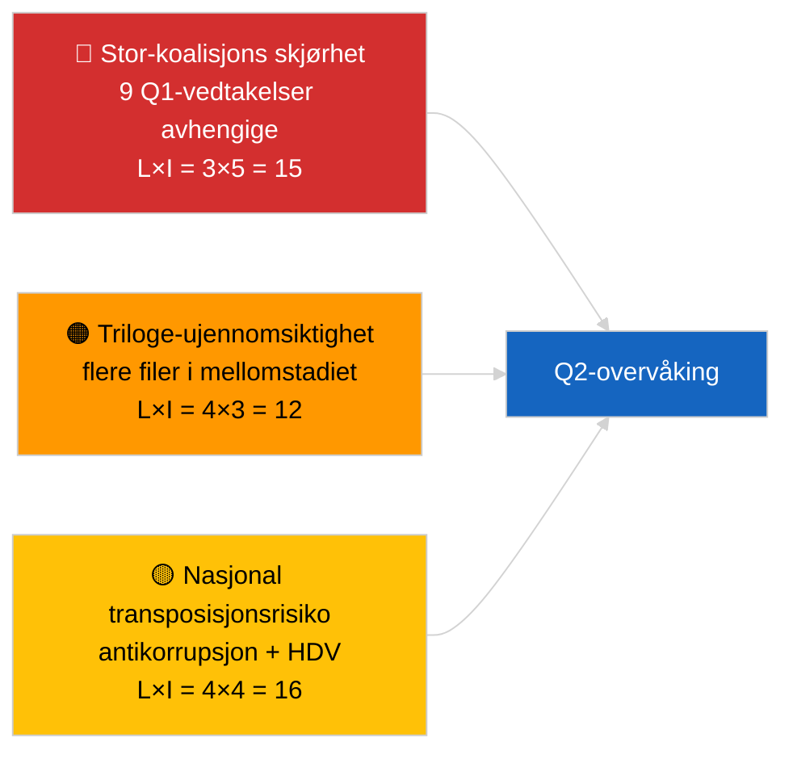

<!-- SPDX-FileCopyrightText: 2026 Hack23 AB -->
<!-- SPDX-License-Identifier: Apache-2.0 -->

# Aktivitetsoversikt — Lovgivningspipeline Q1 (Siste nytt) | 2026-04-04

**Klassifisering:** OSINT | Offentlig parlamentarisk arkiv
**Konfidens:** 🟡 Middels (Q1-retrospektiv pipeline-analyse under DEGRADERT API-tilstand)
**Generert:** 2026-04-04T00:00:00Z (retrospektiv rapport)
**Artikkeltype:** Siste nytt — EP10 Q1 2026 Lovgivningspipeline-analyse
**Kilde:** Europaparlamentets åpne dataportal

---

## 🎯 BLUF

**EP10's første kvartal i 2026 leverte en substansielt produktiv lovgivningspipeline til tross for den strukturelle skjørheten i den dominerende PPE-koalisjonens aritmetikk.** Q1-høydepunktsklyngen er forankret i tre plenarblokker — januar 2026 (Strasbourg), februar 2026 (Strasbourg + Brussel mini), og mars 2026 (Strasbourg 9–12 + Brussel mini 25–26) — og ga antikorrupsjonsdirektivet (TA-10-2026-0094), ECBs visepresidentutnevnelse (TA-10-2026-0060), HDV-utslippsrammeverket (TA-10-2026-0084), den amerikanske tolltilpasningen (TA-10-2026-0096), rapporten Bedre lovgivning (TA-10-2026-0063), gjennomgangen av offentlig tilgang til dokumenter (TA-10-2026-0065), Georgia-resolusjonen om politiske fanger (TA-10-2026-0083), Mercosur ECJ-remissen (TA-10-2026-0008) og Braun-immunitetsopphevingen (TA-10-2026-0088). Pipeline-helseindeksen er **MODERAT** — høyt antall vedtakelser, men sterk avhengighet av stor-koalisjonskonsenus indikerer skjørhet i rettsstat- og handelsfiler. **🟡 MEDIUM konfidens** for den kvantitative pipeline-poengsummen (DEGRADERT flødstilstand begrenser uavhengig korroborasjon).

---

## 🧭 3 Decisions This Brief Supports

| # | Beslutning | Hvem beslutter | Frist | Bevis |
|:-:|------------|----------------|:-----:|-------|
| 1 | **Redaksjonelt:** publiser Q1-pipeline-retrospektiv som ankeret i neste månedsoversikt | Redaktør | +48t | Helhetlig Q1-inventar |
| 2 | **Overvåking:** legg til Q1-klusterfiler på trilogue-/transposisjonsbevakningstavlen | Analytiker | Ukentlig | Gjennomføringsrisiko |
| 3 | **Framoverskuende:** Q2-pipeline-kalibrering etter Strasbourg-plenaret 27–30 april | Analyseledelse | 2026-05-01 | Q1 → Q2-overgang |

---

## 📰 60-Second Read

- 🔴 **Q1-ankertekster (9 elementer med høy signifikans)** — antikorrupsjon, ECB-visepresident, HDV-utslipp, US-toll, Bedre lovgivning, offentlig tilgang, Georgia, Mercosur, Braun. (🟢 Høy for vedtakelser)
- 🟠 **Pipeline-helse MODERAT** — høyt antall skjuler stor-koalisjonsavhengighet; rettsstat- og handelsfiler mest eksponert for PPE-internt press. (🟡 Middels)
- 🟢 **Tre plenarblokker** drev Q1-produksjonen: januar / februar / mars (10 plenardager totalt). (🟢 Høy)
- 🟡 **Trilogestadiet** ikke-observerbart for flere Q1-filer pga. interinstitusjonell ujennomsiktighet. (🟡 Middels)
- 🔵 **Økonomisk kontekst:** ECB-bekreftelse + US-toll + HDV-utslipp skaper en sammenhengende industriell-økonomisk Q1-fortelling. (🟢 Høy)
- 🟣 **Kryssreferanse:** søsterserier `breaking` (koalisjon), `breaking-3` (recess-analyse), `breaking-4` (vedtatte tekster dybdedykk). (🟢 Høy)
- 🩷 **Forstyrrelsesvektor:** Mercosur ECJ-uttalelse kan gjenåpne Q1-handelsfilen midtveis i Q2. (🟡 Middels)
- ⚪ **Videreføring:** transposisjonsvinduer for antikorrupsjon og HDV-utslipp strekker seg til Q1 2028.

---

## 🗂️ Top Q1 Adopted Texts

| Rang | EP-referanse | Tittel (kortform) | Plenum | Signifikans |
|:----:|--------------|------------------|--------|:-----------:|
| 1 | TA-10-2026-0094 | Antikorrupsjonsdirektivet | Mars | 9,0 |
| 2 | TA-10-2026-0060 | ECB visepresident | Mars | 8,0 |
| 3 | TA-10-2026-0096 | Amerikansk importtoll | Mars | 7,5 |
| 4 | TA-10-2026-0084 | HDV-utslippskreditter | Mars | 7,0 |
| 5 | TA-10-2026-0083 | Georgias politiske fanger | Mars | 7,0 |
| 6 | TA-10-2026-0088 | Braun immunitetsopphevelse | Mars | 7,0 |
| 7 | TA-10-2026-0063 | Rapport Bedre lovgivning | Mars | 7,0 |
| 8 | TA-10-2026-0065 | Offentlig tilgang til dokumenter | Mars | 7,0 |
| 9 | TA-10-2026-0008 | Mercosur ECJ-remiss | Januar | 7,0 |

---

## ⚠️ Risk & Threat Snapshot

| Risiko | L | I | Poeng | Utløser | Kilde | Admiralitet |
|--------|:-:|:-:|:-----:|---------|-------|:-----------:|
| Stor-koalisjons skjørhet | 3 | 5 | 15 | PPE-intern splittelse om RoL eller handel | Koalisjonsaritmetikk | A2 |
| Triloge-ujennomsiktighet | 4 | 3 | 12 | Rådet trenerer | Interinstitusjonell kadense | A2 |
| Nasjonal transposisjonsfragmentering | 4 | 4 | 16 | Medlemsstatsdivergense | TA-10-2026-0094, TA-10-2026-0084 | A1 |
| Mercosur ECJ-uttalelse sjokk | 3 | 4 | 12 | Domstolen publiserer | TA-10-2026-0008 | A2 |

---

## 🔮 Top Forward Trigger

**Rapport om trilogeframgang i slutten av Q2.** Rådets første posisjoner om Q1-vedtatte EP-filer vil signalere om stor-koalisjonsproduktene omsettes til interinstitusjonelle resultater eller stopper ved trilogen.

---

## 🛡️ Source Quality Assessment

- **Primærkilder:** Q1-feed for vedtatte tekster (én-ukes tilbakefall aktiv under DEGRADERT tilstand).
- **Databegrensninger:** Feed-utilgjengelighet for prosedyrer begrenser uavhengig stadiesporning.
- **Konfidens:** 🟢 HIGH for vedtakelsesregisteret; 🟡 MEDIUM for stadium-nivå pipeline-helsescoring.

---

## 📎 Links

| Lenke | Sti |
|-------|-----|
| Artikkel | `./article.md` |
| Søsterserier | `analysis/daily/2026-04-04/breaking/`, `breaking-3/`, `breaking-4/`, `week-in-review/` |
| Manifest | `./manifest.json` |

---

**Dokumentkontroll**
- **Mal:** `/analysis/templates/executive-brief.md`
- **Artefaktsti:** `analysis/daily/2026-04-04/breaking-2/executive-brief.md`
- **Klassifisering:** Offentlig
- **Retrospektiv generering:** Backfill-sesjon.
