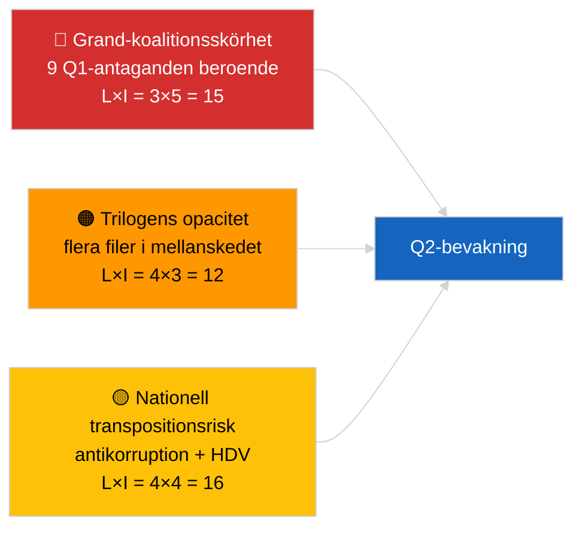

<!-- SPDX-FileCopyrightText: 2026 Hack23 AB -->
<!-- SPDX-License-Identifier: Apache-2.0 -->

# Verksamhetsöversikt — Lagstiftningspipeline Q1 (Brytande) | 2026-04-04

**Klassificering:** OSINT | Offentliga parlamentariska uppgifter
**Konfidens:** 🟡 Medel (Q1-retrospektiv pipelineanalys under DEGRADERAT API-tillstånd)
**Genererad:** 2026-04-04T00:00:00Z (retrospektiv rapport)
**Artikeltyp:** Brytande — EP10 Q1 2026 Lagstiftningspipelineanalys
**Källa:** Europaparlamentets öppna dataportal

---

## 🎯 BLUF

**EP10:s första kvartal 2026 levererade ett substantiellt produktivt lagstiftningspipelineresultat trots den strukturella skörhet som den dominerande PPE-koalitionens aritmetik uppvisar.** Q1-höjdpunkterna ankrar på tre plenarsessioner — januari 2026 (Strasbourg), februari 2026 (Strasbourg + Brysselsmini), och mars 2026 (Strasbourg 9–12 mars + Brysselsmini 25–26 mars) — och gav antikorreptionsdirektivet (TA-10-2026-0094), ECB:s vice-ordförandeförordnande (TA-10-2026-0060), HDV-emissionsramverket (TA-10-2026-0084), den amerikanska tullanpassningen (TA-10-2026-0096), rapporten Bättre lagstiftning (TA-10-2026-0063), granskningen av allmänhetens tillgång till handlingar (TA-10-2026-0065), Georgienresolutionen om politiska fångar (TA-10-2026-0083), Mercosur ECJ-remissen (TA-10-2026-0008) och Brauns immunitetsupphävande (TA-10-2026-0088). Pipeline-hälsovärdet är **MÅTTLIGT** — högt antal antagna texter, men starkt beroende av grand-koalitionskonsensus pekar på skörhet vad gäller rättsstatliga frågor och handelsfiler. **🟡 MEDIUM konfidens** för den kvantitativa pipelinescoringen (DEGRADERAT flödestillstånd begränsar oberoende korroboration).

---

## 🧭 3 Decisions This Brief Supports

| # | Beslut | Vem beslutar | Tidsfrist | Bevis |
|:-:|--------|-------------|:--------:|-------|
| 1 | **Redaktionellt:** publicera Q1-pipelineretrospektiv som ankaret för nästa månadsöversikt | Redaktör | +48h | Heltäckande Q1-inventering |
| 2 | **Övervakning:** lägg till Q1-klusterfiler på trilogue-/transpositionsbevakningstavlan | Analytiker | Veckovis | Genomföranderisk |
| 3 | **Framåtblick:** Q2-pipelinekalibrering efter Strasbourg-plenaret 27–30 april | Analysledning | 2026-05-01 | Q1 → Q2-övergång |

---

## 📰 60-Second Read

- 🔴 **Q1-ankartekster (9 poster med hög signifikans)** — antikorruption, ECB-vice-ordförande, HDV-utsläpp, US-tull, Bättre lagstiftning, offentlig tillgång, Georgien, Mercosur, Braun. (🟢 Hög för antagna)
- 🟠 **Pipeline-hälsa MÅTTLIG** — högt antal döljer grand-koalitionsberoende; rättsstatliga frågor och handelsfiler mest exponerade för PPE-internt tryck. (🟡 Medel)
- 🟢 **Tre plenarblock** drev Q1-produktionen: januari / februari / mars (10 plenadagar totalt). (🟢 Hög)
- 🟡 **Trilogenstadiet** oobservbart för flera Q1-filer p.g.a. interinstitutionell opacitet. (🟡 Medel)
- 🔵 **Ekonomisk kontext:** ECB-bekräftelse + US-tull + HDV-utsläpp skapar en sammanhängande industriell-ekonomisk Q1-berättelse. (🟢 Hög)
- 🟣 **Korsreferens:** syskonfiler `breaking` (koalition), `breaking-3` (recess-analys), `breaking-4` (antagna texter djupdykning). (🟢 Hög)
- 🩷 **Störningsektor:** Mercosur ECJ-yttrande kan öppna Q1-handelsfilen mitt i Q2. (🟡 Medel)
- ⚪ **Vidarebär:** transpositionsfönster för antikorruption och HDV-utsläpp sträcker sig till Q1 2028.

---

## 🗂️ Top Q1 Adopted Texts

| Rang | EP-referens | Titel (kortform) | Plenum | Signifikans |
|:----:|-------------|-----------------|--------|:-----------:|
| 1 | TA-10-2026-0094 | Antikorruptionsdirektivet | Mars | 9,0 |
| 2 | TA-10-2026-0060 | ECB:s vice-ordförande | Mars | 8,0 |
| 3 | TA-10-2026-0096 | Amerikansk importtull | Mars | 7,5 |
| 4 | TA-10-2026-0084 | HDV-emissionskrediter | Mars | 7,0 |
| 5 | TA-10-2026-0083 | Georgiens politiska fångar | Mars | 7,0 |
| 6 | TA-10-2026-0088 | Brauns immunitetsupphävande | Mars | 7,0 |
| 7 | TA-10-2026-0063 | Rapport Bättre lagstiftning | Mars | 7,0 |
| 8 | TA-10-2026-0065 | Allmänhetens tillgång till handlingar | Mars | 7,0 |
| 9 | TA-10-2026-0008 | Mercosur ECJ-remiss | Januari | 7,0 |

---

## ⚠️ Risk & Threat Snapshot

| Risk | L | I | Poäng | Utlösare | Källa | Admiralitet |
|------|:-:|:-:|:-----:|----------|-------|:-----------:|
| Grand-koalitionsskörhet | 3 | 5 | 15 | PPE-intern splittring om RoL eller handel | Koalitionsaritmetik | A2 |
| Trilogens opacitet | 4 | 3 | 12 | Rådet håller igen | Interinstitutionell takt | A2 |
| Nationell transpositionsfragmentering | 4 | 4 | 16 | Medlemsstatsdivergens | TA-10-2026-0094, TA-10-2026-0084 | A1 |
| Mercosur ECJ-yttrande chock | 3 | 4 | 12 | EUD publicerar | TA-10-2026-0008 | A2 |

---

## 🔮 Top Forward Trigger

**Rapport om trilogframsteg i slutet av Q2.** Rådets första ståndpunkter om Q1-antagna EP-filer kommer att signalera om grand-koalitionens produktion översätts till interinstitutionella resultat eller stannar av i trilogskedet.

---

## 🛡️ Source Quality Assessment

- **Primärkällor:** Q1-feed för antagna texter (en-veckas återgång aktiv under DEGRADERAT tillstånd).
- **Databegränsningar:** Bristande tillgänglighet till procedurflödet begränsar oberoende spårning av stadier.
- **Konfidens:** 🟢 HIGH för antagningstinventarien; 🟡 MEDIUM för stadium-nivå pipeline-hälsoscoring.

---

## 📎 Links

| Länk | Sökväg |
|------|--------|
| Artikel | `./article.md` |
| Syskonfiler | `analysis/daily/2026-04-04/breaking/`, `breaking-3/`, `breaking-4/`, `week-in-review/` |
| Manifest | `./manifest.json` |

---

**Dokumentkontroll**
- **Mall:** `/analysis/templates/executive-brief.md`
- **Artefaktsökväg:** `analysis/daily/2026-04-04/breaking-2/executive-brief.md`
- **Klassificering:** Offentlig
- **Retrospektiv generering:** Bakfyllningssession.
