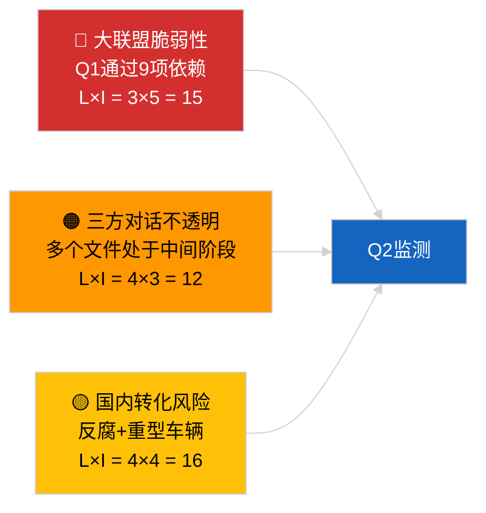

<!-- SPDX-FileCopyrightText: 2026 Hack23 AB -->
<!-- SPDX-License-Identifier: Apache-2.0 -->

# 活动概述 — 第一季度立法管道（突发新闻）| 2026-04-04

**分类：** OSINT｜公开议会档案
**可信度：** 🟡 中等（在API降级状态下进行的第一季度回顾性管道分析）
**生成时间：** 2026-04-04T00:00:00Z（回顾性报告）
**文章类型：** 突发新闻 — EP10 2026年第一季度立法管道分析
**来源：** 欧洲议会开放数据门户

---

## 🎯 BLUF

**EP10的2026年第一季度在占主导地位的PPE联盟算术所显示的结构性脆弱性下，仍实现了实质性的立法管道产出。** Q1亮点集群集中在三个全体会议区块：2026年1月（斯特拉斯堡）、2026年2月（斯特拉斯堡+布鲁塞尔小型全会）和2026年3月（斯特拉斯堡3月9—12日+布鲁塞尔小型全会3月25—26日）。这些会期通过了反腐指令（TA-10-2026-0094）、欧洲央行副行长任命（TA-10-2026-0060）、重型车辆排放积分框架（TA-10-2026-0084）、美国关税调整（TA-10-2026-0096）、更好立法报告（TA-10-2026-0063）、公众获取文件审查（TA-10-2026-0065）、格鲁吉亚政治犯决议（TA-10-2026-0083）、南方共同市场欧盟法院提交（TA-10-2026-0008）和布劳恩豁免解除（TA-10-2026-0088）。管道健康指数为**一般** — 高采纳数量，但对大联盟共识的强烈依赖表明法治与贸易文件存在脆弱性。定量管道评分的**🟡 中等可信度**（降级的信息流状态限制独立核实）。

---

## 🧭 3 Decisions This Brief Supports

| # | 决策事项 | 决策者 | 截止日期 | 依据 |
|:-:|----------|--------|:--------:|------|
| 1 | **编辑：** 将Q1管道回顾报告发布为下一期月度综述的核心内容 | 主编 | +48小时 | 全面的Q1清单 |
| 2 | **监测：** 将Q1集群文件添加至三方对话/国内转化监测仪表板 | 分析师 | 每周 | 实施风险 |
| 3 | **前瞻：** 4月27—30日斯特拉斯堡全体会议后进行Q2管道校准 | 分析管理层 | 2026-05-01 | Q1→Q2过渡 |

---

## 📰 60-Second Read

- 🔴 **Q1锚点文本（9个高重要性条目）** — 反腐、欧洲央行副行长、重型车辆排放、美国关税、更好立法、公开获取、格鲁吉亚、南方共同市场、布劳恩。（🟢 采纳方面为高）
- 🟠 **管道健康状况一般** — 高数字掩盖大联盟依赖性；法治与贸易文件最易受PPE内部压力影响。（🟡 中等）
- 🟢 **三个全体会议区块**推动了Q1产出：1月/2月/3月（共10个全会日）。（🟢 高）
- 🟡 **三方对话阶段**因机构间不透明性而无法对多个Q1文件进行观察。（🟡 中等）
- 🔵 **经济背景：** 欧洲央行确认+美国关税+重型车辆排放形成连贯的Q1工业经济叙事。（🟢 高）
- 🟣 **交叉参考：** 姊妹会期`breaking`（联盟）、`breaking-3`（休会分析）、`breaking-4`（采纳文本深度分析）。（🟢 高）
- 🩷 **干扰向量：** 南方共同市场欧盟法院意见可能在Q2中期重启Q1贸易文件。（🟡 中等）
- ⚪ **延续：** 反腐和重型车辆排放的国内转化窗口延伸至2028年Q1。

---

## 🗂️ Top Q1 Adopted Texts

| 排名 | 欧洲议会参考号 | 标题（简短） | 全体会议 | 重要性 |
|:----:|-------------|------------|----------|:------:|
| 1 | TA-10-2026-0094 | 反腐指令 | 3月 | 9.0 |
| 2 | TA-10-2026-0060 | 欧洲央行副行长 | 3月 | 8.0 |
| 3 | TA-10-2026-0096 | 美国进口关税 | 3月 | 7.5 |
| 4 | TA-10-2026-0084 | 重型车辆排放积分 | 3月 | 7.0 |
| 5 | TA-10-2026-0083 | 格鲁吉亚政治犯 | 3月 | 7.0 |
| 6 | TA-10-2026-0088 | 布劳恩豁免解除 | 3月 | 7.0 |
| 7 | TA-10-2026-0063 | 更好立法报告 | 3月 | 7.0 |
| 8 | TA-10-2026-0065 | 公众获取文件 | 3月 | 7.0 |
| 9 | TA-10-2026-0008 | 南方共同市场欧盟法院提交 | 1月 | 7.0 |

---

## ⚠️ Risk & Threat Snapshot

| 风险 | L | I | 得分 | 触发因素 | 来源 | 可靠性 |
|------|:-:|:-:|:----:|---------|------|:------:|
| 大联盟脆弱性 | 3 | 5 | 15 | PPE在法治或贸易问题上内部分裂 | 联盟算术 | A2 |
| 三方对话不透明 | 4 | 3 | 12 | 理事会拖延 | 机构间节奏 | A2 |
| 国内转化碎片化 | 4 | 4 | 16 | 成员国分歧 | TA-10-2026-0094, TA-10-2026-0084 | A1 |
| 南方共同市场欧盟法院意见冲击 | 3 | 4 | 12 | 法院发布 | TA-10-2026-0008 | A2 |

---

## 🔮 Top Forward Trigger

**Q2末三方对话进展报告。** 理事会对Q1欧洲议会已采纳文件的首批立场将表明大联盟产出是否转化为机构间成果，或在三方对话阶段搁置。

---

## 🛡️ Source Quality Assessment

- **一手资料：** Q1已采纳文本信息流（在降级状态下一周回溯激活）。
- **数据局限：** 程序信息流不可用限制了独立阶段跟踪。
- **可信度：** 🟢 采纳清单方面为高；🟡 阶段层面管道健康评分方面为中等。

---

## 📎 Links

| 链接 | 路径 |
|------|------|
| 文章 | `./article.md` |
| 姊妹会期 | `analysis/daily/2026-04-04/breaking/`, `breaking-3/`, `breaking-4/`, `week-in-review/` |
| 清单 | `./manifest.json` |

---

**文件控制**
- **模板：** `/analysis/templates/executive-brief.md`
- **制品路径：** `analysis/daily/2026-04-04/breaking-2/executive-brief.md`
- **分类：** 公开
- **回顾性生成：** 回填会话。
