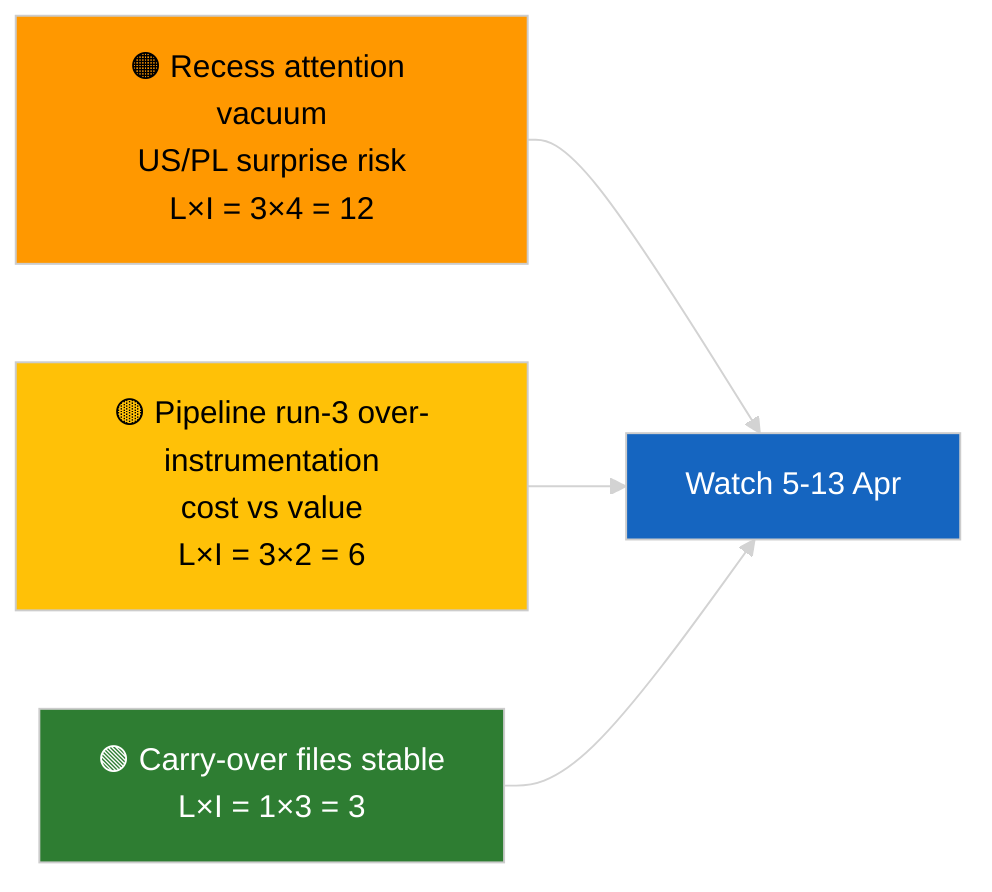

<!-- SPDX-FileCopyrightText: 2026 Hack23 AB -->
<!-- SPDX-License-Identifier: Apache-2.0 -->

# Executive Brief — Breaking (Pre-Recess Analysis Run 3) | 2026-04-04

**Classification:** OSINT | Public Parliamentary Record
**Confidence:** 🟢 High (recess-period analytic update)
**Generated:** 2026-04-04T00:00:00Z (retrospective brief)
**Article Type:** Breaking — Run 3 Enhanced Pre-Recess Analysis
**Source:** European Parliament Open Data Portal

---

## 🎯 BLUF

**No new breaking developments on 2026-04-04; the EP is in Easter recess (27 March → 13 April).** This third run of the day extends prior 2026-04-04 analyses (`breaking` coalition assessment, `breaking-2` Q1 pipeline) by adding full document titles and procedure references for the carry-over Q1 cluster. No new actors, no new procedures, no new adopted texts dated today. The contribution is **provenance enrichment**, not new political signal. **🟢 HIGH confidence** the lack of breaking signal is calendar-driven; **🟢 HIGH confidence** that the provenance additions improve downstream consumer reliability (full procedure IDs traceable).

---

## 🧭 3 Decisions This Brief Supports

| # | Decision | Who Decides | Deadline | Evidence |
|:-:|----------|-------------|:--------:|----------|
| 1 | **Editorial:** SKIP daily; this run is provenance enrichment only | Editor | +12h | No new signal |
| 2 | **Monitoring:** ensure next-cycle runs inherit the full-title / procedure-ID enrichment | Data pipeline | 2026-04-05 | Reduce downstream resolution friction |
| 3 | **Forward-watch:** monitor Easter recess end 13 April | Analysis lead | 2026-04-13 | Recess→committee-week transition |

---

## 📰 60-Second Read

- 🔴 **No new breaking developments** on 2026-04-04. (🟢 High)
- 🟠 **Run-3 enrichment:** full document titles and procedure references appended to carry-over Q1 cluster. (🟢 High)
- 🟢 **Recess continues** (Day 9 of 18); 4 days remain. (🟢 High)
- 🟡 **No data-pipeline regression** today; analytical tools still operational per 2026-04-03/breaking-2 baseline. (🟢 High)
- 🔵 **Economic context:** carry-over US-tariff and ECB Vice-President files remain primary. (🟢 High)
- 🟣 **Cross-reference:** see siblings for substantive coalition / pipeline / adopted-texts analysis. (🟢 High)
- 🩷 **Disruption vector:** none acute today. (🟢 High)
- ⚪ **Carry-forward:** track Polish-judiciary developments and US-EU trade messaging during the remaining recess days.

---

## 🗂️ Top Documents / Procedures Table

| Rank | EP reference | Title (short) | Significance | Confidence | Status |
|:----:|--------------|---------------|:------------:|:----------:|--------|
| 1 | — | No new breaking developments | 0.0 | 🟢 HIGH | Recess Day 9 of 18 |
| 2 | TA-10-2026-0094 | Anti-corruption directive (carry-over, full procedure ID 2023/0135) | 9.0 | 🟢 HIGH | Transposition watch |
| 3 | TA-10-2026-0088 | Braun immunity waiver (procedure 2025/2192) | 7.0 | 🟢 HIGH | LIBE follow-on watch |

---

## ⚠️ Risk & Threat Snapshot

| Risk | L | I | Score | Trigger | Source | Admiralty |
|------|:-:|:-:|:-----:|---------|--------|:---------:|
| Recess attention vacuum | 3 | 4 | 12 | US or PL surprise | EP calendar | A2 |
| Pipeline run-3 cost vs value | 3 | 2 | 6 | Sustained empty enrichment | Run cadence | B3 |

---

## 🔮 Top Forward Trigger

**Easter recess end 13 April 2026 + committee work-week 13-17 April.** First substantive new signal of Q2.

---

## 🛡️ Source Quality Assessment

- **Primary sources:** Q1 adopted-texts inventory (one-week fallback); procedure registry.
- **Confidence:** 🟢 HIGH on enrichment correctness.

---

## 📎 Links

| Link | Path |
|------|------|
| Article | `./article.md` |
| Sibling runs | `analysis/daily/2026-04-04/breaking/`, `breaking-2/`, `breaking-4/`, `week-in-review/` |
| Manifest | `./manifest.json` |

---

**Document Control**
- **Template:** `/analysis/templates/executive-brief.md`
- **Artifact path:** `analysis/daily/2026-04-04/breaking-3/executive-brief.md`
- **Classification:** Public
- **Retrospective generation:** Back-fill session.
