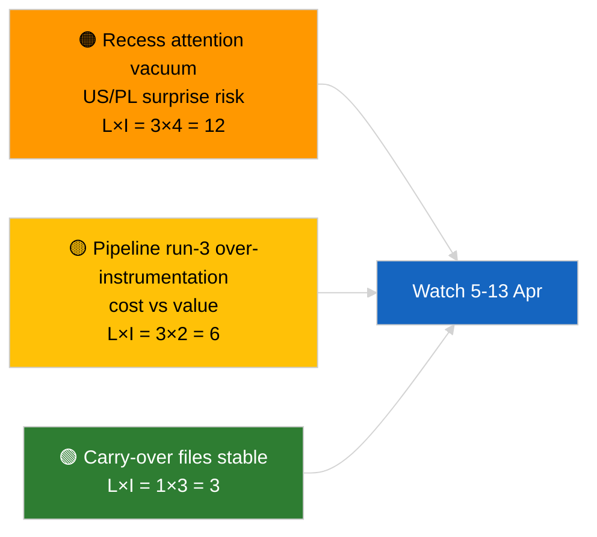

<!-- SPDX-FileCopyrightText: 2026 Hack23 AB -->
<!-- SPDX-License-Identifier: Apache-2.0 -->

# ملخص تنفيذي — تنبيه إخباري (تحليل ما قبل الاستراحة، الجولة 3) | 2026-04-04

**التصنيف:** معلومات مفتوحة المصدر (OSINT) | محضر برلماني عام
**مستوى الثقة:** 🟢 عالٍ (تحديث تحليلي خلال فترة الاستراحة)
**تاريخ الإنشاء:** 2026-04-04T00:00:00Z (ملخص بأثر رجعي)
**نوع المقالة:** تنبيه — الجولة 3 تحليل معزز ما قبل الاستراحة
**المصدر:** البوابة المفتوحة للبيانات للبرلمان الأوروبي

---

## 🎯 BLUF

**لا أحداث إخبارية جديدة بتاريخ 2026-04-04؛ البرلمان الأوروبي في عطلة عيد الفصح (27 مارس → 13 أبريل).** تُوسّع هذه الجولة الثالثة من اليوم التحليلات السابقة المؤرخة في 2026-04-04 (`breaking` تقييم الائتلاف، `breaking-2` خط الأنابيب ر1) من خلال إضافة عناوين كاملة للوثائق ومراجع الإجراءات إلى مجموعة ر1 المستمرة. لا جهات فاعلة جديدة، لا إجراءات جديدة، لا نصوص معتمدة مؤرخة اليوم. المساهمة هي **إثراء المصدر**، لا إشارة سياسية جديدة. **🟢 ثقة عالية** في أن غياب الإشارة الجديدة مرتبط بالتقويم؛ **🟢 ثقة عالية** في أن إضافات المصدر تُحسّن موثوقية المستهلكين اللاحقين (معرّفات الإجراءات الكاملة قابلة للتتبع).

---

## 🧭 3 قرارات يدعمها هذا الملخص

| # | القرار | صانع القرار | الموعد النهائي | الدليل |
|:-:|--------|------------|:-------------:|--------|
| 1 | **التحرير:** تخطي الإصدار اليومي؛ هذه الجولة إثراء مصدر بحت | المحرر | +12 ساعة | لا إشارة جديدة |
| 2 | **الرصد:** ضمان أن تحتوي جولات الدورة القادمة على إثراء كامل للعنوان/معرّف الإجراء | خط بيانات | 2026-04-05 | تقليل الاحتكاك في الحل المصب |
| 3 | **المراقبة الاستشرافية:** مراقبة نهاية استراحة عيد الفصح في 13 أبريل | مدير التحليل | 2026-04-13 | الانتقال استراحة → أسبوع اللجنة |

---

## 📰 القراءة في 60 ثانية

- 🔴 **لا أحداث إخبارية جديدة** بتاريخ 2026-04-04. (🟢 عالٍ)
- 🟠 **إثراء الجولة 3:** عناوين كاملة للوثائق ومراجع الإجراءات أضيفت إلى مجموعة ر1 المستمرة. (🟢 عالٍ)
- 🟢 **الاستراحة مستمرة** (اليوم 9 من 18)؛ 4 أيام متبقية. (🟢 عالٍ)
- 🟡 **لا تراجع في خط بيانات** اليوم؛ أدوات التحليل لا تزال تعمل وفق الخط الأساسي 2026-04-03/breaking-2. (🟢 عالٍ)
- 🔵 **السياق الاقتصادي:** ملفات الرسوم الجمركية الأمريكية ونائب رئيس البنك المركزي الأوروبي المستمرة تبقى أولية. (🟢 عالٍ)
- 🟣 **الإسناد المرجعي:** انظر التحليلات الشقيقة لجوهر الائتلاف/خط الأنابيب/النصوص المعتمدة. (🟢 عالٍ)
- 🩷 **ناقل الاضطراب:** لا يوجد عاجل اليوم. (🟢 عالٍ)
- ⚪ **الاستمرارية:** تتبع التطورات القانونية البولندية والرسائل التجارية بين الاتحاد الأوروبي والولايات المتحدة خلال أيام الاستراحة المتبقية.

---

## 🗂️ جدول الوثائق/الإجراءات الرئيسية

| الترتيب | مرجع البرلمان الأوروبي | العنوان (مختصر) | الأهمية | الثقة | الحالة |
|:-------:|----------------------|----------------|:-------:|:------:|--------|
| 1 | — | لا أحداث إخبارية جديدة | 0.0 | 🟢 HIGH | يوم استراحة 9 من 18 |
| 2 | TA-10-2026-0094 | توجيه مكافحة الفساد (مستمر، معرّف إجراء كامل 2023/0135) | 9.0 | 🟢 HIGH | رصد النقل إلى القانون الوطني |
| 3 | TA-10-2026-0088 | رفع الحصانة عن براون (إجراء 2025/2192) | 7.0 | 🟢 HIGH | رصد متابعة LIBE |

---

## ⚠️ لمحة عن المخاطر والتهديدات

| الخطر | الاحتمال | الأثر | النقاط | المُحفِّز | المصدر | أدميرالتي |
|-------|:--------:|:-----:|:------:|-----------|--------|:---------:|
| فراغ الاهتمام خلال الاستراحة | 3 | 4 | 12 | مفاجأة أمريكية أو بولندية | تقويم البرلمان الأوروبي | A2 |
| تكلفة الجولة 3 مقابل قيمتها | 3 | 2 | 6 | إثراء فارغ مستمر | إيقاع التشغيل | B3 |

---

## 🔮 أهم المحفزات المستقبلية

**نهاية استراحة عيد الفصح في 13 أبريل 2026 + أسبوع اللجنة 13–17 أبريل.** أول إشارة جوهرية جديدة في الربع الثاني.

---

## 🛡️ تقييم جودة المصادر

- **المصادر الأولية:** جرد نصوص الربع الأول المعتمدة (احتياطي أسبوعي)؛ سجل الإجراءات.
- **مستوى الثقة:** 🟢 HIGH في دقة الإثراء.

---

## 📎 الروابط

| الرابط | المسار |
|--------|--------|
| المقالة | `./article.md` |
| الجولات الشقيقة | `analysis/daily/2026-04-04/breaking/`, `breaking-2/`, `breaking-4/`, `week-in-review/` |
| البيان | `./manifest.json` |

---

**ضبط الوثيقة**
- **القالب:** `/analysis/templates/executive-brief.md`
- **مسار الأداة:** `analysis/daily/2026-04-04/breaking-3/executive-brief.md`
- **التصنيف:** عام
- **الإنشاء بأثر رجعي:** جلسة تعبئة.
