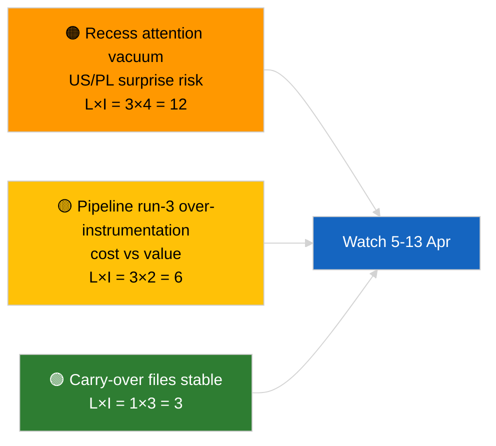

<!-- SPDX-FileCopyrightText: 2026 Hack23 AB -->
<!-- SPDX-License-Identifier: Apache-2.0 -->

# Kortfattet analyse — Hastesag (Præ-pause analyse, kørsel 3) | 2026-04-04

**Klassificering:** OSINT | Offentlig parlamentarisk protokol
**Konfidens:** 🟢 Høj (analytisk opdatering i pauseperiode)
**Genereret:** 2026-04-04T00:00:00Z (retrospektivt brev)
**Artikeltype:** Hastesag — Kørsel 3 Forbedret præ-pause analyse
**Kilde:** Europa-Parlamentets åbne dataportal

---

## 🎯 BLUF

**Ingen nye hastenyheder den 2026-04-04; EP er i påskepause (27. marts → 13. april).** Denne tredje kørsel på dagen udvider tidligere analyser fra 2026-04-04 (`breaking` koalitionsvurdering, `breaking-2` K1-pipeline) ved at tilføje fulde dokumenttitler og procedurereferencer til det videreførte K1-kluster. Ingen nye aktører, ingen nye procedurer, ingen nye vedtagne tekster dateret i dag. Bidraget er **proveniens-berigelse**, ikke nyt politisk signal. **🟢 HØJ konfidens** til at manglen på nyt signal er kalenderbestemt; **🟢 HØJ konfidens** til at proveniens-tilføjelserne forbedrer pålideligheden for efterfølgende forbrugere (fulde procedure-ID'er sporbare).

---

## 🧭 3 beslutninger dette brev understøtter

| # | Beslutning | Beslutningstager | Frist | Bevis |
|:-:|-----------|-----------------|:-----:|-------|
| 1 | **Redaktion:** SPRING daglig over; denne kørsel er kun proveniens-berigelse | Redaktør | +12h | Intet nyt signal |
| 2 | **Overvågning:** sikre at næste cyklus' kørsler arver fuld titel/procedure-ID-berigelse | Datapipeline | 2026-04-05 | Reducér friktion i downstream opløsning |
| 3 | **Fremadrettet overvågning:** overvåg påskepausens afslutning 13. april | Analyseansvarlig | 2026-04-13 | Pause→komitéuge-overgang |

---

## 📰 60-sekunders læsning

- 🔴 **Ingen nye hastenyheder** den 2026-04-04. (🟢 Høj)
- 🟠 **Kørsel-3 berigelse:** fulde dokumenttitler og procedurereferencer tilføjet til videreført K1-kluster. (🟢 Høj)
- 🟢 **Pausen fortsætter** (dag 9 af 18); 4 dage tilbage. (🟢 Høj)
- 🟡 **Ingen datapipeline-regression** i dag; analytiske værktøjer fortsat operationelle ifølge 2026-04-03/breaking-2 baseline. (🟢 Høj)
- 🔵 **Økonomisk kontekst:** videreførte filer om US-told og ECB's vicepræsident forbliver primære. (🟢 Høj)
- 🟣 **Krydsreference:** se søskende for substantiel koalitions-/pipeline-/vedtagne-teksters analyse. (🟢 Høj)
- 🩷 **Forstyrrelsesvektorer:** ingen akutte i dag. (🟢 Høj)
- ⚪ **Videreførelse:** følg polske retsudviklinger og US–EU handelsbudskaber i de resterende pausedage.

---

## 🗂️ Top dokumenter/proceduretabel

| Rang | EP-reference | Titel (kort) | Betydning | Konfidens | Status |
|:----:|-------------|-------------|:---------:|:---------:|--------|
| 1 | — | Ingen nye hastenyheder | 0,0 | 🟢 HIGH | Pausedag 9 af 18 |
| 2 | TA-10-2026-0094 | Anti-korruptionsdirektiv (videreført, fuld procedure-ID 2023/0135) | 9,0 | 🟢 HIGH | Transponeringsovervågning |
| 3 | TA-10-2026-0088 | Braun immunitetsophævelse (procedure 2025/2192) | 7,0 | 🟢 HIGH | LIBE opfølgningsovervågning |

---

## ⚠️ Risiko- og trusselsbillede

| Risiko | L | I | Score | Udløser | Kilde | Admiralty |
|--------|:-:|:-:|:-----:|---------|------|:---------:|
| Opmærksomhedsvakuum under pause | 3 | 4 | 12 | US eller PL-overraskelse | EP-kalender | A2 |
| Pipeline kørsel-3 omkostning vs værdi | 3 | 2 | 6 | Vedvarende tom berigelse | Kørselskadans | B3 |

---

## 🔮 Top fremtidige udløser

**Påskepausens afslutning 13. april 2026 + komitéuge 13.–17. april.** Første substantielle nye signal i K2.

---

## 🛡️ Kildekvalitetsvurdering

- **Primære kilder:** K1 vedtagne-teksters opgørelse (en-uges fallback); procedureregister.
- **Konfidens:** 🟢 HIGH om berigelsens korrekthed.

---

## 📎 Links

| Link | Sti |
|------|-----|
| Artikel | `./article.md` |
| Søskendekørsler | `analysis/daily/2026-04-04/breaking/`, `breaking-2/`, `breaking-4/`, `week-in-review/` |
| Manifest | `./manifest.json` |

---

**Dokumentstyring**
- **Skabelon:** `/analysis/templates/executive-brief.md`
- **Artefaktsti:** `analysis/daily/2026-04-04/breaking-3/executive-brief.md`
- **Klassificering:** Offentlig
- **Retrospektiv generering:** Tilbagefyldningssession.
