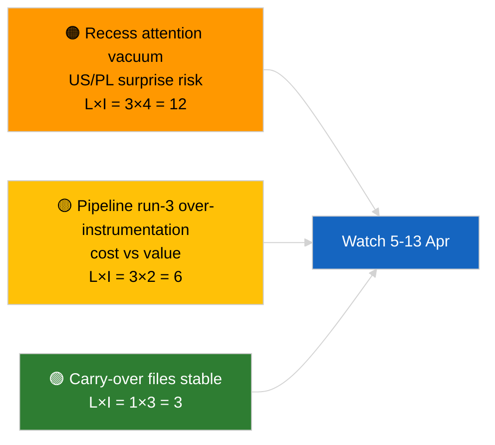

<!-- SPDX-FileCopyrightText: 2026 Hack23 AB -->
<!-- SPDX-License-Identifier: Apache-2.0 -->

# Kurzfassung — Eilmeldung (Analyse vor Pause, Lauf 3) | 2026-04-04

**Einstufung:** OSINT | Öffentliches Parlamentsprotokoll
**Konfidenz:** 🟢 Hoch (analytische Aktualisierung im Pausenzeitraum)
**Erstellt:** 2026-04-04T00:00:00Z (retrospektiver Brief)
**Artikeltyp:** Eilmeldung — Lauf 3 Erweiterte Vorabanalyse vor Pause
**Quelle:** Offenes Datenportal des Europäischen Parlaments

---

## 🎯 BLUF

**Keine neuen Eilmeldungen am 2026-04-04; das EP befindet sich in der Osterpause (27. März → 13. April).** Dieser dritte Lauf des Tages erweitert frühere Analysen vom 2026-04-04 (`breaking` Koalitionsbewertung, `breaking-2` Q1-Pipeline) durch Hinzufügen vollständiger Dokumenttitel und Verfahrensreferenzen für das fortlaufende Q1-Cluster. Keine neuen Akteure, keine neuen Verfahren, keine heute datierten angenommenen Texte. Der Beitrag ist **Provenienzanreicherung**, kein neues politisches Signal. **🟢 HOHE Konfidenz**, dass das Fehlen eines neuen Signals kalenderbedingt ist; **🟢 HOHE Konfidenz**, dass die Provenienzergänzungen die Zuverlässigkeit für nachfolgende Verbraucher verbessern (vollständige Verfahrens-IDs nachverfolgbar).

---

## 🧭 3 Entscheidungen, die dieser Brief unterstützt

| # | Entscheidung | Entscheidungsträger | Frist | Nachweis |
|:-:|-------------|-------------------|:-----:|---------|
| 1 | **Redaktion:** TAGESAUSGABE ÜBERSPRINGEN; dieser Lauf ist reine Provenienzanreicherung | Redakteur | +12 Std. | Kein neues Signal |
| 2 | **Überwachung:** sicherstellen, dass die Läufe des nächsten Zyklus vollständige Titel-/Verfahrens-ID-Anreicherung erben | Datenpipeline | 2026-04-05 | Reibung bei nachgelagerter Auflösung reduzieren |
| 3 | **Vorausschauende Überwachung:** Osterpausenende 13. April überwachen | Analyseleiterin | 2026-04-13 | Übergang Pause→Ausschusswoche |

---

## 📰 60-Sekunden-Lektüre

- 🔴 **Keine neuen Eilmeldungen** am 2026-04-04. (🟢 Hoch)
- 🟠 **Lauf-3-Anreicherung:** vollständige Dokumenttitel und Verfahrensreferenzen zum fortlaufenden Q1-Cluster hinzugefügt. (🟢 Hoch)
- 🟢 **Pause dauert an** (Tag 9 von 18); 4 Tage verbleibend. (🟢 Hoch)
- 🟡 **Keine Datenpipeline-Regression** heute; analytische Werkzeuge weiterhin nach Basislinie 2026-04-03/breaking-2 operativ. (🟢 Hoch)
- 🔵 **Wirtschaftlicher Kontext:** fortlaufende US-Zoll- und EZB-Vizepräsidenten-Dateien bleiben primär. (🟢 Hoch)
- 🟣 **Querverweise:** Schwesterbriefe für substantielle Koalitions-/Pipeline-/angenommene-Texte-Analyse konsultieren. (🟢 Hoch)
- 🩷 **Störungsvektor:** heute kein akuter. (🟢 Hoch)
- ⚪ **Fortführung:** polnische Rechtsentwicklungen und US–EU Handelsmitteilungen in den verbleibenden Pausentagen verfolgen.

---

## 🗂️ Top-Dokumente/Verfahrenstabelle

| Rang | EP-Referenz | Titel (kurz) | Bedeutung | Konfidenz | Status |
|:----:|------------|-------------|:---------:|:---------:|--------|
| 1 | — | Keine neuen Eilmeldungen | 0,0 | 🟢 HIGH | Pausetag 9 von 18 |
| 2 | TA-10-2026-0094 | Antikorruptionsrichtlinie (fortlaufend, vollständige Verfahrens-ID 2023/0135) | 9,0 | 🟢 HIGH | Umsetzungsüberwachung |
| 3 | TA-10-2026-0088 | Braun Immunitätsaufhebung (Verfahren 2025/2192) | 7,0 | 🟢 HIGH | LIBE Nachverfolgungsüberwachung |

---

## ⚠️ Risiko- und Bedrohungsbild

| Risiko | L | I | Punkte | Auslöser | Quelle | Admiralty |
|--------|:-:|:-:|:------:|---------|--------|:---------:|
| Aufmerksamkeitsvakuum in der Pause | 3 | 4 | 12 | US oder PL-Überraschung | EP-Kalender | A2 |
| Pipeline Lauf-3 Kosten vs. Nutzen | 3 | 2 | 6 | Anhaltende leere Anreicherung | Laufkadenz | B3 |

---

## 🔮 Wichtigster künftiger Auslöser

**Osterpausenende 13. April 2026 + Ausschusswoche 13.–17. April.** Erstes substantielles neues Signal in Q2.

---

## 🛡️ Quellenqualitätsbewertung

- **Primäre Quellen:** Q1 angenommener Texte Inventar (Einwochen-Fallback); Verfahrensregister.
- **Konfidenz:** 🟢 HIGH zur Korrektheit der Anreicherung.

---

## 📎 Links

| Link | Pfad |
|------|------|
| Artikel | `./article.md` |
| Schwesterläufe | `analysis/daily/2026-04-04/breaking/`, `breaking-2/`, `breaking-4/`, `week-in-review/` |
| Manifest | `./manifest.json` |

---

**Dokumentenkontrolle**
- **Vorlage:** `/analysis/templates/executive-brief.md`
- **Artefaktpfad:** `analysis/daily/2026-04-04/breaking-3/executive-brief.md`
- **Einstufung:** Öffentlich
- **Retrospektive Erstellung:** Auffüllsitzung.
