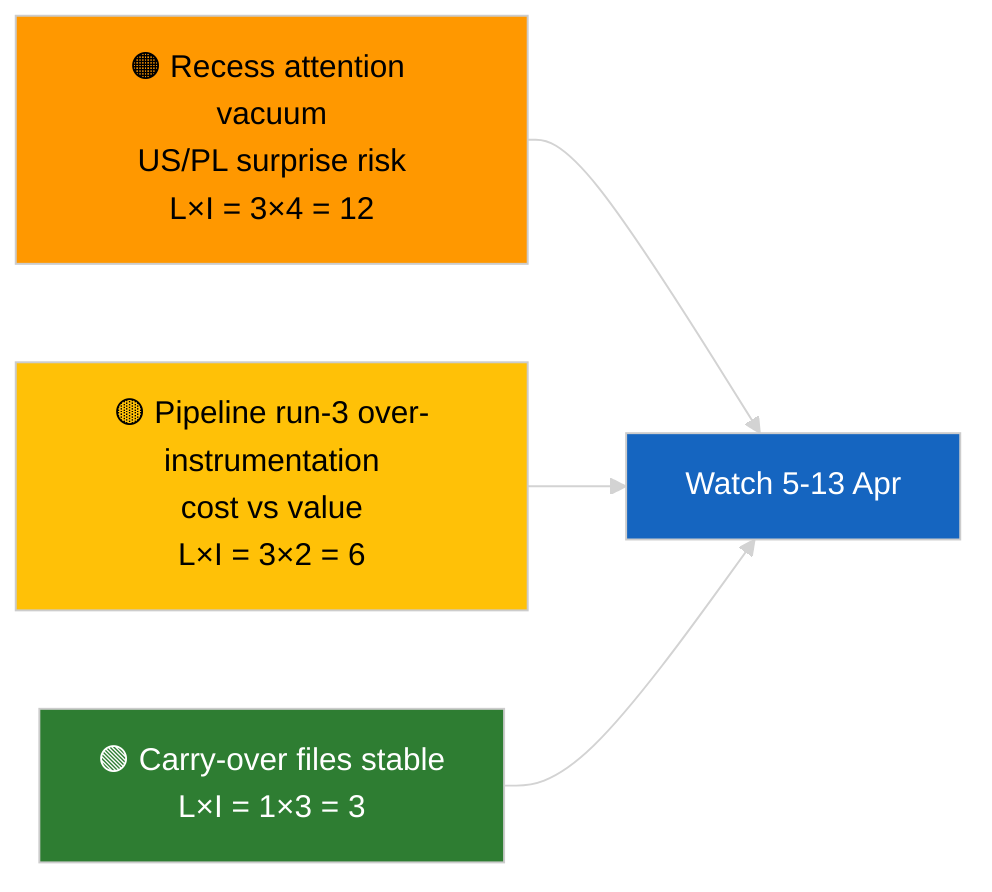

<!-- SPDX-FileCopyrightText: 2026 Hack23 AB -->
<!-- SPDX-License-Identifier: Apache-2.0 -->

# Nota ejecutiva — Alerta informativa (Análisis pre-pausa, ejecución 3) | 2026-04-04

**Clasificación:** OSINT | Protocolo parlamentario público
**Confianza:** 🟢 Alta (actualización analítica durante el período de pausa)
**Generada:** 2026-04-04T00:00:00Z (nota retrospectiva)
**Tipo de artículo:** Alerta — Ejecución 3 análisis reforzado pre-pausa
**Fuente:** Portal de datos abiertos del Parlamento Europeo

---

## 🎯 BLUF

**Ningún nuevo evento el 2026-04-04; el PE está en receso de Semana Santa (27 de marzo → 13 de abril).** Esta tercera ejecución del día amplía los análisis anteriores del 2026-04-04 (`breaking` evaluación de coalición, `breaking-2` pipeline T1) añadiendo títulos completos de documentos y referencias de procedimiento al clúster T1 en curso. Sin nuevos actores, sin nuevos procedimientos, sin textos aprobados fechados hoy. La contribución es un **enriquecimiento de proveniencia**, no una nueva señal política. **🟢 ALTA confianza** en que la ausencia de nueva señal se debe al calendario; **🟢 ALTA confianza** en que las adiciones de proveniencia mejoran la fiabilidad para los consumidores posteriores (identificadores de procedimiento completos rastreables).

---

## 🧭 3 decisiones que apoya esta nota

| # | Decisión | Responsable | Plazo | Evidencia |
|:-:|---------|------------|:-----:|-----------|
| 1 | **Redacción:** OMITIR edición diaria; esta ejecución es puro enriquecimiento de proveniencia | Editor | +12h | Sin nueva señal |
| 2 | **Supervisión:** garantizar que las ejecuciones del próximo ciclo hereden el enriquecimiento completo de título/ID de procedimiento | Pipeline de datos | 2026-04-05 | Reducir fricción en resolución posterior |
| 3 | **Vigilancia prospectiva:** supervisar el fin del receso pascual el 13 de abril | Responsable de análisis | 2026-04-13 | Transición pausa→semana de comisión |

---

## 📰 Lectura en 60 segundos

- 🔴 **Ningún nuevo evento** el 2026-04-04. (🟢 Alta)
- 🟠 **Enriquecimiento ejecución 3:** títulos completos de documentos y referencias de procedimiento añadidos al clúster T1 en curso. (🟢 Alta)
- 🟢 **La pausa continúa** (día 9 de 18); 4 días restantes. (🟢 Alta)
- 🟡 **Sin regresión en el pipeline de datos** hoy; herramientas analíticas aún operativas según línea base 2026-04-03/breaking-2. (🟢 Alta)
- 🔵 **Contexto económico:** los archivos en curso sobre aranceles de EE. UU. y el vicepresidente del BCE siguen siendo primarios. (🟢 Alta)
- 🟣 **Referencias cruzadas:** consultar análisis hermanos para la sustancia de coalición/pipeline/textos adoptados. (🟢 Alta)
- 🩷 **Vector de perturbación:** ninguno urgente hoy. (🟢 Alta)
- ⚪ **Continuidad:** seguir los desarrollos jurídicos polacos y los mensajes comerciales UE–EE. UU. durante los días de pausa restantes.

---

## 🗂️ Tabla de documentos/procedimientos principales

| Rango | Referencia PE | Título (abreviado) | Importancia | Confianza | Estado |
|:-----:|--------------|-------------------|:-----------:|:---------:|--------|
| 1 | — | Ningún nuevo evento | 0,0 | 🟢 HIGH | Día de pausa 9 de 18 |
| 2 | TA-10-2026-0094 | Directiva antiCorrupción (en curso, ID proc. completo 2023/0135) | 9,0 | 🟢 HIGH | Seguimiento transposición |
| 3 | TA-10-2026-0088 | Levantamiento de inmunidad Braun (procedimiento 2025/2192) | 7,0 | 🟢 HIGH | Seguimiento LIBE |

---

## ⚠️ Instantánea de riesgos y amenazas

| Riesgo | L | I | Puntuación | Desencadenante | Fuente | Admiralty |
|--------|:-:|:-:|:----------:|---------------|--------|:---------:|
| Vacío de atención durante la pausa | 3 | 4 | 12 | Sorpresa EE. UU. o PL | Calendario PE | A2 |
| Costo vs valor ejecución 3 del pipeline | 3 | 2 | 6 | Enriquecimiento vacío persistente | Cadencia de ejecución | B3 |

---

## 🔮 Principal desencadenante futuro

**Fin del receso pascual el 13 de abril de 2026 + semana de comisión 13–17 de abril.** Primera nueva señal sustancial en T2.

---

## 🛡️ Evaluación de calidad de fuentes

- **Fuentes primarias:** Inventario de textos adoptados T1 (respaldo semanal); registro de procedimientos.
- **Confianza:** 🟢 HIGH sobre la exactitud del enriquecimiento.

---

## 📎 Enlaces

| Enlace | Ruta |
|--------|------|
| Artículo | `./article.md` |
| Ejecuciones hermanas | `analysis/daily/2026-04-04/breaking/`, `breaking-2/`, `breaking-4/`, `week-in-review/` |
| Manifiesto | `./manifest.json` |

---

**Control de documentos**
- **Plantilla:** `/analysis/templates/executive-brief.md`
- **Ruta del artefacto:** `analysis/daily/2026-04-04/breaking-3/executive-brief.md`
- **Clasificación:** Público
- **Generación retrospectiva:** Sesión de relleno.
