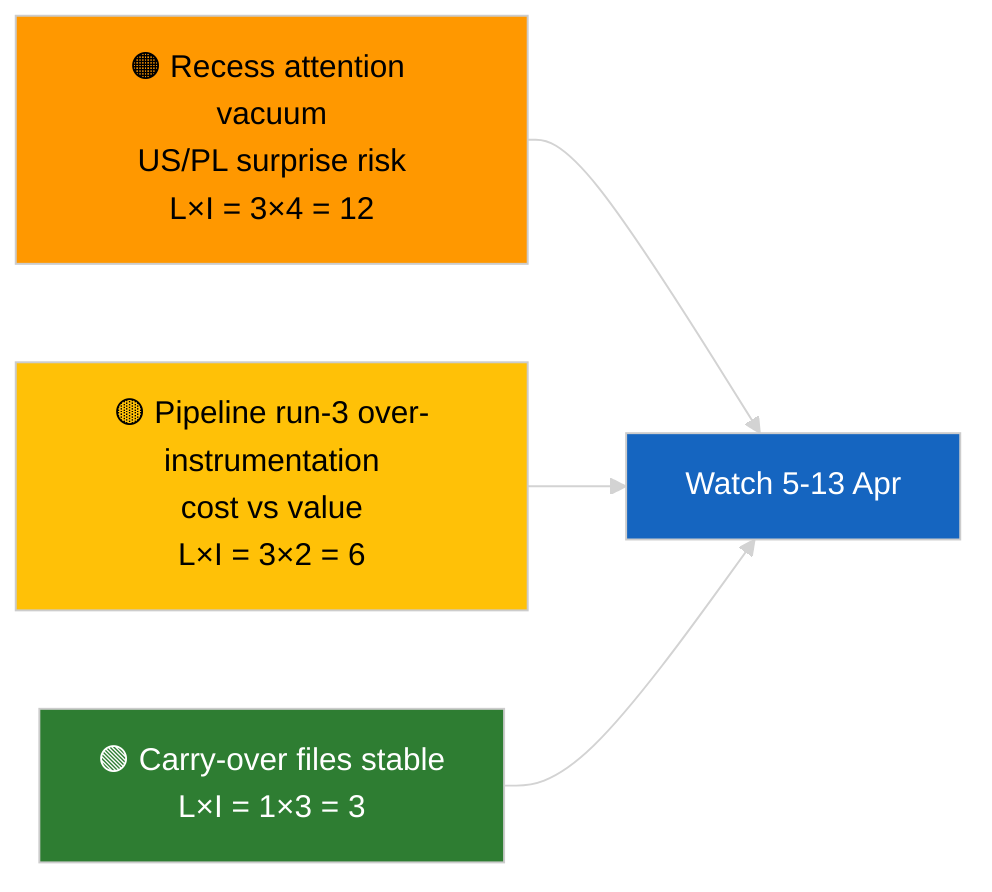

<!-- SPDX-FileCopyrightText: 2026 Hack23 AB -->
<!-- SPDX-License-Identifier: Apache-2.0 -->

# Tiivistelmä — Uutistapaus (Taukoanalyysi, ajo 3) | 2026-04-04

**Luokittelu:** OSINT | Julkinen parlamenttipöytäkirja
**Luottamustaso:** 🟢 Korkea (analyyttinen päivitys taukojakson aikana)
**Laadittu:** 2026-04-04T00:00:00Z (retrospektiivinen tiivistelmä)
**Artikkelityyppi:** Uutistapaus — Ajo 3 Parannettu ennen taukoa -analyysi
**Lähde:** Euroopan parlamentin avoin dataporttaali

---

## 🎯 BLUF

**Ei uusia tapahtumia 2026-04-04; EP on pääsiäistauolla (27. maaliskuuta → 13. huhtikuuta).** Tämä päivän kolmas ajo laajentaa aiempia 2026-04-04 analyysejä (`breaking` koalitioarviointi, `breaking-2` Q1-putkilinja) lisäämällä täydelliset asiakirjaotsikot ja menettelyreferenssit jatkettuun Q1-klusteriin. Ei uusia toimijoita, ei uusia menettelyjä, ei uusia tänään päivättyjä hyväksyttyjä tekstejä. Panos on **proveniensin rikastaminen**, ei uusi poliittinen signaali. **🟢 KORKEA luottamus** siihen, että uuden signaalin puuttuminen johtuu kalenterista; **🟢 KORKEA luottamus** siihen, että proveniensilisäykset parantavat myöhempien kuluttajien luotettavuutta (täydelliset menettely-ID:t jäljitettävissä).

---

## 🧭 3 päätöstä, joita tämä tiivistelmä tukee

| # | Päätös | Päätöksentekijä | Määräaika | Näyttö |
|:-:|--------|----------------|:---------:|--------|
| 1 | **Toimitus:** OHITA päivittäinen; tämä ajo on pelkkää proveniensin rikastamista | Toimittaja | +12t | Ei uutta signaalia |
| 2 | **Seuranta:** varmista, että seuraavan syklin ajot perivät täyden otsikon/menettely-ID-rikastamisen | Datapipeline | 2026-04-05 | Vähennä kitkaa alatason resoluutiossa |
| 3 | **Eteenpäinseuranta:** seuraa pääsiäistauon päättymistä 13. huhtikuuta | Analyysipäällikkö | 2026-04-13 | Tauko→valiokuntaviikko -siirtymä |

---

## 📰 60 sekunnin kooste

- 🔴 **Ei uusia tapahtumia** 2026-04-04. (🟢 Korkea)
- 🟠 **Ajo-3 rikastaminen:** täydelliset asiakirjaotsikot ja menettelyreferenssit lisätty jatkettuun Q1-klusteriin. (🟢 Korkea)
- 🟢 **Tauko jatkuu** (päivä 9/18); 4 päivää jäljellä. (🟢 Korkea)
- 🟡 **Ei datapipelinen regressiota** tänään; analyyttiset työkalut edelleen toiminnassa perustason 2026-04-03/breaking-2 mukaisesti. (🟢 Korkea)
- 🔵 **Taloudellinen konteksti:** jatketut USA-tullit ja EKP:n varapuheenjohtajatiedostot pysyvät ensisijaisina. (🟢 Korkea)
- 🟣 **Ristiviittaus:** katso sisaranalyysit koalitio-/putkilinja-/hyväksyttyjen tekstien substanssianalyysiin. (🟢 Korkea)
- 🩷 **Häirintävektori:** ei akuuttia tänään. (🟢 Korkea)
- ⚪ **Jatkuvuus:** seuraa Puolan oikeudellisia kehityksiä ja USA–EU kauppaviestiä jäljellä olevien taukopäivien aikana.

---

## 🗂️ Huippuasiakirjat/menettelytaulukko

| Sijoitus | EP-viite | Otsikko (lyhyt) | Merkitys | Luottamus | Tila |
|:--------:|---------|----------------|:--------:|:---------:|------|
| 1 | — | Ei uusia tapahtumia | 0,0 | 🟢 HIGH | Taukopäivä 9/18 |
| 2 | TA-10-2026-0094 | Korruptionvastainen direktiivi (jatkettu, täysi menettely-ID 2023/0135) | 9,0 | 🟢 HIGH | Transponointiseuranta |
| 3 | TA-10-2026-0088 | Braunin koskemattomuuden poistaminen (menettely 2025/2192) | 7,0 | 🟢 HIGH | LIBE jatkotoimenpiteiden seuranta |

---

## ⚠️ Riski- ja uhkakuva

| Riski | L | I | Pisteet | Laukaisin | Lähde | Admiralty |
|-------|:-:|:-:|:-------:|-----------|------|:---------:|
| Huomion tyhjiö tauon aikana | 3 | 4 | 12 | USA tai PL-yllätys | EP-kalenteri | A2 |
| Pipeline ajo-3 kustannus vs arvo | 3 | 2 | 6 | Kestävä tyhjä rikastaminen | Ajokadenssi | B3 |

---

## 🔮 Tärkein tuleva laukaisin

**Pääsiäistauon päättyminen 13. huhtikuuta 2026 + valiokuntaviikko 13.–17. huhtikuuta.** Q2:n ensimmäinen substansiaalinen uusi signaali.

---

## 🛡️ Lähdelaatuselvitys

- **Ensisijaiset lähteet:** Q1:n hyväksyttyjen tekstien inventaari (viikon varasuunnitelma); menettelyrekisteri.
- **Luottamustaso:** 🟢 HIGH rikastamisen oikeellisuudesta.

---

## 📎 Linkit

| Linkki | Polku |
|--------|-------|
| Artikkeli | `./article.md` |
| Sisarajot | `analysis/daily/2026-04-04/breaking/`, `breaking-2/`, `breaking-4/`, `week-in-review/` |
| Manifesti | `./manifest.json` |

---

**Asiakirjavalvonta**
- **Malli:** `/analysis/templates/executive-brief.md`
- **Artefaktipolku:** `analysis/daily/2026-04-04/breaking-3/executive-brief.md`
- **Luokittelu:** Julkinen
- **Retrospektiivinen luonti:** Täyttöistunto.
