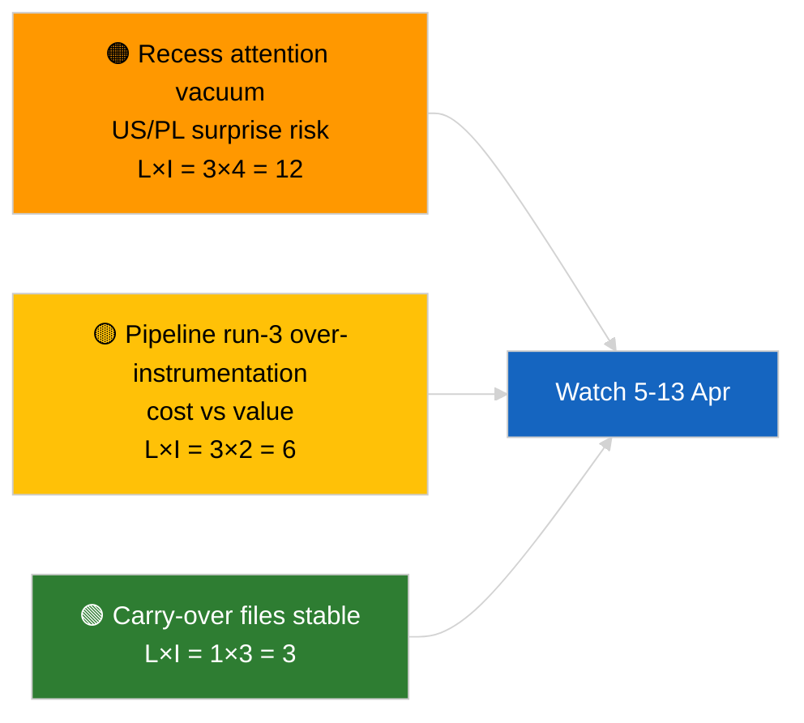

<!-- SPDX-FileCopyrightText: 2026 Hack23 AB -->
<!-- SPDX-License-Identifier: Apache-2.0 -->

# Note de synthèse — Alerte d'actualité (Analyse pré-pause, exécution 3) | 2026-04-04

**Classification :** OSINT | Protocole parlementaire public
**Confiance :** 🟢 Haute (mise à jour analytique en période de pause)
**Générée :** 2026-04-04T00:00:00Z (note rétrospective)
**Type d'article :** Alerte — Exécution 3 analyse renforcée pré-pause
**Source :** Portail de données ouvertes du Parlement européen

---

## 🎯 BLUF

**Aucun nouvel événement le 2026-04-04 ; le PE est en pause pascale (27 mars → 13 avril).** Cette troisième exécution de la journée enrichit les analyses antérieures du 2026-04-04 (`breaking` évaluation de coalition, `breaking-2` pipeline T1) en ajoutant des titres de documents complets et des références de procédure au cluster T1 poursuivi. Aucun nouvel acteur, aucune nouvelle procédure, aucun texte adopté daté d'aujourd'hui. La contribution est un **enrichissement de provenance**, non un nouveau signal politique. **🟢 HAUTE confiance** quant au fait que l'absence de nouveau signal est due au calendrier ; **🟢 HAUTE confiance** quant au fait que les ajouts de provenance améliorent la fiabilité pour les consommateurs en aval (identifiants de procédure complets traçables).

---

## 🧭 3 décisions soutenues par cette note

| # | Décision | Décideur | Échéance | Preuve |
|:-:|---------|---------|:--------:|--------|
| 1 | **Rédaction :** PASSER l'édition quotidienne ; cette exécution est un pur enrichissement de provenance | Rédacteur | +12h | Aucun nouveau signal |
| 2 | **Surveillance :** s'assurer que les exécutions du prochain cycle héritent de l'enrichissement complet titre/ID de procédure | Pipeline de données | 2026-04-05 | Réduire les frictions dans la résolution en aval |
| 3 | **Veille prospective :** surveiller la fin de la pause pascale le 13 avril | Responsable analyse | 2026-04-13 | Transition pause→semaine de commission |

---

## 📰 Lecture en 60 secondes

- 🔴 **Aucun nouvel événement** le 2026-04-04. (🟢 Haute)
- 🟠 **Enrichissement exécution 3 :** titres de documents complets et références de procédure ajoutés au cluster T1 poursuivi. (🟢 Haute)
- 🟢 **La pause se poursuit** (jour 9 sur 18) ; 4 jours restants. (🟢 Haute)
- 🟡 **Aucune régression du pipeline de données** aujourd'hui ; outils analytiques toujours opérationnels selon la ligne de base 2026-04-03/breaking-2. (🟢 Haute)
- 🔵 **Contexte économique :** les fichiers poursuivis sur les tarifs américains et le vice-président de la BCE restent primaires. (🟢 Haute)
- 🟣 **Références croisées :** voir les analyses sœurs pour la substance coalition/pipeline/textes adoptés. (🟢 Haute)
- 🩷 **Vecteur de perturbation :** aucun d'urgence aujourd'hui. (🟢 Haute)
- ⚪ **Continuité :** suivre les développements juridiques polonais et les messages commerciaux UE–États-Unis durant les jours de pause restants.

---

## 🗂️ Tableau des principaux documents/procédures

| Rang | Référence PE | Titre (abrégé) | Importance | Confiance | Statut |
|:----:|-------------|---------------|:---------:|:---------:|--------|
| 1 | — | Aucun nouvel événement | 0,0 | 🟢 HIGH | Jour de pause 9 sur 18 |
| 2 | TA-10-2026-0094 | Directive anti-corruption (poursuivie, ID proc. complet 2023/0135) | 9,0 | 🟢 HIGH | Suivi transposition |
| 3 | TA-10-2026-0088 | Levée d'immunité Braun (procédure 2025/2192) | 7,0 | 🟢 HIGH | Suivi de suivi LIBE |

---

## ⚠️ Tableau des risques et menaces

| Risque | L | I | Score | Déclencheur | Source | Admiralty |
|--------|:-:|:-:|:-----:|------------|--------|:---------:|
| Vide attentionnel en période de pause | 3 | 4 | 12 | Surprise US ou PL | Calendrier PE | A2 |
| Coût vs valeur exécution 3 du pipeline | 3 | 2 | 6 | Enrichissement vide persistant | Cadence d'exécution | B3 |

---

## 🔮 Principal déclencheur futur

**Fin de la pause pascale le 13 avril 2026 + semaine de commission 13–17 avril.** Premier nouveau signal substantiel en T2.

---

## 🛡️ Évaluation de la qualité des sources

- **Sources primaires :** Inventaire des textes adoptés T1 (repli hebdomadaire) ; registre des procédures.
- **Confiance :** 🟢 HIGH quant à l'exactitude de l'enrichissement.

---

## 📎 Liens

| Lien | Chemin |
|------|--------|
| Article | `./article.md` |
| Exécutions sœurs | `analysis/daily/2026-04-04/breaking/`, `breaking-2/`, `breaking-4/`, `week-in-review/` |
| Manifeste | `./manifest.json` |

---

**Contrôle documentaire**
- **Modèle :** `/analysis/templates/executive-brief.md`
- **Chemin d'artefact :** `analysis/daily/2026-04-04/breaking-3/executive-brief.md`
- **Classification :** Public
- **Génération rétrospective :** Session de remplissage.
