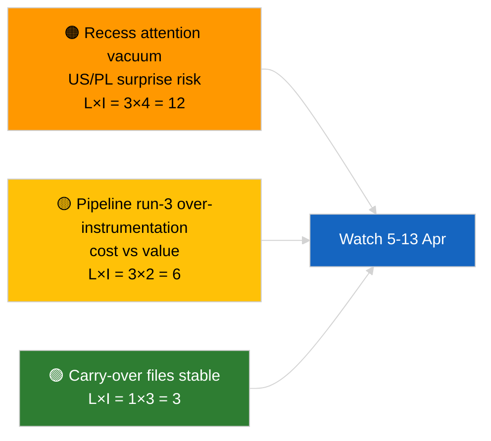

<!-- SPDX-FileCopyrightText: 2026 Hack23 AB -->
<!-- SPDX-License-Identifier: Apache-2.0 -->

# סיכום מנהלים — התראת חדשות (ניתוח טרום-הפסקה, ריצה 3) | 2026-04-04

**סיווג:** OSINT | פרוטוקול פרלמנטרי ציבורי
**אמינות:** 🟢 גבוהה (עדכון אנליטי בתקופת ההפסקה)
**נוצר:** 2026-04-04T00:00:00Z (מכתב רטרוספקטיבי)
**סוג מאמר:** התראה — ריצה 3 ניתוח מוגבר לפני הפסקה
**מקור:** פורטל הנתונים הפתוח של הפרלמנט האירופי

---

## 🎯 BLUF

**אין אירועי חדשות חדשים ב-2026-04-04; הפרלמנט האירופי בחופשת פסחא (27 מרץ → 13 אפריל).** ריצה שלישית זו של היום מרחיבה ניתוחים קודמים מ-2026-04-04 (`breaking` הערכת קואליציה, `breaking-2` צינור R1) על ידי הוספת כותרות מסמכים מלאות והפניות להליכים למאגר R1 המשיך. אין שחקנים חדשים, אין הליכים חדשים, אין טקסטים שאומצו עם תאריך היום. התרומה היא **העשרת מקור**, לא אות פוליטי חדש. **🟢 אמינות גבוהה** שהיעדר אות חדש מותנה ביומן; **🟢 אמינות גבוהה** שתוספות מקור משפרות את האמינות עבור צרכנים מורדים (מזהי הליכים מלאים ניתנים למעקב).

---

## 🧭 3 החלטות שמכתב זה תומך בהן

| # | החלטה | מקבל ההחלטה | מועד אחרון | ראיות |
|:-:|-------|------------|:----------:|-------|
| 1 | **עריכה:** דלג על מהדורה יומית; ריצה זו היא העשרת מקור גרידא | עורך | +12 שעות | אין אות חדש |
| 2 | **מעקב:** ודא שריצות המחזור הבא יורשות העשרת כותרת/מזהה הליך מלאה | צינור נתונים | 2026-04-05 | הפחתת חיכוך ברזולוציה מורדת |
| 3 | **ניטור צופה פני עתיד:** עקוב אחר סוף הפסקת פסחא ב-13 אפריל | מנהל ניתוח | 2026-04-13 | מעבר הפסקה→שבוע ועדה |

---

## 📰 קריאת 60 שניות

- 🔴 **אין אירועי חדשות חדשים** ב-2026-04-04. (🟢 גבוהה)
- 🟠 **העשרת ריצה 3:** כותרות מסמכים מלאות והפניות להליכים נוספו למאגר R1 המשיך. (🟢 גבוהה)
- 🟢 **ההפסקה נמשכת** (יום 9 מתוך 18); נותרו 4 ימים. (🟢 גבוהה)
- 🟡 **אין רגרסיה בצינור נתונים** היום; כלים אנליטיים עדיין פועלים לפי קו בסיס 2026-04-03/breaking-2. (🟢 גבוהה)
- 🔵 **הקשר כלכלי:** קבצים מתמשכים על מכסי ארה"ב וסגן נשיא ה-ECB נשארים ראשוניים. (🟢 גבוהה)
- 🟣 **הצלבות:** ראה ניתוחים אחים לתוכן קואליציה/צינור/טקסטים שאומצו. (🟢 גבוהה)
- 🩷 **וקטור שיבוש:** אין דחוף היום. (🟢 גבוהה)
- ⚪ **המשכיות:** עקוב אחר התפתחויות משפטיות פולניות ומסרים מסחריים EU–ארה"ב בימי ההפסקה הנותרים.

---

## 🗂️ טבלת מסמכים/הליכים עיקריים

| דירוג | הפניית EP | כותרת (מקוצרת) | חשיבות | אמינות | סטטוס |
|:-----:|----------|----------------|:------:|:------:|-------|
| 1 | — | אין אירועי חדשות חדשים | 0.0 | 🟢 HIGH | יום הפסקה 9 מתוך 18 |
| 2 | TA-10-2026-0094 | הנחיה נגד שחיתות (ממשיך, מזהה הליך מלא 2023/0135) | 9.0 | 🟢 HIGH | ניטור שילוב בחקיקה לאומית |
| 3 | TA-10-2026-0088 | הסרת חסינות Braun (הליך 2025/2192) | 7.0 | 🟢 HIGH | ניטור מעקב LIBE |

---

## ⚠️ תמונת מצב סיכונים ואיומים

| סיכון | L | I | ניקוד | טריגר | מקור | Admiralty |
|-------|:-:|:-:|:-----:|-------|------|:---------:|
| ואקום תשומת לב בהפסקה | 3 | 4 | 12 | הפתעה מארה"ב או פולין | לוח שנה EP | A2 |
| עלות ריצה 3 לעומת ערך | 3 | 2 | 6 | העשרה ריקה מתמשכת | קצב ריצה | B3 |

---

## 🔮 הטריגר העתידי המוביל

**סוף הפסקת פסחא 13 באפריל 2026 + שבוע ועדה 13–17 באפריל.** האות החדש המהותי הראשון ברבעון 2.

---

## 🛡️ הערכת איכות מקורות

- **מקורות עיקריים:** מלאי טקסטים שאומצו R1 (גיבוי שבועי); מרשם הליכים.
- **אמינות:** 🟢 HIGH על דיוק ההעשרה.

---

## 📎 קישורים

| קישור | נתיב |
|-------|------|
| מאמר | `./article.md` |
| ריצות אחיות | `analysis/daily/2026-04-04/breaking/`, `breaking-2/`, `breaking-4/`, `week-in-review/` |
| מניפסט | `./manifest.json` |

---

**בקרת מסמכים**
- **תבנית:** `/analysis/templates/executive-brief.md`
- **נתיב ארטיפקט:** `analysis/daily/2026-04-04/breaking-3/executive-brief.md`
- **סיווג:** ציבורי
- **יצירה רטרוספקטיבית:** סשן מילוי.
