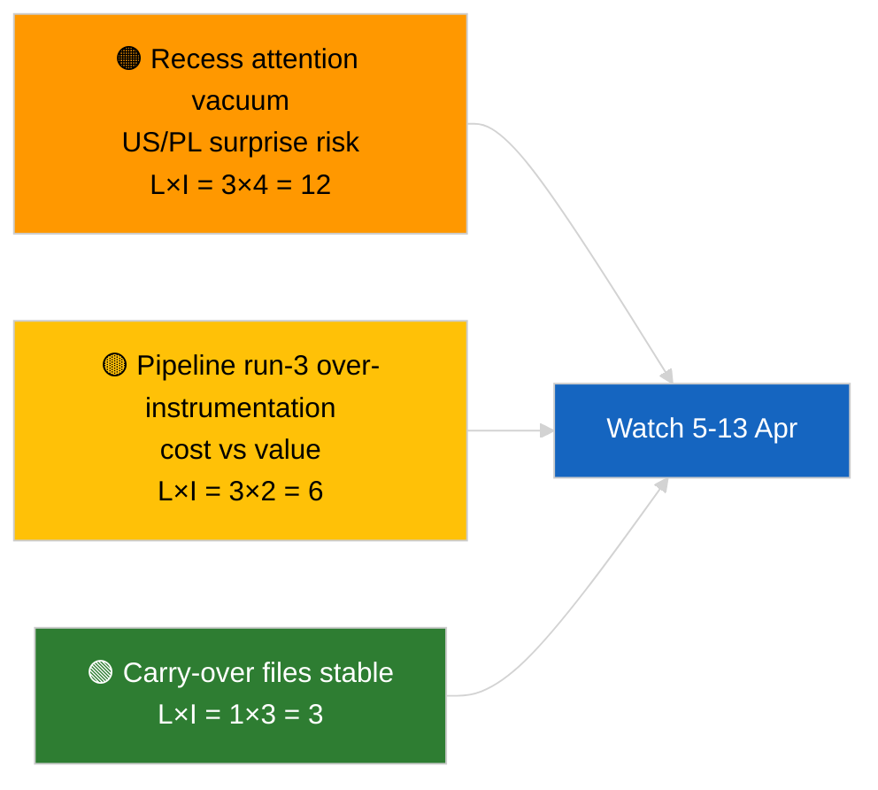

<!-- SPDX-FileCopyrightText: 2026 Hack23 AB -->
<!-- SPDX-License-Identifier: Apache-2.0 -->

# エグゼクティブ・ブリーフ — ニュース速報（休会前分析、第3ラン）| 2026-04-04

**分類：** OSINT｜公開議会議事録
**信頼度：** 🟢 高（休会期間中の分析更新）
**生成日：** 2026-04-04T00:00:00Z（回顧的ブリーフ）
**記事タイプ：** 速報 — 第3ラン 強化された休会前分析
**出典：** 欧州議会オープンデータポータル

---

## 🎯 BLUF

**2026年4月4日付の新規速報なし；欧州議会は復活祭休会中（3月27日→4月13日）。** この日3回目のランは、2026-04-04の先行分析（`breaking` 連合評価、`breaking-2` Q1パイプライン）を拡張し、継続中のQ1クラスターに完全な文書タイトルと手続き参照を追加する。新規アクター、新規手続き、本日付で採択されたテキストはいずれも存在しない。この貢献は**出所情報の充実**であり、新たな政治的シグナルではない。新規シグナルの欠如はカレンダーに起因するとの**🟢 高い信頼度**；出所の追加が後続の利用者の信頼性を向上させるとの**🟢 高い信頼度**（完全な手続きIDのトレーサビリティ確保）。

---

## 🧭 このブリーフが支援する3つの意思決定

| # | 意思決定 | 意思決定者 | 期限 | 根拠 |
|:-:|---------|----------|:----:|------|
| 1 | **編集部：** 日次版はスキップ；このランは出所充実のみ | 編集者 | +12時間 | 新規シグナルなし |
| 2 | **モニタリング：** 次サイクルのランが完全なタイトル/手続きID充実を継承することを確認 | データパイプライン | 2026-04-05 | 下流解決の摩擦を低減 |
| 3 | **前向き監視：** 4月13日の復活祭休会終了を監視 | 分析マネージャー | 2026-04-13 | 休会→委員会週移行 |

---

## 📰 60秒で読む要点

- 🔴 **2026-04-04付の新規速報なし。**（🟢 高）
- 🟠 **第3ラン充実：** 継続中Q1クラスターに完全な文書タイトルと手続き参照を追加。（🟢 高）
- 🟢 **休会継続中**（18日中9日目）；残り4日。（🟢 高）
- 🟡 **データパイプライン回帰なし；** 分析ツールは2026-04-03/breaking-2ベースラインで継続稼働。（🟢 高）
- 🔵 **経済的文脈：** 継続中の米国関税とECB副総裁ファイルが引き続き主要。（🟢 高）
- 🟣 **相互参照：** 連合/パイプライン/採択テキスト実質分析は姉妹ブリーフを参照。（🟢 高）
- 🩷 **混乱ベクター：** 本日は緊急案件なし。（🟢 高）
- ⚪ **継続事項：** 残りの休会日にポーランドの法的動向とEU–米国通商メッセージを追跡。

---

## 🗂️ 主要文書/手続き一覧

| 順位 | EP参照 | タイトル（略称） | 重要度 | 信頼度 | 状況 |
|:---:|--------|---------------|:------:|:------:|------|
| 1 | — | 新規速報なし | 0.0 | 🟢 HIGH | 休会18日中9日目 |
| 2 | TA-10-2026-0094 | 汚職防止指令（継続中、完全手続きID 2023/0135） | 9.0 | 🟢 HIGH | 移行措置モニタリング |
| 3 | TA-10-2026-0088 | Braun議員特権免除（手続き2025/2192） | 7.0 | 🟢 HIGH | LIBEフォローアップ監視 |

---

## ⚠️ リスク・脅威スナップショット

| リスク | L | I | スコア | トリガー | 出典 | Admiralty |
|--------|:-:|:-:|:-----:|---------|-----|:---------:|
| 休会中の注意力の空白 | 3 | 4 | 12 | 米国またはポーランドのサプライズ | EP暦 | A2 |
| パイプライン第3ランのコスト対価値 | 3 | 2 | 6 | 継続する空の充実作業 | ランカデンス | B3 |

---

## 🔮 主要な今後のトリガー

**2026年4月13日の復活祭休会終了 + 4月13日〜17日の委員会週。** Q2における最初の実質的新規シグナル。

---

## 🛡️ ソース品質評価

- **主要出典：** Q1採択テキスト目録（1週間フォールバック）；手続き登録簿。
- **信頼度：** 🟢 HIGH（充実作業の正確性について）。

---

## 📎 リンク

| リンク | パス |
|-------|------|
| 記事 | `./article.md` |
| 姉妹ラン | `analysis/daily/2026-04-04/breaking/`、`breaking-2/`、`breaking-4/`、`week-in-review/` |
| マニフェスト | `./manifest.json` |

---

**文書管理**
- **テンプレート：** `/analysis/templates/executive-brief.md`
- **アーティファクトパス：** `analysis/daily/2026-04-04/breaking-3/executive-brief.md`
- **分類：** 公開
- **回顧的作成：** バックフィルセッション。
