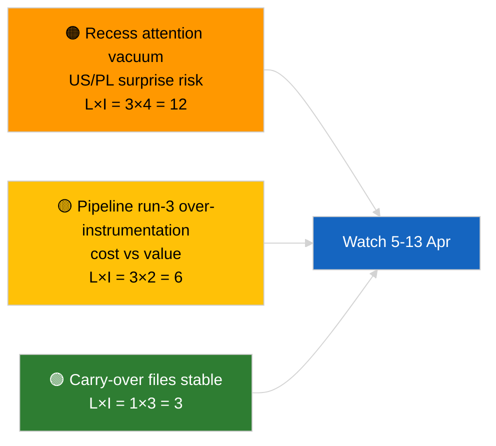

<!-- SPDX-FileCopyrightText: 2026 Hack23 AB -->
<!-- SPDX-License-Identifier: Apache-2.0 -->

# 경영진 브리프 — 속보（휴회 전 분석, 3차 실행）| 2026-04-04

**분류:** OSINT | 공개 의회 의사록
**신뢰도:** 🟢 높음（휴회 기간 분석 업데이트）
**생성일:** 2026-04-04T00:00:00Z（소급 브리프）
**기사 유형:** 속보 — 3차 실행 강화된 휴회 전 분석
**출처:** 유럽 의회 오픈 데이터 포털

---

## 🎯 BLUF

**2026년 4월 4일 자 신규 속보 없음; 유럽 의회는 부활절 휴회 중(3월 27일 → 4월 13일).** 오늘의 세 번째 실행은 2026-04-04의 선행 분석(`breaking` 연립 평가, `breaking-2` Q1 파이프라인)을 확장하여 지속 중인 Q1 클러스터에 완전한 문서 제목과 절차 참조를 추가한다. 신규 행위자 없음, 신규 절차 없음, 오늘 날짜의 채택 문서 없음. 이 기여는 **출처 정보 보강**이며 새로운 정치적 신호가 아니다. 새로운 신호 부재는 일정에 기인한다는 **🟢 높은 신뢰도**; 출처 추가가 후속 이용자의 신뢰성을 향상시킨다는 **🟢 높은 신뢰도**（전체 절차 ID 추적 가능）.

---

## 🧭 이 브리프가 지원하는 3가지 결정

| # | 결정 | 의사결정자 | 기한 | 근거 |
|:-:|-----|----------|:----:|------|
| 1 | **편집:** 일일 에디션 건너뜀; 이 실행은 출처 보강만 | 편집자 | +12시간 | 신규 신호 없음 |
| 2 | **모니터링:** 다음 사이클의 실행이 전체 제목/절차 ID 보강을 상속하도록 확인 | 데이터 파이프라인 | 2026-04-05 | 다운스트림 해결의 마찰 감소 |
| 3 | **예측 모니터링:** 4월 13일 부활절 휴회 종료 감시 | 분석 관리자 | 2026-04-13 | 휴회→위원회 주 전환 |

---

## 📰 60초 요약

- 🔴 **2026-04-04 신규 속보 없음.**（🟢 높음）
- 🟠 **3차 실행 보강:** 지속 중인 Q1 클러스터에 완전한 문서 제목과 절차 참조 추가.（🟢 높음）
- 🟢 **휴회 계속 중**（18일 중 9일째）; 4일 남음.（🟢 높음）
- 🟡 **데이터 파이프라인 회귀 없음;** 분석 도구는 2026-04-03/breaking-2 기준선에 따라 계속 운영 중.（🟢 높음）
- 🔵 **경제적 맥락:** 미국 관세 및 ECB 부총재 파일이 계속 1순위.（🟢 높음）
- 🟣 **교차 참조:** 연립/파이프라인/채택 문서 실질 분석은 자매 브리프 참조.（🟢 높음）
- 🩷 **교란 벡터:** 오늘 긴급 사항 없음.（🟢 높음）
- ⚪ **지속 사항:** 남은 휴회 일간 폴란드 법적 동향과 EU–미국 무역 메시지 추적.

---

## 🗂️ 주요 문서/절차 표

| 순위 | EP 참조 | 제목（약칭） | 중요도 | 신뢰도 | 상태 |
|:---:|--------|------------|:------:|:------:|------|
| 1 | — | 신규 속보 없음 | 0.0 | 🟢 HIGH | 휴회 18일 중 9일째 |
| 2 | TA-10-2026-0094 | 부패방지 지침（지속 중, 전체 절차 ID 2023/0135） | 9.0 | 🟢 HIGH | 이행 모니터링 |
| 3 | TA-10-2026-0088 | Braun 면책 해제（절차 2025/2192） | 7.0 | 🟢 HIGH | LIBE 후속 모니터링 |

---

## ⚠️ 위험 및 위협 스냅샷

| 위험 | L | I | 점수 | 트리거 | 출처 | Admiralty |
|------|:-:|:-:|:---:|-------|-----|:---------:|
| 휴회 중 관심 공백 | 3 | 4 | 12 | 미국 또는 폴란드 서프라이즈 | EP 일정 | A2 |
| 파이프라인 3차 실행 비용 대 가치 | 3 | 2 | 6 | 지속적인 공백 보강 | 실행 주기 | B3 |

---

## 🔮 주요 미래 트리거

**2026년 4월 13일 부활절 휴회 종료 + 4월 13일~17일 위원회 주.** Q2의 첫 번째 실질적 신규 신호.

---

## 🛡️ 소스 품질 평가

- **주요 출처:** Q1 채택 문서 목록（1주 폴백）; 절차 등록부.
- **신뢰도:** 🟢 HIGH（보강의 정확성에 대해）.

---

## 📎 링크

| 링크 | 경로 |
|------|------|
| 기사 | `./article.md` |
| 자매 실행 | `analysis/daily/2026-04-04/breaking/`, `breaking-2/`, `breaking-4/`, `week-in-review/` |
| 매니페스트 | `./manifest.json` |

---

**문서 관리**
- **템플릿:** `/analysis/templates/executive-brief.md`
- **아티팩트 경로:** `analysis/daily/2026-04-04/breaking-3/executive-brief.md`
- **분류:** 공개
- **소급 생성:** 백필 세션.
