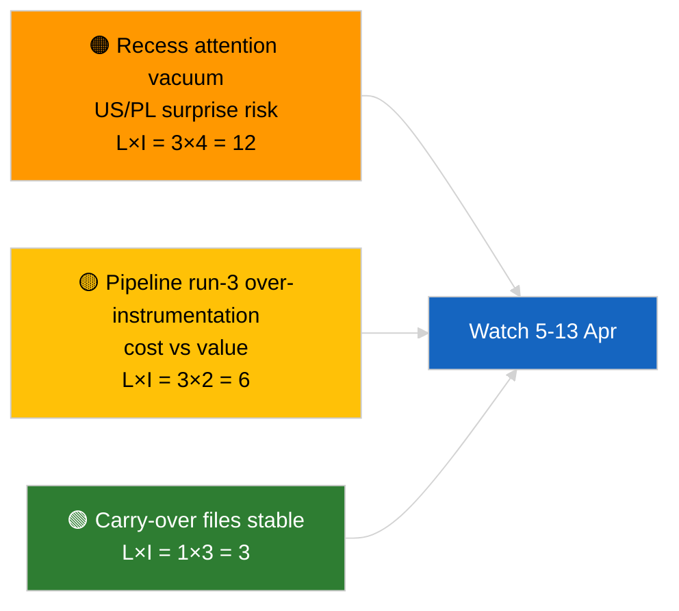

<!-- SPDX-FileCopyrightText: 2026 Hack23 AB -->
<!-- SPDX-License-Identifier: Apache-2.0 -->

# Beknopte nota — Nieuwsbreuk (Pre-pauze analyse, uitvoering 3) | 2026-04-04

**Classificatie:** OSINT | Openbaar parlementair protocol
**Betrouwbaarheid:** 🟢 Hoog (analytische update in pauzeperiode)
**Gegenereerd:** 2026-04-04T00:00:00Z (retrospectieve nota)
**Artikeltype:** Nieuwsbreuk — Uitvoering 3 Versterkte pre-pauze analyse
**Bron:** Open dataportal van het Europees Parlement

---

## 🎯 BLUF

**Geen nieuwe nieuwsgebeurtenissen op 2026-04-04; het EP is in paasreces (27 maart → 13 april).** Deze derde uitvoering van de dag breidt eerdere analyses uit van 2026-04-04 (`breaking` coalitie-evaluatie, `breaking-2` K1-pijplijn) door volledige documenttitels en procedureverwijzingen toe te voegen aan het voortgezette K1-cluster. Geen nieuwe actoren, geen nieuwe procedures, geen vandaag gedateerde aangenomen teksten. De bijdrage is **provenance-verrijking**, geen nieuw politiek signaal. **🟢 HOGE betrouwbaarheid** dat het ontbreken van een nieuw signaal kalendergebonden is; **🟢 HOGE betrouwbaarheid** dat de provenance-toevoegingen de betrouwbaarheid voor navolgende consumenten verbeteren (volledige procedure-ID's traceerbaar).

---

## 🧭 3 beslissingen die deze nota ondersteunt

| # | Beslissing | Beslisser | Deadline | Bewijs |
|:-:|-----------|----------|:--------:|--------|
| 1 | **Redactie:** DAGELIJKSE EDITIE OVERSLAAN; deze uitvoering is pure provenance-verrijking | Redacteur | +12u | Geen nieuw signaal |
| 2 | **Monitoring:** zorgen dat uitvoeringen van de volgende cyclus volledige titel-/procedure-ID-verrijking erven | Datapijplijn | 2026-04-05 | Wrijving in stroomafwaartse resolutie verminderen |
| 3 | **Toekomstgerichte bewaking:** paasreces einde 13 april bewaken | Analysemanager | 2026-04-13 | Overgang pauze→commissieweek |

---

## 📰 60 seconden lezen

- 🔴 **Geen nieuwe nieuwsgebeurtenissen** op 2026-04-04. (🟢 Hoog)
- 🟠 **Uitvoering-3 verrijking:** volledige documenttitels en procedureverwijzingen toegevoegd aan voortgezet K1-cluster. (🟢 Hoog)
- 🟢 **Pauze duurt voort** (dag 9 van 18); 4 dagen resterend. (🟢 Hoog)
- 🟡 **Geen datapijplijn-regressie** vandaag; analytische tools nog operationeel conform basislijn 2026-04-03/breaking-2. (🟢 Hoog)
- 🔵 **Economische context:** voortgezette dossiers over Amerikaanse tarieven en ECB-vicevoorzitter blijven primair. (🟢 Hoog)
- 🟣 **Kruisreferenties:** zie zusteranalyses voor substantiële coalitie-/pijplijn-/aangenomen-teksten-analyse. (🟢 Hoog)
- 🩷 **Verstoringsvektor:** geen urgente vandaag. (🟢 Hoog)
- ⚪ **Continuïteit:** Poolse rechtsontwikkelingen en EU–VS handelsboodschappen volgen in de resterende pausedagen.

---

## 🗂️ Topdocumenten/Procedurabel

| Rang | EP-referentie | Titel (kort) | Belang | Betrouwbaarheid | Status |
|:----:|--------------|-------------|:------:|:--------------:|--------|
| 1 | — | Geen nieuwe nieuwsgebeurtenissen | 0,0 | 🟢 HIGH | Pausedag 9 van 18 |
| 2 | TA-10-2026-0094 | Anti-corruptierichtlijn (voortgezet, volledig procedure-ID 2023/0135) | 9,0 | 🟢 HIGH | Omzettingsbewaking |
| 3 | TA-10-2026-0088 | Braun immuniteitsheffing (procedure 2025/2192) | 7,0 | 🟢 HIGH | LIBE opvolgingsbewaking |

---

## ⚠️ Risico- en dreigingsoverzicht

| Risico | L | I | Score | Trigger | Bron | Admiralty |
|--------|:-:|:-:|:-----:|---------|------|:---------:|
| Aandachtsvacuüm tijdens pauze | 3 | 4 | 12 | VS of PL-verrassing | EP-kalender | A2 |
| Pijplijn uitvoering-3 kosten vs waarde | 3 | 2 | 6 | Aanhoudende lege verrijking | Uitvoeringsritme | B3 |

---

## 🔮 Belangrijkste toekomstige trigger

**Einde paasreces 13 april 2026 + commissieweek 13–17 april.** Eerste substantieel nieuw signaal in K2.

---

## 🛡️ Bronkwaliteitsbeoordeling

- **Primaire bronnen:** K1 aangenomen-teksten inventarisatie (weekback-up fallback); procedureregister.
- **Betrouwbaarheid:** 🟢 HIGH over de correctheid van de verrijking.

---

## 📎 Koppelingen

| Koppeling | Pad |
|-----------|-----|
| Artikel | `./article.md` |
| Zusteruitvoeringen | `analysis/daily/2026-04-04/breaking/`, `breaking-2/`, `breaking-4/`, `week-in-review/` |
| Manifest | `./manifest.json` |

---

**Documentbeheer**
- **Sjabloon:** `/analysis/templates/executive-brief.md`
- **Artefactpad:** `analysis/daily/2026-04-04/breaking-3/executive-brief.md`
- **Classificatie:** Openbaar
- **Retrospectieve generatie:** Terugvulsessie.
