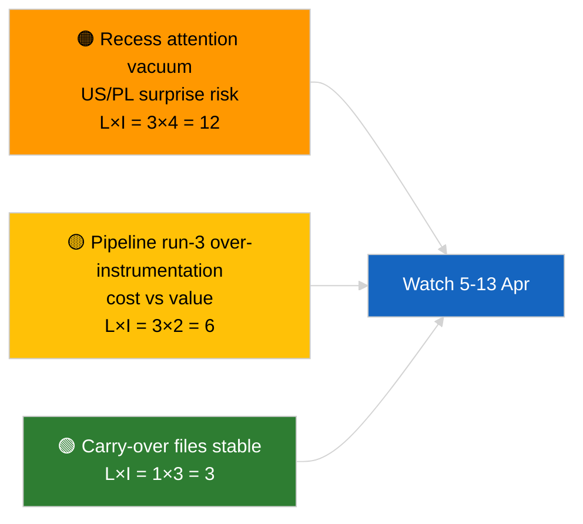

<!-- SPDX-FileCopyrightText: 2026 Hack23 AB -->
<!-- SPDX-License-Identifier: Apache-2.0 -->

# Kortfattet analyse — Nyhetssak (Analyse før pause, kjøring 3) | 2026-04-04

**Klassifisering:** OSINT | Offentlig parlamentarisk protokoll
**Konfidens:** 🟢 Høy (analytisk oppdatering i pauseperioden)
**Generert:** 2026-04-04T00:00:00Z (retrospektivt brev)
**Artikkeltype:** Nyhetssak — Kjøring 3 Forbedret analyse før pause
**Kilde:** Europaparlamentets åpne dataportal

---

## 🎯 BLUF

**Ingen nye nyhetsutvikling 2026-04-04; EP er i påskepause (27. mars → 13. april).** Denne tredje kjøringen på dagen utvider tidligere analyser fra 2026-04-04 (`breaking` koalisjonsvurdering, `breaking-2` K1-pipeline) ved å legge til fullstendige dokumenttitler og prosedyrereferanser for bærvidare K1-kluster. Ingen nye aktører, ingen nye prosedyrer, ingen nye vedtatte tekster datert i dag. Bidraget er **proveniensberiking**, ikke nytt politisk signal. **🟢 HØY konfidens** til at mangel på nytt signal er kalenderbestemt; **🟢 HØY konfidens** til at provenienstilleggene forbedrer påliteligheten for påfølgende forbrukere (fullstendige prosedyre-IDer sporbare).

---

## 🧭 3 beslutninger dette brevet støtter

| # | Beslutning | Beslutningstaker | Frist | Bevis |
|:-:|-----------|-----------------|:-----:|-------|
| 1 | **Redaksjon:** HOPP OVER daglig; denne kjøringen er bare proveniensberiking | Redaktør | +12t | Ingen ny signal |
| 2 | **Overvåking:** sikre at neste syklusens kjøringer arver full tittel/prosedyre-ID-beriking | Datapipeline | 2026-04-05 | Reduser friksjon i nedstrøms løsning |
| 3 | **Fremtidsovervåking:** overvåk slutten av påskepausen 13. april | Analyseansvarlig | 2026-04-13 | Pause→komitéuke-overgang |

---

## 📰 60-sekunders lesning

- 🔴 **Ingen ny nyhetsutvikling** 2026-04-04. (🟢 Høy)
- 🟠 **Kjøring-3 beriking:** fullstendige dokumenttitler og prosedyrereferanser lagt til for bærvidare K1-kluster. (🟢 Høy)
- 🟢 **Pausen fortsetter** (dag 9 av 18); 4 dager gjenstår. (🟢 Høy)
- 🟡 **Ingen datapipeline-regresjon** i dag; analytiske verktøy fortsatt operative etter 2026-04-03/breaking-2 grunnlinje. (🟢 Høy)
- 🔵 **Økonomisk kontekst:** bærvidare filer om USA-toll og ECBs visepresident forblir primære. (🟢 Høy)
- 🟣 **Kryss-referanse:** se søsken for substansiell koalisjons-/pipeline-/vedtatte-teksters analyse. (🟢 Høy)
- 🩷 **Forstyrrelsesvektorer:** ingen akutte i dag. (🟢 Høy)
- ⚪ **Videreføring:** følg polsk rettsutvikling og USA–EU handelsmeldinger i de gjenstående pausedagene.

---

## 🗂️ Topp dokumenter/prosedyretabell

| Rang | EP-referanse | Tittel (kort) | Betydning | Konfidens | Status |
|:----:|------------|--------------|:---------:|:---------:|--------|
| 1 | — | Ingen ny nyhetsutvikling | 0,0 | 🟢 HIGH | Pausedag 9 av 18 |
| 2 | TA-10-2026-0094 | Antikorrupsjonsdirektiv (bærvidare, fullstendig prosedyre-ID 2023/0135) | 9,0 | 🟢 HIGH | Transponeringsovervåking |
| 3 | TA-10-2026-0088 | Braun immunitetsopphevelse (prosedyre 2025/2192) | 7,0 | 🟢 HIGH | LIBE oppfølgingsovervåking |

---

## ⚠️ Risiko- og trusselbilde

| Risiko | L | I | Score | Utløser | Kilde | Admiralty |
|--------|:-:|:-:|:-----:|---------|------|:---------:|
| Oppmerksomhetsvakuum under pause | 3 | 4 | 12 | USA eller PL-overraskelse | EP-kalender | A2 |
| Pipeline kjøring-3 kostnad vs verdi | 3 | 2 | 6 | Vedvarende tom beriking | Kjøringskadans | B3 |

---

## 🔮 Topp fremtidige utløser

**Påskepausens slutt 13. april 2026 + komitéuke 13.–17. april.** Første substansielle nye signal i K2.

---

## 🛡️ Kildekvalitetsvurdering

- **Primære kilder:** K1 vedtatte-teksters inventering (en-ukes fallback); prosedyreregister.
- **Konfidens:** 🟢 HIGH om berikningens korrekthet.

---

## 📎 Lenker

| Lenke | Sti |
|-------|-----|
| Artikkel | `./article.md` |
| Søskenkjøringer | `analysis/daily/2026-04-04/breaking/`, `breaking-2/`, `breaking-4/`, `week-in-review/` |
| Manifest | `./manifest.json` |

---

**Dokumentkontroll**
- **Mal:** `/analysis/templates/executive-brief.md`
- **Artefaktsti:** `analysis/daily/2026-04-04/breaking-3/executive-brief.md`
- **Klassifisering:** Offentlig
- **Retrospektiv generering:** Bakfyllingssesjon.
