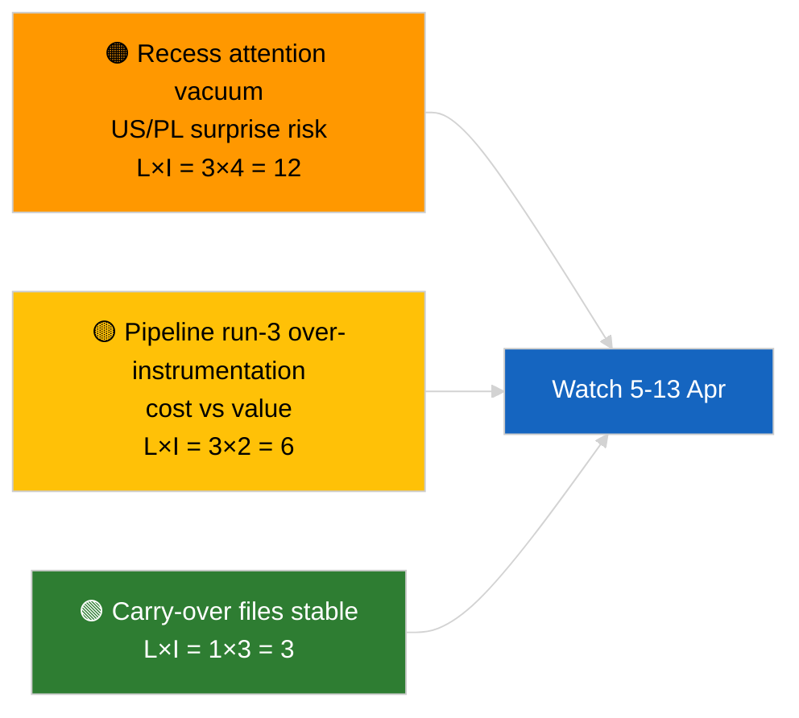

<!-- SPDX-FileCopyrightText: 2026 Hack23 AB -->
<!-- SPDX-License-Identifier: Apache-2.0 -->

# Kortfattad analys — Brott (Föranalys, körning 3 inför uppehåll) | 2026-04-04

**Klassificering:** OSINT | Offentligt parlamentsprotokoll
**Konfidens:** 🟢 Hög (analytisk uppdatering under uppehållsperiod)
**Genererad:** 2026-04-04T00:00:00Z (retrospektivt brev)
**Artikeltyp:** Brott — Körning 3 Förstärkt föranalys inför uppehåll
**Källa:** Europeiska parlamentets öppna dataportal

---

## 🎯 BLUF

**Inga nya brytningshändelser den 2026-04-04; EP befinner sig i påskuppehåll (27 mars → 13 april).** Denna tredje körning under dagen utvidgar tidigare analyser från 2026-04-04 (`breaking` koalitionsbedömning, `breaking-2` K1-pipeline) genom att lägga till fullständiga dokumenttitlar och procedurreferenser för bärvidare K1-kluster. Inga nya aktörer, inga nya procedurer, inga nya antagna texter daterade till idag. Bidraget är **proveniensberikande**, inte ny politisk signal. **🟢 HÖG konfidens** att bristen på ny signal beror på kalendern; **🟢 HÖG konfidens** att proveniensbidragen förbättrar tillförlitligheten för efterföljande konsumenter (fullständiga procedur-ID:n spårbara).

---

## 🧭 3 beslut som detta brev stöder

| # | Beslut | Beslutsfattare | Deadline | Bevis |
|:-:|--------|---------------|:--------:|-------|
| 1 | **Redaktion:** HOPPA OVER daglig; denna körning är enbart proveniensberikande | Redaktör | +12h | Ingen ny signal |
| 2 | **Övervakning:** säkerställa att nästa cykels körningar ärver fullständig titel/procedur-ID-berikande | Datapipeline | 2026-04-05 | Minska friktion i nedströms lösning |
| 3 | **Framåtbevakning:** övervaka påskuppehållets slut 13 april | Analysansvarig | 2026-04-13 | Övergång uppehåll→kommittévecka |

---

## 📰 60-sekunderläsning

- 🔴 **Inga nya brytningshändelser** den 2026-04-04. (🟢 Hög)
- 🟠 **Körning-3 berikande:** fullständiga dokumenttitlar och procedurreferenser tillagda för bärvidare K1-kluster. (🟢 Hög)
- 🟢 **Uppehållet fortsätter** (dag 9 av 18); 4 dagar återstår. (🟢 Hög)
- 🟡 **Ingen datapipelineregression** idag; analytiska verktyg fortfarande operativa enligt baslinje 2026-04-03/breaking-2. (🟢 Hög)
- 🔵 **Ekonomiskt sammanhang:** bärvidare filer om USA-tullar och ECB:s vice-ordförande förblir primära. (🟢 Hög)
- 🟣 **Korsreferens:** se syskonanalyser för substantiell koalitions-/pipeline-/antagna-texters analys. (🟢 Hög)
- 🩷 **Störningsvektor:** ingen akut idag. (🟢 Hög)
- ⚪ **Vidareföring:** spåra polska rättsutvecklingar och USA–EU handelsmeddelanden under de återstående uppehållsdagarna.

---

## 🗂️ Topp dokument/procedurtabell

| Rank | EP-referens | Titel (kort) | Betydelse | Konfidens | Status |
|:----:|------------|--------------|:---------:|:---------:|--------|
| 1 | — | Inga nya brytningshändelser | 0,0 | 🟢 HIGH | Uppehållsdag 9 av 18 |
| 2 | TA-10-2026-0094 | Antikorruptionsdirektiv (bärvidare, fullständig procedur-ID 2023/0135) | 9,0 | 🟢 HIGH | Transponeringsbevakning |
| 3 | TA-10-2026-0088 | Braun immunitetsupphävande (procedur 2025/2192) | 7,0 | 🟢 HIGH | LIBE uppföljningsbevakning |

---

## ⚠️ Risk- och hotbild

| Risk | L | I | Poäng | Utlösare | Källa | Admiralty |
|------|:-:|:-:|:-----:|---------|------|:---------:|
| Vakuum i uppmärksamhet under uppehåll | 3 | 4 | 12 | USA eller PL-överraskning | EP-kalender | A2 |
| Pipeline körning-3 kostnad vs nytta | 3 | 2 | 6 | Ihållande tom berikande | Körningskadans | B3 |

---

## 🔮 Topp framtida utlösare

**Påskuppehållets slut 13 april 2026 + kommittévecka 13–17 april.** Första substantiella nya signal i K2.

---

## 🛡️ Källkvalitetsbedömning

- **Primära källor:** K1 antagna-texters inventering (en veckas fallback); procedurregister.
- **Konfidens:** 🟢 HIGH om berikandets korrekthet.

---

## 📎 Länkar

| Länk | Sökväg |
|------|--------|
| Artikel | `./article.md` |
| Syskonkörningar | `analysis/daily/2026-04-04/breaking/`, `breaking-2/`, `breaking-4/`, `week-in-review/` |
| Manifest | `./manifest.json` |

---

**Dokumentkontroll**
- **Mall:** `/analysis/templates/executive-brief.md`
- **Artefaktsökväg:** `analysis/daily/2026-04-04/breaking-3/executive-brief.md`
- **Klassificering:** Offentlig
- **Retrospektiv generering:** Bakfyllningssession.
