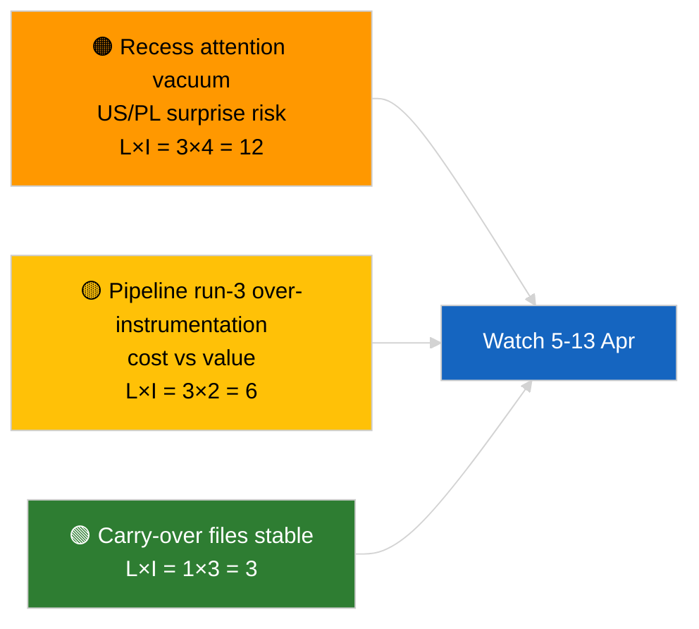

<!-- SPDX-FileCopyrightText: 2026 Hack23 AB -->
<!-- SPDX-License-Identifier: Apache-2.0 -->

# 执行摘要 — 突发新闻（休会前分析，第3轮）| 2026-04-04

**分类：** OSINT | 公开议会议事录
**可信度：** 🟢 高（休会期间分析更新）
**生成日期：** 2026-04-04T00:00:00Z（回顾性摘要）
**文章类型：** 突发新闻 — 第3轮 强化休会前分析
**来源：** 欧洲议会开放数据门户

---

## 🎯 BLUF

**2026年4月4日无新突发事件；欧洲议会正值复活节休会（3月27日 → 4月13日）。** 今日第三轮分析在2026-04-04早期分析（`breaking` 联盟评估、`breaking-2` Q1管道）基础上，向持续中的Q1集群添加完整文件标题和程序参考。无新参与者、无新程序、无今日日期的采纳文本。此次贡献是**来源信息丰富**，而非新的政治信号。**🟢 高可信度**：新信号缺失源于日历安排；**🟢 高可信度**：来源补充提升了后续使用者的可靠性（完整程序ID可追溯）。

---

## 🧭 本摘要支持的3项决策

| # | 决策 | 决策者 | 截止时间 | 依据 |
|:-:|-----|-------|:--------:|------|
| 1 | **编辑：** 跳过日常版本；本轮为纯来源丰富 | 编辑 | +12小时 | 无新信号 |
| 2 | **监控：** 确保下一周期的运行继承完整标题/程序ID丰富 | 数据管道 | 2026-04-05 | 减少下游解析摩擦 |
| 3 | **前瞻监控：** 监测4月13日复活节休会结束 | 分析主管 | 2026-04-13 | 休会→委员会周过渡 |

---

## 📰 60秒速读

- 🔴 **2026-04-04无新突发事件。**（🟢 高）
- 🟠 **第3轮丰富：** 向持续中Q1集群添加完整文件标题和程序参考。（🟢 高）
- 🟢 **休会持续中**（第9天，共18天）；剩余4天。（🟢 高）
- 🟡 **数据管道无回归；** 分析工具按2026-04-03/breaking-2基线继续运行。（🟢 高）
- 🔵 **经济背景：** 持续中的美国关税和欧洲央行副行长文件仍为主要参考。（🟢 高）
- 🟣 **交叉参考：** 联盟/管道/采纳文本实质性分析请见同系列简报。（🟢 高）
- 🩷 **扰乱向量：** 今日无紧急事项。（🟢 高）
- ⚪ **持续事项：** 在剩余休会天内追踪波兰法律动态和欧盟–美国贸易信息。

---

## 🗂️ 主要文件/程序一览表

| 排名 | EP参考 | 标题（简称） | 重要性 | 可信度 | 状态 |
|:---:|--------|------------|:------:|:------:|------|
| 1 | — | 无新突发事件 | 0.0 | 🟢 HIGH | 休会第9天，共18天 |
| 2 | TA-10-2026-0094 | 反腐败指令（持续中，完整程序ID 2023/0135） | 9.0 | 🟢 HIGH | 转化监测 |
| 3 | TA-10-2026-0088 | Braun豁免撤销（程序2025/2192） | 7.0 | 🟢 HIGH | LIBE跟进监测 |

---

## ⚠️ 风险与威胁快照

| 风险 | L | I | 得分 | 触发因素 | 来源 | 海军情报等级 |
|-----|:-:|:-:|:---:|---------|-----|:---------:|
| 休会期间注意力真空 | 3 | 4 | 12 | 美国或波兰意外事件 | EP日历 | A2 |
| 管道第3轮成本对比价值 | 3 | 2 | 6 | 持续性空洞丰富 | 运行节奏 | B3 |

---

## 🔮 首要未来触发因素

**2026年4月13日复活节休会结束 + 4月13日至17日委员会周。** Q2首个实质性新信号。

---

## 🛡️ 来源质量评估

- **主要来源：** Q1采纳文本清单（一周备用）；程序注册表。
- **可信度：** 🟢 HIGH（就丰富准确性而言）。

---

## 📎 链接

| 链接 | 路径 |
|-----|------|
| 文章 | `./article.md` |
| 同系列运行 | `analysis/daily/2026-04-04/breaking/`, `breaking-2/`, `breaking-4/`, `week-in-review/` |
| 清单 | `./manifest.json` |

---

**文档控制**
- **模板：** `/analysis/templates/executive-brief.md`
- **制品路径：** `analysis/daily/2026-04-04/breaking-3/executive-brief.md`
- **分类：** 公开
- **回顾性生成：** 回填会话。
