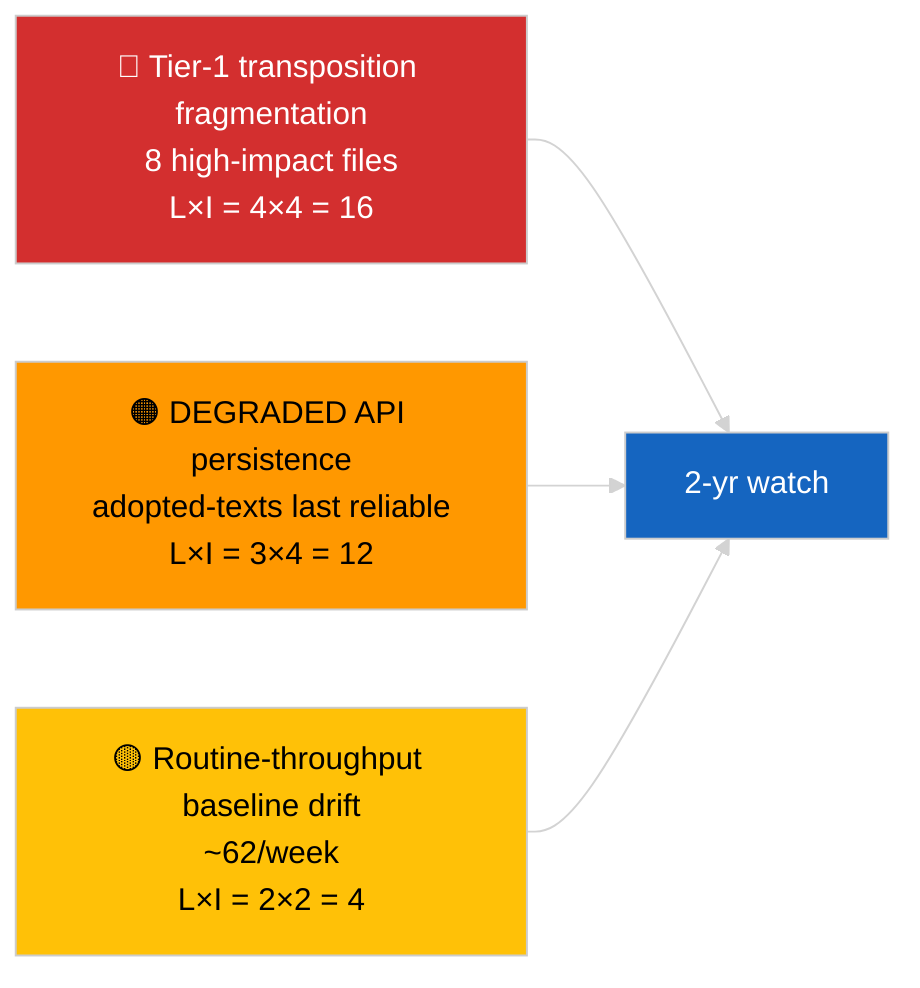

<!-- SPDX-FileCopyrightText: 2026 Hack23 AB -->
<!-- SPDX-License-Identifier: Apache-2.0 -->

# Executive Brief — Breaking (Adopted Texts Deep Dive) | 2026-04-04

**Classification:** OSINT | Public Parliamentary Record
**Confidence:** 🟢 High (85-item one-week feed sample under DEGRADED API state)
**Generated:** 2026-04-04T00:00:00Z (retrospective brief)
**Article Type:** Breaking — Adopted Texts Deep Dive
**Source:** European Parliament Open Data Portal

---

## 🎯 BLUF

**The one-week adopted-texts feed returned 85 items spanning three distinct periods of parliamentary activity — 70 items from the current EP10 2026 session, the remainder from prior windows.** Under the DEGRADED API state confirmed by 2026-04-03/breaking-2, the adopted-texts feed remains the most reliable substantive data source (one-week fallback returns the 85 items). The dominant tier-1 cluster is the March 2026 Strasbourg + Brussels output: anti-corruption (TA-10-2026-0094), ECB Vice-President (TA-10-2026-0060), HDV emissions (TA-10-2026-0084), US tariff (TA-10-2026-0096), Braun immunity (TA-10-2026-0088), Better Law-Making (TA-10-2026-0063), public-access-to-documents (TA-10-2026-0065), Georgia (TA-10-2026-0083). Remaining ~62 items are lower-significance routine adoptions. **🟢 HIGH confidence** on the 85-item count and dominant-cluster identification.

---

## 🧭 3 Decisions This Brief Supports

| # | Decision | Who Decides | Deadline | Evidence |
|:-:|----------|-------------|:--------:|----------|
| 1 | **Editorial:** publish Q1 adopted-texts long-form recap as anchor article | Editor | +48h | 85-item inventory + 8 tier-1 |
| 2 | **Monitoring:** prioritise adopted-texts feed as primary data path during DEGRADED state | Data pipeline | until restoration | Most reliable endpoint |
| 3 | **Forward-watch:** transposition status reporting for top-3 tier-1 items | Analyst | quarterly | Implementation oversight |

---

## 📰 60-Second Read

- 🔴 **85 adopted texts** in the one-week feed sample; 70 from EP10 2026; remainder carry-over older windows. (🟢 High)
- 🟠 **8 tier-1 items concentrated in March 2026** — anti-corruption, ECB VP, HDV emissions, US tariff, Braun immunity, Better Law-Making, public-access, Georgia. (🟢 High)
- 🟢 **Adopted-texts feed = most reliable** endpoint during DEGRADED state. (🟢 High)
- 🟡 **~62 lower-significance routine adoptions** (typical EP throughput baseline). (🟢 High)
- 🔵 **Economic context:** the 8 tier-1 cluster pivots on industrial-economic (HDV, tariff), institutional (ECB, Better Law-Making), and rule-of-law (anti-corruption, Braun) axes. (🟢 High)
- 🟣 **Cross-reference:** sibling `breaking-2` reproduces the same inventory at pipeline-stage abstraction. (🟢 High)
- 🩷 **Disruption vector:** ECB / US-tariff files are most exposed to external macro shocks. (🟡 Medium)
- ⚪ **Carry-forward:** quarterly transposition reporting needed across Q3-Q4 2026 and into 2027 / 2028.

---

## 🗂️ Top Documents / Procedures Table

| Rank | EP reference | Title (short) | Significance | Confidence |
|:----:|--------------|---------------|:------------:|:----------:|
| 1 | TA-10-2026-0094 | Anti-corruption directive | 9.0 | 🟢 HIGH |
| 2 | TA-10-2026-0060 | ECB Vice-President | 8.0 | 🟢 HIGH |
| 3 | TA-10-2026-0096 | US customs tariff | 7.5 | 🟢 HIGH |
| 4 | TA-10-2026-0084 | HDV emission credits | 7.0 | 🟢 HIGH |
| 5 | TA-10-2026-0088 | Braun immunity | 7.0 | 🟢 HIGH |
| 6 | TA-10-2026-0083 | Georgia political prisoners | 7.0 | 🟢 HIGH |
| 7 | TA-10-2026-0063 | Better Law-Making | 7.0 | 🟢 HIGH |
| 8 | TA-10-2026-0065 | Public access to documents | 7.0 | 🟢 HIGH |

---

## ⚠️ Risk & Threat Snapshot

| Risk | L | I | Score | Trigger | Source | Admiralty |
|------|:-:|:-:|:-----:|---------|--------|:---------:|
| Tier-1 transposition fragmentation | 4 | 4 | 16 | National divergence | TA-10-2026-0094, TA-10-2026-0084 | A1 |
| Adopted-texts feed regression | 3 | 4 | 12 | Loss of last reliable endpoint | Sibling `breaking-2` | A2 |
| Routine throughput drift | 2 | 2 | 4 | Sustained <40/week | Feed sample | B3 |

---

## 🔮 Top Forward Trigger

**Quarterly transposition reporting cycle for the 8 tier-1 cluster (Q3 2026 → Q1 2028).** Member-state compliance dashboards will indicate whether Q1 EP output translates to durable EU-wide effect.

---

## 🛡️ Source Quality Assessment

- **Primary sources:** EP `get_adopted_texts_feed` one-week window (85 items).
- **Confidence:** 🟢 HIGH on inventory; 🟡 MEDIUM on long-tail item-by-item classification.

---

## 📎 Links

| Link | Path |
|------|------|
| Article | `./article.md` |
| Sibling runs | `analysis/daily/2026-04-04/breaking/`, `breaking-2/`, `breaking-3/`, `week-in-review/` |
| Manifest | `./manifest.json` |

---

**Document Control**
- **Template:** `/analysis/templates/executive-brief.md`
- **Artifact path:** `analysis/daily/2026-04-04/breaking-4/executive-brief.md`
- **Classification:** Public
- **Retrospective generation:** Back-fill session.
