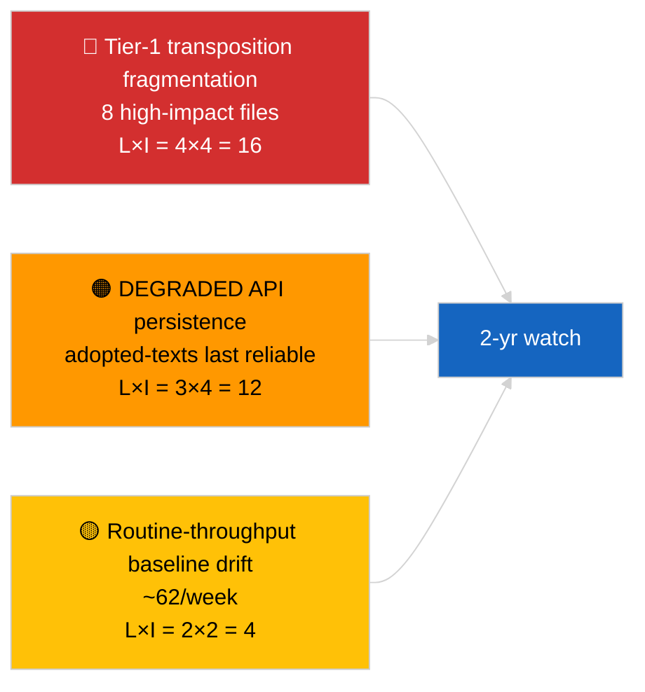

<!-- SPDX-FileCopyrightText: 2026 Hack23 AB -->
<!-- SPDX-License-Identifier: Apache-2.0 -->

# تقرير تنفيذي — عاجل (تحليل معمّق للنصوص المعتمدة) | 2026-04-04

**التصنيف:** OSINT | سجل برلماني عام
**مستوى الثقة:** 🟢 مرتفع (عينة 85 بنداً على مدى أسبوع في حالة API المتدهورة)
**تاريخ الإنشاء:** 2026-04-04T00:00:00Z (استرجاعي)
**نوع المقالة:** عاجل — تحليل معمّق للنصوص المعتمدة
**المصدر:** بوابة البيانات المفتوحة للبرلمان الأوروبي

---

## 🎯 BLUF

**أعاد التغذية الأسبوعية للنصوص المعتمدة 85 بنداً موزعة على ثلاث فترات متمايزة من النشاط البرلماني — 70 بنداً من دورة EP10 2026 الجارية، والباقي من نوافذ سابقة.** في حالة API المتدهورة التي أكدها 2026-04-03/breaking-2، تظل تغذية النصوص المعتمدة المصدر الجوهري الأكثر موثوقية (احتياطي أسبوع واحد يعيد 85 بنداً). يتمثّل تجمع الدرجة الأولى المهيمن في مخرجات مارس 2026 من ستراسبورغ + بروكسل: مكافحة الفساد (TA-10-2026-0094)، نائب رئيس البنك المركزي الأوروبي (TA-10-2026-0060)، انبعاثات HDV (TA-10-2026-0084)، الرسوم الجمركية الأمريكية (TA-10-2026-0096)، حصانة براون (TA-10-2026-0088)، التشريع الأفضل (TA-10-2026-0063)، الوصول إلى الوثائق (TA-10-2026-0065)، جورجيا (TA-10-2026-0083). البنود الـ ~62 المتبقية هي اعتمادات روتينية أقل أهمية. **🟢 ثقة مرتفعة** في عدد البنود الـ 85 وتحديد التجمع المهيمن.

---

## 🧭 3 قرارات يدعمها هذا التقرير

| # | القرار | من يقرر | الموعد النهائي | الدليل |
|:-:|--------|---------|:--------------:|--------|
| 1 | **تحريري:** نشر ملخص طويل للربع الأول للنصوص المعتمدة كمقالة مرساة | المحرر | +48 ساعة | مخزون 85 بنداً + 8 من الدرجة الأولى |
| 2 | **مراقبة:** إعطاء الأولوية لتغذية النصوص المعتمدة كمسار بيانات رئيسي في حالة التدهور | خط أنابيب البيانات | حتى الاستعادة | أكثر نقاط النهاية موثوقية |
| 3 | **متابعة مستقبلية:** الإبلاغ عن حالة التنفيذ لأهم 3 بنود من الدرجة الأولى | المحلل | ربع سنوي | الإشراف على التنفيذ |

---

## 📰 القراءة في 60 ثانية

- 🔴 **85 نصاً معتمداً** في عينة التغذية الأسبوعية؛ 70 من EP10 2026؛ الباقي ترحيل من نوافذ أقدم. (🟢 مرتفعة)
- 🟠 **8 بنود من الدرجة الأولى مركّزة في مارس 2026** — مكافحة الفساد، نائب رئيس البنك المركزي الأوروبي، انبعاثات HDV، الرسوم الجمركية الأمريكية، حصانة براون، التشريع الأفضل، الوصول إلى الوثائق، جورجيا. (🟢 مرتفعة)
- 🟢 **تغذية النصوص المعتمدة = نقطة النهاية الأكثر موثوقية** في حالة التدهور. (🟢 مرتفعة)
- 🟡 **~62 اعتماداً روتينياً أقل أهمية** (خط الأساس النموذجي لإنتاجية البرلمان الأوروبي). (🟢 مرتفعة)
- 🔵 **السياق الاقتصادي:** يتمحور تجمع الدرجة الأولى الـ 8 حول المحاور الصناعية الاقتصادية (HDV، الرسوم)، والمؤسسية (البنك المركزي الأوروبي، التشريع الأفضل)، وسيادة القانون (مكافحة الفساد، براون). (🟢 مرتفعة)
- 🟣 **الإسناد المتقاطع:** التحليل الشقيق `breaking-2` يعيد إنتاج نفس المخزون على مستوى التجريد في خط الأنابيب. (🟢 مرتفعة)
- 🩷 **ناقل التعطيل:** ملفات البنك المركزي الأوروبي / الرسوم الجمركية الأمريكية هي الأكثر تعرضاً للصدمات الاقتصادية الكلية الخارجية. (🟡 متوسطة)
- ⚪ **الترحيل إلى الأمام:** تقارير ربع سنوية عن حالة التنفيذ مطلوبة خلال Q3–Q4 2026 وحتى 2027/2028.

---

## 🗂️ جدول أهم الوثائق / الإجراءات

| الترتيب | المرجع البرلماني | العنوان (مختصر) | الأهمية | مستوى الثقة |
|:-------:|----------------|-----------------|:-------:|:-----------:|
| 1 | TA-10-2026-0094 | توجيه مكافحة الفساد | 9.0 | 🟢 مرتفع |
| 2 | TA-10-2026-0060 | نائب رئيس البنك المركزي الأوروبي | 8.0 | 🟢 مرتفع |
| 3 | TA-10-2026-0096 | الرسوم الجمركية الأمريكية | 7.5 | 🟢 مرتفع |
| 4 | TA-10-2026-0084 | أرصدة انبعاثات HDV | 7.0 | 🟢 مرتفع |
| 5 | TA-10-2026-0088 | حصانة براون | 7.0 | 🟢 مرتفع |
| 6 | TA-10-2026-0083 | المعتقلون السياسيون في جورجيا | 7.0 | 🟢 مرتفع |
| 7 | TA-10-2026-0063 | التشريع الأفضل | 7.0 | 🟢 مرتفع |
| 8 | TA-10-2026-0065 | الوصول العام إلى الوثائق | 7.0 | 🟢 مرتفع |

---

## ⚠️ لمحة سريعة عن المخاطر والتهديدات

| الخطر | L | I | النتيجة | المحفز | المصدر | الأميرالية |
|-------|:-:|:-:|:-------:|--------|--------|:----------:|
| تجزئة تنفيذ الدرجة الأولى | 4 | 4 | 16 | التباين الوطني | TA-10-2026-0094, TA-10-2026-0084 | A1 |
| تراجع تغذية النصوص المعتمدة | 3 | 4 | 12 | فقدان آخر نقطة نهاية موثوقة | الشقيق `breaking-2` | A2 |
| انحراف الإنتاجية الروتينية | 2 | 2 | 4 | مستمر <40/أسبوع | عينة التغذية | B3 |

---

## 🔮 أبرز المحفزات المستقبلية

**دورة التنفيذ الربع السنوي لتجمع الدرجة الأولى الـ 8 (Q3 2026 → Q1 2028).** ستُبيّن لوحات متابعة الامتثال في الدول الأعضاء ما إذا كانت مخرجات الربع الأول للبرلمان الأوروبي تتحول إلى أثر دائم على مستوى الاتحاد الأوروبي.

---

## 🛡️ تقييم جودة المصادر

- **المصادر الأساسية:** تغذية `get_adopted_texts_feed` للبرلمان الأوروبي لنافذة أسبوع واحد (85 بنداً).
- **مستوى الثقة:** 🟢 مرتفع في المخزون؛ 🟡 متوسط في تصنيف البنود الفردية ذات الذيل الطويل.

---

## 📎 روابط

| الرابط | المسار |
|--------|--------|
| المقالة | `./article.md` |
| التشغيلات الشقيقة | `analysis/daily/2026-04-04/breaking/`, `breaking-2/`, `breaking-3/`, `week-in-review/` |
| البيان | `./manifest.json` |

---

**ضبط الوثيقة**
- **القالب:** `/analysis/templates/executive-brief.md`
- **مسار الأثر:** `analysis/daily/2026-04-04/breaking-4/executive-brief.md`
- **التصنيف:** عام
- **الإنشاء الاسترجاعي:** جلسة الملء الاسترجاعي.
