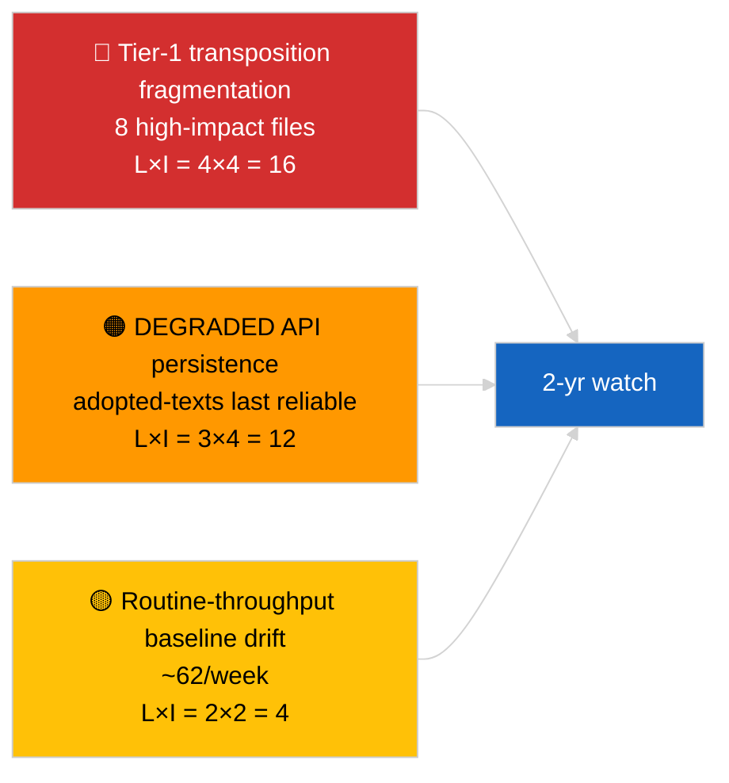

<!-- SPDX-FileCopyrightText: 2026 Hack23 AB -->
<!-- SPDX-License-Identifier: Apache-2.0 -->

# Eksekutiv rapport — Breaking (Dybdedykning i vedtagne tekster) | 2026-04-04

**Klassificering:** OSINT | Offentlig parlamentarisk protokol
**Konfidens:** 🟢 Høj (85-element ugeprøve under DEGRADED API-tilstand)
**Genereret:** 2026-04-04T00:00:00Z (retrospektivt)
**Artikeltype:** Breaking — Vedtagne tekster dybdedykning
**Kilde:** Europa-Parlamentets åbne dataportal

---

## 🎯 BLUF

**Den ugentlige feed for vedtagne tekster returnerede 85 elementer fordelt på tre forskellige perioder — 70 elementer fra den aktuelle EP10 2026-session, resten fra tidligere vinduer.** Under den DEGRADED API-tilstand, bekræftet af 2026-04-03/breaking-2, er vedtagne-teksters-feeden den mest pålidelige substantielle datakilde (en uges fallback returnerer 85 elementer). Det dominerende tier-1-klynge er marts 2026 Strasbourg + Bruxelles-output: antikorruption (TA-10-2026-0094), ECB-vicepræsident (TA-10-2026-0060), HDV-emissioner (TA-10-2026-0084), amerikanske told (TA-10-2026-0096), Braun-immunitet (TA-10-2026-0088), Bedre lovgivning (TA-10-2026-0063), dokumentadgang (TA-10-2026-0065), Georgien (TA-10-2026-0083). De resterende ~62 elementer er lavere-signifikante rutinevedtagelser. **🟢 HØJ konfidens** på 85-elementer-antallet og dominerende klyngeidentificering.

---

## 🧭 3 Beslutninger denne rapport understøtter

| # | Beslutning | Hvem beslutter | Deadline | Dokumentation |
|:-:|-----------|----------------|:--------:|---------------|
| 1 | **Redaktionelt:** udgiv Q1 vedtagne tekster langt resume som ankerlæsning | Redaktør | +48h | 85-elementer inventar + 8 tier-1 |
| 2 | **Overvågning:** prioritér vedtagne-teksters-feeden som primær datavej under DEGRADED-tilstand | Datapipeline | til genoprettelse | Mest pålidelig slutpunkt |
| 3 | **Fremadrettet:** transponeringstatus for top-3 tier-1 elementer | Analytiker | kvartalsvis | Implementeringsovervågning |

---

## 📰 60-sekunders læsning

- 🔴 **85 vedtagne tekster** i ugefeedsudvalget; 70 fra EP10 2026; resten carry-over ældre vinduer. (🟢 Høj)
- 🟠 **8 tier-1 elementer koncentreret i marts 2026** — antikorruption, ECB VP, HDV-emissioner, amerikanske told, Braun-immunitet, Bedre lovgivning, dokumentadgang, Georgien. (🟢 Høj)
- 🟢 **Vedtagne-teksters-feed = mest pålidelig** slutpunkt under DEGRADED-tilstand. (🟢 Høj)
- 🟡 **~62 lavere-signifikante rutinemæssige vedtagelser** (typisk EP-gennemstrømmingsbasis). (🟢 Høj)
- 🔵 **Økonomisk kontekst:** 8 tier-1-klyngen drejer sig om industri-økonomi (HDV, told), institutionelle (ECB, Bedre lovgivning) og retsstatlige (antikorruption, Braun) akser. (🟢 Høj)
- 🟣 **Krydsreference:** søskendeanalyse `breaking-2` gengiver samme inventar på pipeline-abstraktionsniveau. (🟢 Høj)
- 🩷 **Forstyrelsesvektor:** ECB / US-told-filer mest eksponerede for eksterne makrochok. (🟡 Medium)
- ⚪ **Carry-forward:** kvartalsvise transponeringsstatusrapporter nødvendige over Q3–Q4 2026 og ind i 2027/2028.

---

## 🗂️ Top Dokumenter / Proceduretabel

| Rang | EP-reference | Titel (kort) | Signifikans | Konfidens |
|:----:|-------------|---------------|:-----------:|:---------:|
| 1 | TA-10-2026-0094 | Antikorruptionsdirektiv | 9,0 | 🟢 HØJ |
| 2 | TA-10-2026-0060 | ECB vicepræsident | 8,0 | 🟢 HØJ |
| 3 | TA-10-2026-0096 | Amerikanske toldtariffer | 7,5 | 🟢 HØJ |
| 4 | TA-10-2026-0084 | HDV-emissionskreditter | 7,0 | 🟢 HØJ |
| 5 | TA-10-2026-0088 | Braun-immunitet | 7,0 | 🟢 HØJ |
| 6 | TA-10-2026-0083 | Georgien politiske fanger | 7,0 | 🟢 HØJ |
| 7 | TA-10-2026-0063 | Bedre lovgivning | 7,0 | 🟢 HØJ |
| 8 | TA-10-2026-0065 | Offentlig adgang til dokumenter | 7,0 | 🟢 HØJ |

---

## ⚠️ Risiko & Trusselsoverblik

| Risiko | L | I | Score | Trigger | Kilde | Admiralitet |
|--------|:-:|:-:|:-----:|---------|--------|:-----------:|
| Tier-1 transponeringsfragmentering | 4 | 4 | 16 | National divergens | TA-10-2026-0094, TA-10-2026-0084 | A1 |
| Vedtagne-teksters-feed-regression | 3 | 4 | 12 | Tab af sidste pålidelige slutpunkt | Søskendeanalyse `breaking-2` | A2 |
| Rutinegennemstrømmingsdrift | 2 | 2 | 4 | Vedvarende <40/uge | Feedudvalg | B3 |

---

## 🔮 Top fremadrettet trigger

**Kvartalsvis transpositionscyklus for 8 tier-1-klyngen (Q3 2026 → Q1 2028).** Medlemsstaternes overholdelsesdashboards vil vise, om Q1 EP-output oversættes til varig EU-effekt.

---

## 🛡️ Vurdering af kildekvalitet

- **Primærkilder:** EP `get_adopted_texts_feed` ugentligt vindue (85 elementer).
- **Konfidens:** 🟢 HØJ på inventar; 🟡 MEDIUM på langhalede element-for-element-klassificering.

---

## 📎 Links

| Link | Sti |
|------|-----|
| Artikel | `./article.md` |
| Søskendekørsler | `analysis/daily/2026-04-04/breaking/`, `breaking-2/`, `breaking-3/`, `week-in-review/` |
| Manifest | `./manifest.json` |

---

**Dokumentkontrol**
- **Skabelon:** `/analysis/templates/executive-brief.md`
- **Artefaktsti:** `analysis/daily/2026-04-04/breaking-4/executive-brief.md`
- **Klassificering:** Offentlig
- **Retrospektiv generering:** Backfill-session.
