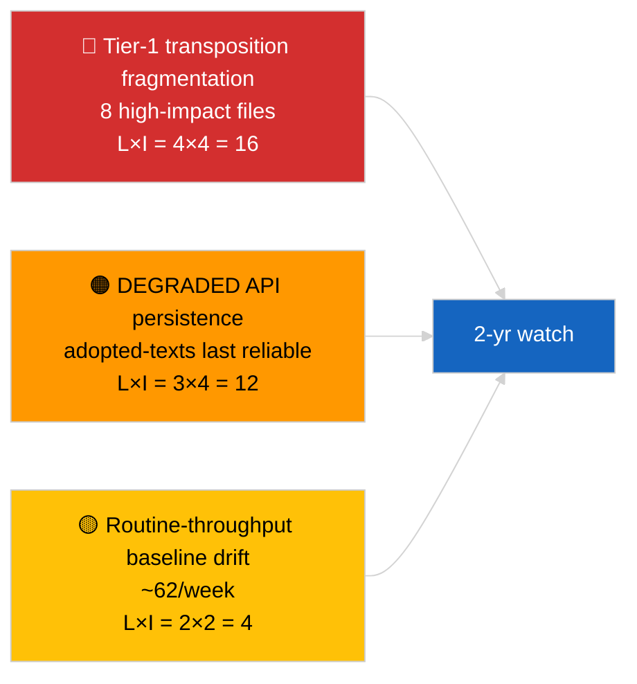

<!-- SPDX-FileCopyrightText: 2026 Hack23 AB -->
<!-- SPDX-License-Identifier: Apache-2.0 -->

# Exekutivbericht — Breaking (Tiefenanalyse angenommener Texte) | 2026-04-04

**Einstufung:** OSINT | Öffentliche parlamentarische Aufzeichnung
**Konfidenz:** 🟢 Hoch (85-Elemente-Wochenstichprobe im DEGRADED API-Zustand)
**Erstellt:** 2026-04-04T00:00:00Z (retrospektiv)
**Artikeltyp:** Breaking — Tiefenanalyse angenommener Texte
**Quelle:** Offenes Datenportal des Europäischen Parlaments

---

## 🎯 BLUF

**Der Wochenfeed für angenommene Texte lieferte 85 Einträge aus drei verschiedenen Zeiträumen — 70 Einträge aus der laufenden EP10 2026-Sitzung, der Rest aus früheren Fenstern.** Im DEGRADED API-Zustand, bestätigt durch 2026-04-03/breaking-2, bleibt der Feed für angenommene Texte die zuverlässigste substantielle Datenquelle (ein Wochen-Fallback liefert 85 Einträge). Das dominierende Tier-1-Cluster ist der März-2026-Output aus Straßburg und Brüssel: Anti-Korruption (TA-10-2026-0094), EZB-Vizepräsident (TA-10-2026-0060), HDV-Emissionen (TA-10-2026-0084), US-Zölle (TA-10-2026-0096), Braun-Immunität (TA-10-2026-0088), Bessere Rechtsetzung (TA-10-2026-0063), Dokumentenzugang (TA-10-2026-0065), Georgien (TA-10-2026-0083). Die verbleibenden ~62 Einträge sind Routineannahmen von geringerer Bedeutung. **🟢 HOHE Konfidenz** für den 85-Einträge-Zähler und die Identifizierung des dominierenden Clusters.

---

## 🧭 3 Entscheidungen, die dieser Bericht unterstützt

| # | Entscheidung | Wer entscheidet | Frist | Nachweise |
|:-:|------------|----------------|:----:|-----------|
| 1 | **Redaktionell:** Q1-Langzusammenfassung angenommener Texte als Ankerartikel veröffentlichen | Redakteur | +48h | 85-Einträge-Inventar + 8 Tier-1 |
| 2 | **Überwachung:** Feed für angenommene Texte als primären Datenpfad im DEGRADED-Zustand priorisieren | Datenpipeline | bis zur Wiederherstellung | Zuverlässigster Endpunkt |
| 3 | **Vorausschau:** Transpositionsstatus-Berichterstattung für Top-3-Tier-1-Einträge | Analyst | vierteljährlich | Implementierungsüberwachung |

---

## 📰 60-Sekunden-Lektüre

- 🔴 **85 angenommene Texte** in der Wochenfeed-Stichprobe; 70 aus EP10 2026; Rest als Carry-over älterer Fenster. (🟢 Hoch)
- 🟠 **8 Tier-1-Einträge im März 2026** — Anti-Korruption, EZB VP, HDV-Emissionen, US-Zölle, Braun-Immunität, Bessere Rechtsetzung, Dokumentenzugang, Georgien. (🟢 Hoch)
- 🟢 **Feed für angenommene Texte = zuverlässigster** Endpunkt im DEGRADED-Zustand. (🟢 Hoch)
- 🟡 **~62 Routineannahmen geringerer Bedeutung** (typische EP-Durchsatz-Basislinie). (🟢 Hoch)
- 🔵 **Wirtschaftlicher Kontext:** Das 8-Tier-1-Cluster dreht sich um industriell-wirtschaftliche (HDV, Zölle), institutionelle (EZB, Bessere Rechtsetzung) und rechtsstaatliche (Anti-Korruption, Braun) Achsen. (🟢 Hoch)
- 🟣 **Querverweise:** Geschwisteranalyse `breaking-2` gibt dasselbe Inventar auf Pipeline-Abstraktionsebene wieder. (🟢 Hoch)
- 🩷 **Störungsvektor:** EZB / US-Zölle-Dateien am stärksten externen Makroschocks ausgesetzt. (🟡 Mittel)
- ⚪ **Carry-forward:** Vierteljährliche Transpositionsstatusberichte erforderlich für Q3–Q4 2026 und 2027/2028.

---

## 🗂️ Top-Dokumente / Verfahrenstabelle

| Rang | EP-Referenz | Titel (kurz) | Bedeutung | Konfidenz |
|:----:|------------|--------------|:---------:|:---------:|
| 1 | TA-10-2026-0094 | Anti-Korruptionsrichtlinie | 9,0 | 🟢 HOCH |
| 2 | TA-10-2026-0060 | EZB-Vizepräsident | 8,0 | 🟢 HOCH |
| 3 | TA-10-2026-0096 | US-Zolltarife | 7,5 | 🟢 HOCH |
| 4 | TA-10-2026-0084 | HDV-Emissionsguthaben | 7,0 | 🟢 HOCH |
| 5 | TA-10-2026-0088 | Braun-Immunität | 7,0 | 🟢 HOCH |
| 6 | TA-10-2026-0083 | Georgien politische Gefangene | 7,0 | 🟢 HOCH |
| 7 | TA-10-2026-0063 | Bessere Rechtsetzung | 7,0 | 🟢 HOCH |
| 8 | TA-10-2026-0065 | Öffentlicher Zugang zu Dokumenten | 7,0 | 🟢 HOCH |

---

## ⚠️ Risiko & Bedrohungsübersicht

| Risiko | L | I | Score | Auslöser | Quelle | Admiralität |
|--------|:-:|:-:|:-----:|---------|--------|:-----------:|
| Tier-1-Transpositionsfragmentierung | 4 | 4 | 16 | Nationale Divergenz | TA-10-2026-0094, TA-10-2026-0084 | A1 |
| Feed-Regression angenommener Texte | 3 | 4 | 12 | Verlust des letzten zuverlässigen Endpunkts | Geschwister `breaking-2` | A2 |
| Routinedurchsatz-Drift | 2 | 2 | 4 | Anhaltend <40/Woche | Feed-Stichprobe | B3 |

---

## 🔮 Top-Vorwärts-Auslöser

**Vierteljährlicher Transpositionszyklus für das 8-Tier-1-Cluster (Q3 2026 → Q1 2028).** Die Compliance-Dashboards der Mitgliedstaaten zeigen, ob der Q1-EP-Output in dauerhafte EU-weite Wirkung übersetzt wird.

---

## 🛡️ Bewertung der Quellenqualität

- **Primärquellen:** EP `get_adopted_texts_feed` Wochenfenster (85 Einträge).
- **Konfidenz:** 🟢 HOCH für das Inventar; 🟡 MITTEL für die Long-Tail-Eintrag-für-Eintrag-Klassifizierung.

---

## 📎 Links

| Link | Pfad |
|------|------|
| Artikel | `./article.md` |
| Geschwisterdurchläufe | `analysis/daily/2026-04-04/breaking/`, `breaking-2/`, `breaking-3/`, `week-in-review/` |
| Manifest | `./manifest.json` |

---

**Dokumentenkontrolle**
- **Vorlage:** `/analysis/templates/executive-brief.md`
- **Artefaktpfad:** `analysis/daily/2026-04-04/breaking-4/executive-brief.md`
- **Einstufung:** Öffentlich
- **Retrospektive Erstellung:** Backfill-Sitzung.
