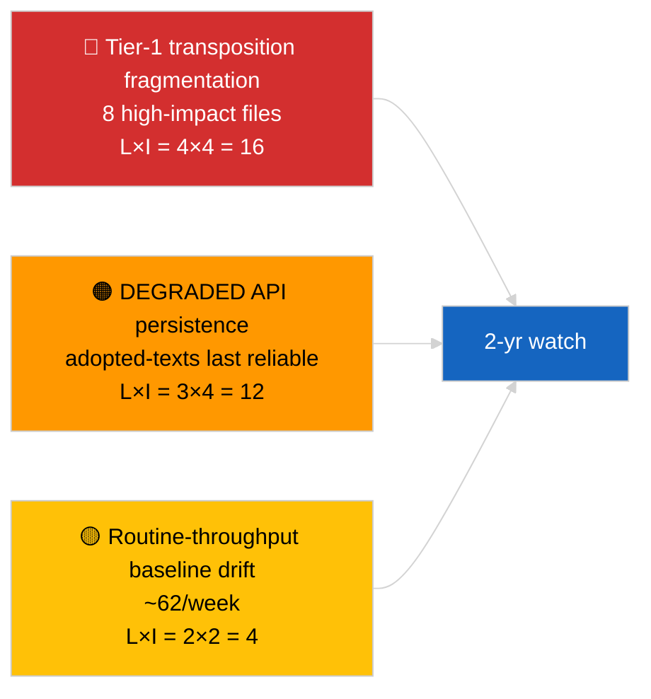

<!-- SPDX-FileCopyrightText: 2026 Hack23 AB -->
<!-- SPDX-License-Identifier: Apache-2.0 -->

# Informe ejecutivo — Breaking (Análisis profundo de textos aprobados) | 2026-04-04

**Clasificación:** OSINT | Registro parlamentario público
**Confianza:** 🟢 Alta (muestra de 85 elementos de una semana bajo estado DEGRADED de API)
**Generado:** 2026-04-04T00:00:00Z (retrospectivo)
**Tipo de artículo:** Breaking — Análisis profundo de textos aprobados
**Fuente:** Portal de datos abiertos del Parlamento Europeo

---

## 🎯 BLUF

**El feed semanal de textos aprobados devolvió 85 elementos que abarcan tres períodos distintos de actividad parlamentaria — 70 elementos de la sesión actual EP10 2026, el resto de ventanas anteriores.** Bajo el estado DEGRADED de API confirmado por 2026-04-03/breaking-2, el feed de textos aprobados sigue siendo la fuente de datos sustancial más fiable (el fallback de una semana devuelve 85 elementos). El clúster tier-1 dominante es el output de marzo 2026 Estrasburgo + Bruselas: anticorrupción (TA-10-2026-0094), vicepresidente del BCE (TA-10-2026-0060), emisiones HDV (TA-10-2026-0084), aranceles estadounidenses (TA-10-2026-0096), inmunidad de Braun (TA-10-2026-0088), Mejor legislar (TA-10-2026-0063), acceso a documentos (TA-10-2026-0065), Georgia (TA-10-2026-0083). Los restantes ~62 elementos son adopciones de rutina de menor importancia. **🟢 ALTA confianza** en el recuento de 85 elementos y en la identificación del clúster dominante.

---

## 🧭 3 Decisiones que apoya este informe

| # | Decisión | Quién decide | Plazo | Evidencia |
|:-:|----------|-------------|:-----:|-----------|
| 1 | **Editorial:** publicar el resumen largo Q1 de textos aprobados como artículo ancla | Editor | +48h | Inventario de 85 elementos + 8 tier-1 |
| 2 | **Monitoreo:** priorizar el feed de textos aprobados como ruta principal de datos en estado DEGRADED | Pipeline de datos | hasta restauración | Punto final más fiable |
| 3 | **Vigilancia prospectiva:** reporte del estado de transposición para los 3 primeros elementos tier-1 | Analista | trimestral | Supervisión de implementación |

---

## 📰 Lectura en 60 segundos

- 🔴 **85 textos aprobados** en la muestra del feed semanal; 70 de EP10 2026; el resto carry-over de ventanas anteriores. (🟢 Alta)
- 🟠 **8 elementos tier-1 concentrados en marzo 2026** — anticorrupción, VP BCE, emisiones HDV, aranceles estadounidenses, inmunidad de Braun, Mejor legislar, acceso a documentos, Georgia. (🟢 Alta)
- 🟢 **Feed de textos aprobados = punto final más fiable** en estado DEGRADED. (🟢 Alta)
- 🟡 **~62 adopciones de rutina de menor importancia** (línea base típica de rendimiento del PE). (🟢 Alta)
- 🔵 **Contexto económico:** el clúster de 8 tier-1 pivota en los ejes industrial-económico (HDV, aranceles), institucional (BCE, Mejor legislar) y estado de derecho (anticorrupción, Braun). (🟢 Alta)
- 🟣 **Referencia cruzada:** el análisis hermano `breaking-2` reproduce el mismo inventario en la abstracción de la canalización. (🟢 Alta)
- 🩷 **Vector de perturbación:** los archivos del BCE / aranceles estadounidenses son los más expuestos a shocks macro externos. (🟡 Medio)
- ⚪ **Carry-forward:** se requieren informes trimestrales del estado de transposición para Q3–Q4 2026 y en 2027/2028.

---

## 🗂️ Tabla de principales documentos / procedimientos

| Rango | Referencia PE | Título (corto) | Importancia | Confianza |
|:-----:|-------------|----------------|:-----------:|:---------:|
| 1 | TA-10-2026-0094 | Directiva anticorrupción | 9,0 | 🟢 ALTA |
| 2 | TA-10-2026-0060 | Vicepresidente del BCE | 8,0 | 🟢 ALTA |
| 3 | TA-10-2026-0096 | Aranceles aduaneros de EE.UU. | 7,5 | 🟢 ALTA |
| 4 | TA-10-2026-0084 | Créditos de emisiones HDV | 7,0 | 🟢 ALTA |
| 5 | TA-10-2026-0088 | Inmunidad de Braun | 7,0 | 🟢 ALTA |
| 6 | TA-10-2026-0083 | Presos políticos de Georgia | 7,0 | 🟢 ALTA |
| 7 | TA-10-2026-0063 | Mejor legislar | 7,0 | 🟢 ALTA |
| 8 | TA-10-2026-0065 | Acceso público a documentos | 7,0 | 🟢 ALTA |

---

## ⚠️ Instantánea de riesgos y amenazas

| Riesgo | L | I | Puntuación | Disparador | Fuente | Almirantazgo |
|--------|:-:|:-:|:----------:|-----------|--------|:------------:|
| Fragmentación de transposición tier-1 | 4 | 4 | 16 | Divergencia nacional | TA-10-2026-0094, TA-10-2026-0084 | A1 |
| Regresión del feed de textos aprobados | 3 | 4 | 12 | Pérdida del último punto final fiable | Análisis hermano `breaking-2` | A2 |
| Deriva del rendimiento de rutina | 2 | 2 | 4 | Sostenido <40/semana | Muestra del feed | B3 |

---

## 🔮 Principal disparador prospectivo

**Ciclo de transposición trimestral para el clúster tier-1 de 8 elementos (Q3 2026 → Q1 2028).** Los paneles de cumplimiento de los Estados miembros indicarán si el output del PE en Q1 se traduce en un efecto europeo duradero.

---

## 🛡️ Evaluación de calidad de fuentes

- **Fuentes primarias:** EP `get_adopted_texts_feed` ventana semanal (85 elementos).
- **Confianza:** 🟢 ALTA en el inventario; 🟡 MEDIA en la clasificación elemento por elemento de cola larga.

---

## 📎 Enlaces

| Enlace | Ruta |
|--------|------|
| Artículo | `./article.md` |
| Ejecuciones hermanas | `analysis/daily/2026-04-04/breaking/`, `breaking-2/`, `breaking-3/`, `week-in-review/` |
| Manifiesto | `./manifest.json` |

---

**Control del documento**
- **Plantilla:** `/analysis/templates/executive-brief.md`
- **Ruta del artefacto:** `analysis/daily/2026-04-04/breaking-4/executive-brief.md`
- **Clasificación:** Público
- **Generación retrospectiva:** Sesión de relleno.
