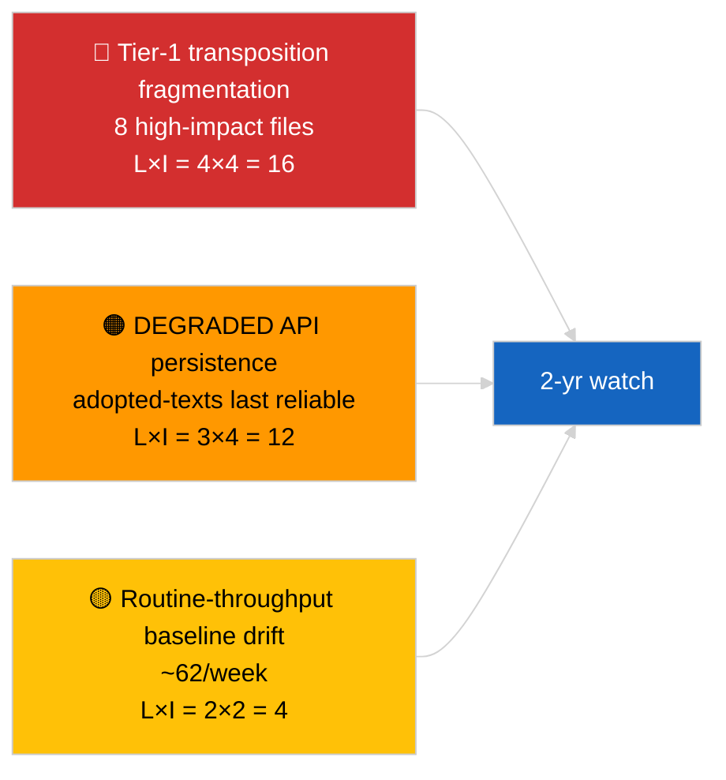

<!-- SPDX-FileCopyrightText: 2026 Hack23 AB -->
<!-- SPDX-License-Identifier: Apache-2.0 -->

# Toimeenpanoraportti — Uutinen (Hyväksyttyjen tekstien syväanalyysi) | 2026-04-04

**Luokittelu:** OSINT | Julkinen parlamentaarinen protokolla
**Luottamustaso:** 🟢 Korkea (85 kohteen viikkonäyte DEGRADED API -tilassa)
**Luotu:** 2026-04-04T00:00:00Z (retrospektiivisesti)
**Artikkelityyppi:** Breaking — Hyväksyttyjen tekstien syväanalyysi
**Lähde:** Euroopan parlamentin avoin dataportti

---

## 🎯 BLUF

**Hyväksyttyjen tekstien viikon syöte palautti 85 kohdetta kolmelta erilliseltä ajanjaksolta — 70 kohdetta nykyisestä EP10 2026 -istunnosta, loput aiemmista ikkunoista.** DEGRADED API -tilassa, jonka 2026-04-03/breaking-2 vahvisti, hyväksyttyjen tekstien syöte on luotettavin substansiaalinen tietolähde (viikon fallback palauttaa 85 kohdetta). Hallitseva tier-1-ryhmä on maaliskuu 2026 Strasbourg + Bryssel -tuotos: korruptionvastainen (TA-10-2026-0094), EKP:n varapuheenjohtaja (TA-10-2026-0060), HDV-päästöt (TA-10-2026-0084), Yhdysvaltain tullit (TA-10-2026-0096), Braun-immuniteetti (TA-10-2026-0088), Parempi lainsäädäntö (TA-10-2026-0063), asiakirjojen saatavuus (TA-10-2026-0065), Georgia (TA-10-2026-0083). Loput ~62 kohdetta ovat alhaisemman merkityksen rutiinihyväksyntöjä. **🟢 KORKEA luottamustaso** 85 kohteen lukumäärässä ja hallitsevan ryhmän tunnistamisessa.

---

## 🧭 3 Päätöstä, joita tämä raportti tukee

| # | Päätös | Kuka päättää | Määräaika | Näyttö |
|:-:|--------|-------------|:---------:|--------|
| 1 | **Toimituksellinen:** julkaise Q1 hyväksyttyjen tekstien pitkä yhteenveto ankkuriartikkelina | Toimittaja | +48h | 85 kohteen inventaari + 8 tier-1 |
| 2 | **Seuranta:** priorisoi hyväksyttyjen tekstien syöte ensisijaisena datapolkuna DEGRADED-tilassa | Datapipeline | kunnes palautetaan | Luotettavin päätepiste |
| 3 | **Eteenpäin katsominen:** transponointistatusraportointi topp-3 tier-1 kohteille | Analyytikko | neljännesvuosittain | Toimeenpanon valvonta |

---

## 📰 60 sekunnin lukeminen

- 🔴 **85 hyväksyttyä tekstiä** viikon syötenäytteessä; 70 EP10 2026:sta; loput carry-over vanhemmista ikkunoista. (🟢 Korkea)
- 🟠 **8 tier-1 kohdetta maaliskuussa 2026** — korruptionvastainen, EKP VP, HDV-päästöt, Yhdysvaltain tullit, Braun-immuniteetti, Parempi lainsäädäntö, asiakirjojen saatavuus, Georgia. (🟢 Korkea)
- 🟢 **Hyväksyttyjen tekstien syöte = luotettavin** päätepiste DEGRADED-tilassa. (🟢 Korkea)
- 🟡 **~62 alhaisemman merkityksen rutiinihyväksyntää** (tyypillinen EP:n läpivirtauslinja). (🟢 Korkea)
- 🔵 **Taloudellinen konteksti:** 8 tier-1-ryhmä kiertyy teollisuus-taloudellisten (HDV, tullit), institutionaalisten (EKP, Parempi lainsäädäntö) ja oikeusvaltioperiaatteen (korruptionvastainen, Braun) akseleiden ympärille. (🟢 Korkea)
- 🟣 **Ristiviittaus:** sisaranalyysi `breaking-2` toistaa saman inventaarin pipeline-abstraktion tasolla. (🟢 Korkea)
- 🩷 **Häiriövektori:** EKP / Yhdysvaltain tullit -tiedostot eniten altistuneita ulkoisille makroshokeille. (🟡 Keskitaso)
- ⚪ **Carry-forward:** neljännesvuosittaiset transponointistatusraportit tarvitaan Q3–Q4 2026 ja 2027/2028 ajalle.

---

## 🗂️ Tärkeimmät asiakirjat / Menettelytaulukko

| Sija | EP-viite | Otsikko (lyhyt) | Merkitys | Luottamustaso |
|:----:|----------|-----------------|:--------:|:-------------:|
| 1 | TA-10-2026-0094 | Korruptionvastainen direktiivi | 9,0 | 🟢 KORKEA |
| 2 | TA-10-2026-0060 | EKP:n varapuheenjohtaja | 8,0 | 🟢 KORKEA |
| 3 | TA-10-2026-0096 | Yhdysvaltain tullitariffit | 7,5 | 🟢 KORKEA |
| 4 | TA-10-2026-0084 | HDV-päästökrediitiit | 7,0 | 🟢 KORKEA |
| 5 | TA-10-2026-0088 | Braun-immuniteetti | 7,0 | 🟢 KORKEA |
| 6 | TA-10-2026-0083 | Georgian poliittiset vangit | 7,0 | 🟢 KORKEA |
| 7 | TA-10-2026-0063 | Parempi lainsäädäntö | 7,0 | 🟢 KORKEA |
| 8 | TA-10-2026-0065 | Asiakirjojen julkinen saatavuus | 7,0 | 🟢 KORKEA |

---

## ⚠️ Riski & Uhkakuva

| Riski | L | I | Pisteet | Laukaisin | Lähde | Admiraliteetti |
|-------|:-:|:-:|:-------:|-----------|--------|:--------------:|
| Tier-1 transponointifragmentoituminen | 4 | 4 | 16 | Kansallinen divergenssi | TA-10-2026-0094, TA-10-2026-0084 | A1 |
| Hyväksyttyjen tekstien syöteen regressio | 3 | 4 | 12 | Viimeisen luotettavan päätepisteen menetys | Sisar `breaking-2` | A2 |
| Rutiinitoiminnan läpivirtauksen ajautuminen | 2 | 2 | 4 | Jatkuva <40/viikko | Syötenäyte | B3 |

---

## 🔮 Tärkein eteenpäin katsova laukaisin

**Neljännesvuosittainen transponointisykli 8 tier-1-ryhmälle (Q3 2026 → Q1 2028).** Jäsenvaltioiden vaatimustenmukaisuuden hallintapaneelit osoittavat, muuttuuko Q1 EP:n tuotos pysyväksi EU:n laajuiseksi vaikutukseksi.

---

## 🛡️ Lähteiden laadun arviointi

- **Ensisijaiset lähteet:** EP `get_adopted_texts_feed` viikon ikkuna (85 kohdetta).
- **Luottamustaso:** 🟢 KORKEA inventaariin; 🟡 KESKITASO pitkän hännän kohde-kohtaiseen luokitteluun.

---

## 📎 Linkit

| Linkki | Polku |
|--------|-------|
| Artikkeli | `./article.md` |
| Sisarajot | `analysis/daily/2026-04-04/breaking/`, `breaking-2/`, `breaking-3/`, `week-in-review/` |
| Manifesti | `./manifest.json` |

---

**Asiakirjan hallinta**
- **Malli:** `/analysis/templates/executive-brief.md`
- **Artefaktin polku:** `analysis/daily/2026-04-04/breaking-4/executive-brief.md`
- **Luokittelu:** Julkinen
- **Retrospektiivinen luonti:** Backfill-istunto.
