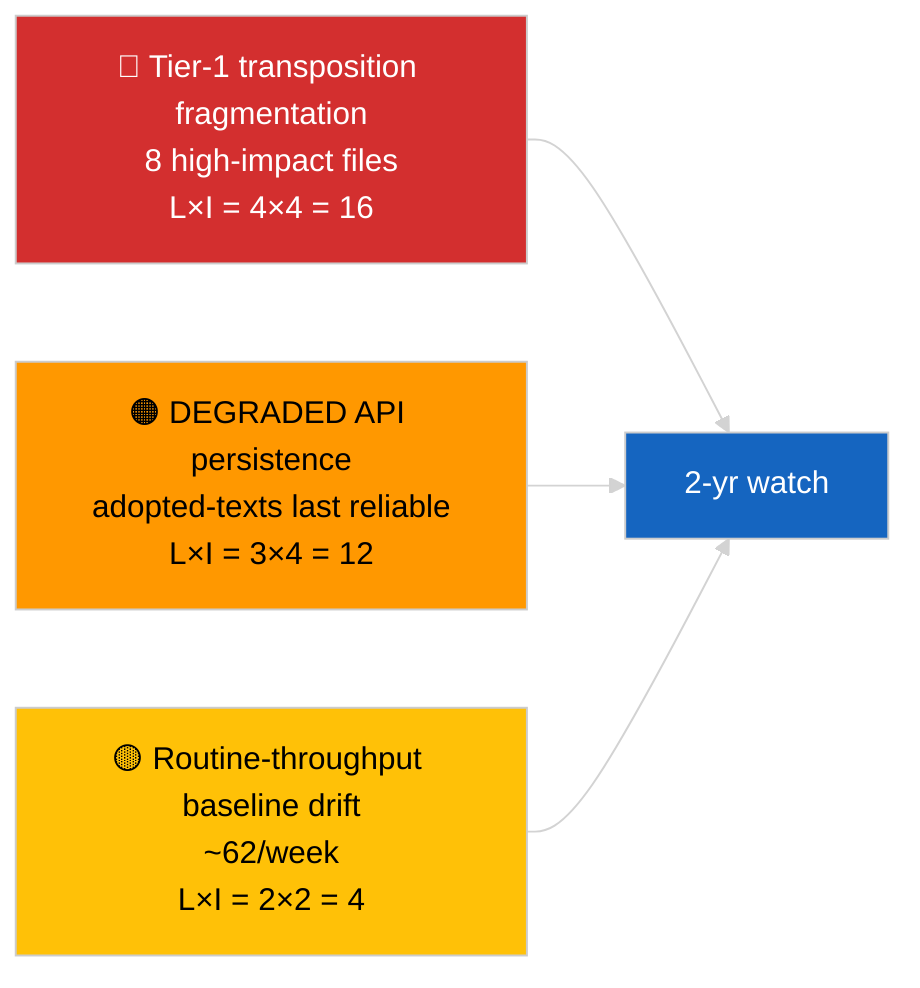

<!-- SPDX-FileCopyrightText: 2026 Hack23 AB -->
<!-- SPDX-License-Identifier: Apache-2.0 -->

# Note de synthèse exécutive — Breaking (Analyse approfondie des textes adoptés) | 2026-04-04

**Classification :** OSINT | Dossier parlementaire public
**Confiance :** 🟢 Élevée (échantillon de 85 éléments sur une semaine, état API DEGRADED)
**Générée :** 2026-04-04T00:00:00Z (rétrospectif)
**Type d'article :** Breaking — Analyse approfondie des textes adoptés
**Source :** Portail des données ouvertes du Parlement européen

---

## 🎯 BLUF

**Le flux hebdomadaire des textes adoptés a retourné 85 éléments couvrant trois périodes d'activité parlementaire distinctes — 70 éléments issus de la session EP10 2026 en cours, le reste provenant de fenêtres antérieures.** Dans l'état API DEGRADED confirmé par le 2026-04-03/breaking-2, le flux des textes adoptés demeure la source de données substantielle la plus fiable (fallback une semaine = 85 éléments). Le cluster tier-1 dominant correspond à l'output de mars 2026 Strasbourg + Bruxelles : anti-corruption (TA-10-2026-0094), vice-président BCE (TA-10-2026-0060), émissions HDV (TA-10-2026-0084), droits de douane américains (TA-10-2026-0096), immunité Braun (TA-10-2026-0088), Mieux légiférer (TA-10-2026-0063), accès aux documents (TA-10-2026-0065), Géorgie (TA-10-2026-0083). Les ~62 éléments restants sont des adoptions de routine à faible significance. **🟢 CONFIANCE ÉLEVÉE** sur le décompte de 85 éléments et l'identification du cluster dominant.

---

## 🧭 3 Décisions que ce rapport soutient

| # | Décision | Qui décide | Échéance | Preuves |
|:-:|----------|-----------|:--------:|---------|
| 1 | **Éditorial :** publier le récapitulatif long format Q1 des textes adoptés comme article ancre | Rédacteur | +48h | Inventaire 85 éléments + 8 tier-1 |
| 2 | **Surveillance :** prioriser le flux des textes adoptés comme chemin de données principal en état DEGRADED | Pipeline de données | jusqu'à restauration | Point d'entrée le plus fiable |
| 3 | **Veille prospective :** suivi du statut de transposition pour les 3 premiers éléments tier-1 | Analyste | trimestriel | Supervision de l'implémentation |

---

## 📰 Lecture en 60 secondes

- 🔴 **85 textes adoptés** dans l'échantillon du flux hebdomadaire ; 70 issus d'EP10 2026 ; le reste en carry-over de fenêtres antérieures. (🟢 Élevée)
- 🟠 **8 éléments tier-1 concentrés en mars 2026** — anti-corruption, VP BCE, émissions HDV, droits de douane américains, immunité Braun, Mieux légiférer, accès aux documents, Géorgie. (🟢 Élevée)
- 🟢 **Flux des textes adoptés = point d'accès le plus fiable** en état DEGRADED. (🟢 Élevée)
- 🟡 **~62 adoptions de routine à faible significance** (débit EP typique de référence). (🟢 Élevée)
- 🔵 **Contexte économique :** le cluster 8 tier-1 s'articule autour des axes industriel-économique (HDV, droits de douane), institutionnel (BCE, Mieux légiférer) et état de droit (anti-corruption, Braun). (🟢 Élevée)
- 🟣 **Référence croisée :** l'analyse sœur `breaking-2` reproduit le même inventaire au niveau d'abstraction du pipeline. (🟢 Élevée)
- 🩷 **Vecteur de perturbation :** les dossiers BCE / droits de douane américains sont les plus exposés aux chocs macro externes. (🟡 Moyen)
- ⚪ **Carry-forward :** rapports trimestriels sur le statut de transposition nécessaires pour Q3–Q4 2026 et jusqu'en 2027/2028.

---

## 🗂️ Tableau des principaux documents / procédures

| Rang | Référence PE | Titre (abrégé) | Significance | Confiance |
|:----:|-------------|----------------|:------------:|:---------:|
| 1 | TA-10-2026-0094 | Directive anti-corruption | 9,0 | 🟢 ÉLEVÉE |
| 2 | TA-10-2026-0060 | Vice-président BCE | 8,0 | 🟢 ÉLEVÉE |
| 3 | TA-10-2026-0096 | Droits de douane américains | 7,5 | 🟢 ÉLEVÉE |
| 4 | TA-10-2026-0084 | Crédits d'émissions HDV | 7,0 | 🟢 ÉLEVÉE |
| 5 | TA-10-2026-0088 | Immunité Braun | 7,0 | 🟢 ÉLEVÉE |
| 6 | TA-10-2026-0083 | Prisonniers politiques géorgiens | 7,0 | 🟢 ÉLEVÉE |
| 7 | TA-10-2026-0063 | Mieux légiférer | 7,0 | 🟢 ÉLEVÉE |
| 8 | TA-10-2026-0065 | Accès public aux documents | 7,0 | 🟢 ÉLEVÉE |

---

## ⚠️ Instantané Risques & Menaces

| Risque | L | I | Score | Déclencheur | Source | Admirauté |
|--------|:-:|:-:|:-----:|------------|--------|:---------:|
| Fragmentation de la transposition tier-1 | 4 | 4 | 16 | Divergence nationale | TA-10-2026-0094, TA-10-2026-0084 | A1 |
| Régression du flux textes adoptés | 3 | 4 | 12 | Perte du dernier point d'accès fiable | Analyse sœur `breaking-2` | A2 |
| Dérive du débit de routine | 2 | 2 | 4 | Maintenu <40/semaine | Échantillon du flux | B3 |

---

## 🔮 Principal déclencheur prospectif

**Cycle trimestriel de transposition pour le cluster 8 tier-1 (Q3 2026 → Q1 2028).** Les tableaux de bord de conformité des États membres indiqueront si l'output Q1 du PE se traduit en effet EU durable.

---

## 🛡️ Évaluation de la qualité des sources

- **Sources primaires :** EP `get_adopted_texts_feed` fenêtre hebdomadaire (85 éléments).
- **Confiance :** 🟢 ÉLEVÉE sur l'inventaire ; 🟡 MOYENNE sur la classification longue traîne élément par élément.

---

## 📎 Liens

| Lien | Chemin |
|------|--------|
| Article | `./article.md` |
| Analyses sœurs | `analysis/daily/2026-04-04/breaking/`, `breaking-2/`, `breaking-3/`, `week-in-review/` |
| Manifeste | `./manifest.json` |

---

**Contrôle du document**
- **Modèle :** `/analysis/templates/executive-brief.md`
- **Chemin artefact :** `analysis/daily/2026-04-04/breaking-4/executive-brief.md`
- **Classification :** Public
- **Génération rétrospective :** Session de remplissage.
