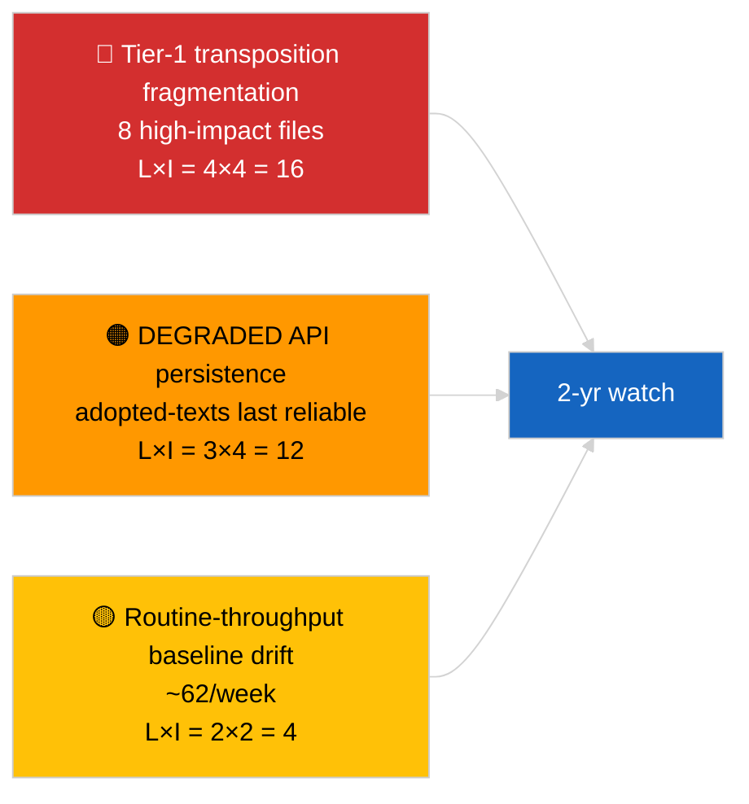

<!-- SPDX-FileCopyrightText: 2026 Hack23 AB -->
<!-- SPDX-License-Identifier: Apache-2.0 -->

# דוח מנהלים — חדשות שוברות (ניתוח מעמיק של טקסטים שאומצו) | 2026-04-04

**סיווג:** OSINT | תיעוד פרלמנטרי ציבורי
**אמינות:** 🟢 גבוהה (מדגם 85 פריטים לאורך שבוע במצב API מושפל)
**נוצר:** 2026-04-04T00:00:00Z (רטרוספקטיבי)
**סוג מאמר:** Breaking — ניתוח מעמיק של טקסטים שאומצו
**מקור:** פורטל הנתונים הפתוח של הפרלמנט האירופי

---

## 🎯 BLUF

**פיד הטקסטים השבועי שאומצו החזיר 85 פריטים הפרוסים על פני שלוש תקופות פעילות פרלמנטרית שונות — 70 פריטים מהמושב הנוכחי EP10 2026, השאר מחלונות קודמים.** במצב API מושפל שאושר על ידי 2026-04-03/breaking-2, פיד הטקסטים שאומצו נותר מקור הנתונים המהותי האמין ביותר (fallback של שבוע אחד מחזיר 85 פריטים). האשכול השלטני ברמה הראשונה הוא תפוקת מרס 2026 מסטרסבורג + בריסל: נגד שחיתות (TA-10-2026-0094), סגן נשיא ה-ECB (TA-10-2026-0060), פליטות HDV (TA-10-2026-0084), מכסי ארה"ב (TA-10-2026-0096), חסינות בראון (TA-10-2026-0088), חקיקה טובה יותר (TA-10-2026-0063), גישה למסמכים (TA-10-2026-0065), גאורגיה (TA-10-2026-0083). ~62 הפריטים הנותרים הם אימוצים שגרתיים בעלי חשיבות נמוכה. **🟢 אמינות גבוהה** על מספר 85 הפריטים וזיהוי האשכול השלטני.

---

## 🧭 3 החלטות שדוח זה תומך בהן

| # | החלטה | מי מחליט | מועד אחרון | ראיות |
|:-:|--------|----------|:----------:|-------|
| 1 | **עריכה:** פרסם סיכום ארוך Q1 של טקסטים שאומצו כמאמר עוגן | עורך | +48 שעות | מלאי 85 פריטים + 8 ברמה ראשונה |
| 2 | **ניטור:** תן עדיפות לפיד טקסטים שאומצו כנתיב נתונים ראשי במצב מושפל | צינור נתונים | עד שחזור | נקודת קצה אמינה ביותר |
| 3 | **מעקב קדימה:** דיווח מצב יישום עבור 3 הפריטים המובילים ברמה הראשונה | אנליסט | רבעוני | פיקוח יישום |

---

## 📰 קריאה של 60 שניות

- 🔴 **85 טקסטים שאומצו** במדגם הפיד השבועי; 70 מ-EP10 2026; שאר carry-over מחלונות ישנים יותר. (🟢 גבוהה)
- 🟠 **8 פריטים ברמה ראשונה מרוכזים במרס 2026** — נגד שחיתות, סגן נשיא ECB, פליטות HDV, מכסי ארה"ב, חסינות בראון, חקיקה טובה יותר, גישה למסמכים, גאורגיה. (🟢 גבוהה)
- 🟢 **פיד טקסטים שאומצו = נקודת הקצה האמינה ביותר** במצב מושפל. (🟢 גבוהה)
- 🟡 **~62 אימוצים שגרתיים בעלי חשיבות נמוכה** (קו בסיס אופייני של תפוקת הפרלמנט האירופי). (🟢 גבוהה)
- 🔵 **הקשר כלכלי:** אשכול 8 הרמה הראשונה מסתובב סביב צירים תעשייתיים-כלכליים (HDV, מכסים), מוסדיים (ECB, חקיקה טובה יותר) ושלטון החוק (נגד שחיתות, בראון). (🟢 גבוהה)
- 🟣 **הפניה צולבת:** ניתוח אחאים `breaking-2` משחזר את אותו מלאי ברמת הפשטת צינור הנתונים. (🟢 גבוהה)
- 🩷 **וקטור שיבוש:** קבצי ECB / מכסי ארה"ב הם החשופים ביותר לזעזועים מקרו-כלכליים חיצוניים. (🟡 בינוני)
- ⚪ **Carry-forward:** דוחות רבעוניים על מצב יישום נדרשים עבור Q3–Q4 2026 וב-2027/2028.

---

## 🗂️ טבלת מסמכים / הליכים מובילים

| דירוג | אזכור PE | כותרת (קצרה) | חשיבות | אמינות |
|:-----:|----------|--------------|:------:|:------:|
| 1 | TA-10-2026-0094 | הנחיה נגד שחיתות | 9.0 | 🟢 גבוהה |
| 2 | TA-10-2026-0060 | סגן נשיא ECB | 8.0 | 🟢 גבוהה |
| 3 | TA-10-2026-0096 | מכסי מכס אמריקאיים | 7.5 | 🟢 גבוהה |
| 4 | TA-10-2026-0084 | קרדיטים לפליטות HDV | 7.0 | 🟢 גבוהה |
| 5 | TA-10-2026-0088 | חסינות בראון | 7.0 | 🟢 גבוהה |
| 6 | TA-10-2026-0083 | אסירים פוליטיים בגאורגיה | 7.0 | 🟢 גבוהה |
| 7 | TA-10-2026-0063 | חקיקה טובה יותר | 7.0 | 🟢 גבוהה |
| 8 | TA-10-2026-0065 | גישה ציבורית למסמכים | 7.0 | 🟢 גבוהה |

---

## ⚠️ תמונת מצב סיכונים ואיומים

| סיכון | L | I | ציון | טריגר | מקור | אדמירלות |
|-------|:-:|:-:|:----:|-------|------|:--------:|
| פיצול יישום ברמה ראשונה | 4 | 4 | 16 | סטייה לאומית | TA-10-2026-0094, TA-10-2026-0084 | A1 |
| נסיגה בפיד טקסטים שאומצו | 3 | 4 | 12 | אובדן נקודת הקצה האמינה האחרונה | אחאים `breaking-2` | A2 |
| סטיית תפוקה שגרתית | 2 | 2 | 4 | מתמשך <40/שבוע | מדגם פיד | B3 |

---

## 🔮 טריגר קדימה מוביל

**מחזור יישום רבעוני עבור אשכול 8 הרמה הראשונה (Q3 2026 → Q1 2028).** לוחות מחוונים של ציות המדינות החברות יצביעו האם תפוקת Q1 של הפרלמנט האירופי מתורגמת להשפעה אירופאית מתמשכת.

---

## 🛡️ הערכת איכות מקורות

- **מקורות ראשוניים:** פיד `get_adopted_texts_feed` של הפרלמנט האירופי לחלון שבוע אחד (85 פריטים).
- **אמינות:** 🟢 גבוהה על המלאי; 🟡 בינונית על סיווג פריט-אחר-פריט ב-long tail.

---

## 📎 קישורים

| קישור | נתיב |
|-------|------|
| מאמר | `./article.md` |
| ריצות אחים | `analysis/daily/2026-04-04/breaking/`, `breaking-2/`, `breaking-3/`, `week-in-review/` |
| מניפסט | `./manifest.json` |

---

**בקרת מסמך**
- **תבנית:** `/analysis/templates/executive-brief.md`
- **נתיב אתר:** `analysis/daily/2026-04-04/breaking-4/executive-brief.md`
- **סיווג:** ציבורי
- **יצירה רטרוספקטיבית:** מפגש מילוי.
