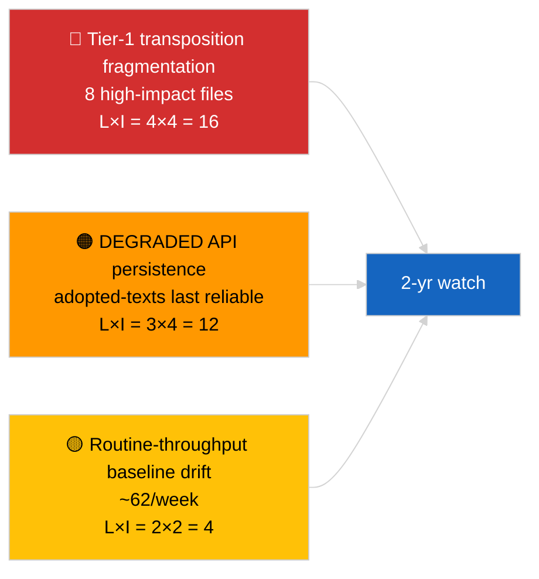

<!-- SPDX-FileCopyrightText: 2026 Hack23 AB -->
<!-- SPDX-License-Identifier: Apache-2.0 -->

# エグゼクティブ・ブリーフ — ブレーキング（採択テキスト詳細分析）| 2026-04-04

**分類：** OSINT | 公開議会記録
**信頼度：** 🟢 高（DEGRADED API状態での1週間85件サンプル）
**作成日：** 2026-04-04T00:00:00Z（遡及作成）
**記事タイプ：** ブレーキング — 採択テキスト詳細分析
**出典：** 欧州議会オープンデータポータル

---

## 🎯 BLUF

**採択テキストの週次フィードは、3つの異なる議会活動期にまたがる85件を返した — うち70件は現在のEP10 2026会期から、残りは過去ウィンドウからのキャリーオーバーである。** 2026-04-03/breaking-2で確認されたDEGRADED API状態において、採択テキスト・フィードは最も信頼性の高い実質的データソースであり続ける（1週間フォールバックで85件を返す）。支配的なTier-1クラスターは2026年3月ストラスブール+ブリュッセル出力である：汚職対策（TA-10-2026-0094）、ECB副総裁（TA-10-2026-0060）、HDV排出量（TA-10-2026-0084）、米国関税（TA-10-2026-0096）、ブラウン免責（TA-10-2026-0088）、より良い立法（TA-10-2026-0063）、文書アクセス（TA-10-2026-0065）、ジョージア（TA-10-2026-0083）。残りの約62件は重要度の低い定常的採択である。85件数と支配的クラスター特定に関して**🟢 高い信頼度**。

---

## 🧭 このブリーフが支援する3つの意思決定

| # | 意思決定 | 決定者 | 期限 | 根拠 |
|:-:|---------|-------|:---:|------|
| 1 | **編集：** Q1採択テキストの長文要約をアンカー記事として公開する | 編集者 | +48時間 | 85件目録 + Tier-1 8件 |
| 2 | **監視：** DEGRADED状態では採択テキスト・フィードを主要データパスとして優先する | データパイプライン | 復元まで | 最も信頼性の高いエンドポイント |
| 3 | **先読み監視：** 上位3件のTier-1項目の移行状況報告 | アナリスト | 四半期ごと | 実施監督 |

---

## 📰 60秒リーディング

- 🔴 週次フィードサンプルで**採択テキスト85件**；EP10 2026から70件、残りは旧ウィンドウからのキャリーオーバー。（🟢 高）
- 🟠 **2026年3月に集中するTier-1 8件** — 汚職対策、ECB VP、HDV排出量、米国関税、ブラウン免責、より良い立法、文書アクセス、ジョージア。（🟢 高）
- 🟢 **採択テキスト・フィード = 最も信頼性の高い** DEGRADED状態のエンドポイント。（🟢 高）
- 🟡 **低重要度の定常採択約62件**（典型的なEP処理量基準）。（🟢 高）
- 🔵 **経済的文脈：** Tier-1 8件クラスターは産業経済的（HDV、関税）、制度的（ECB、より良い立法）、法の支配的（汚職対策、ブラウン）軸を中心に展開する。（🟢 高）
- 🟣 **相互参照：** 関連ブリーフ `breaking-2` がパイプライン抽象化レベルで同一目録を再現。（🟢 高）
- 🩷 **混乱ベクター：** ECB / 米国関税ファイルが外部マクロショックに最も露出。（🟡 中）
- ⚪ **キャリーフォワード：** Q3–Q4 2026および2027/2028に向けた四半期移行状況報告が必要。

---

## 🗂️ 主要文書 / 手続き一覧表

| 順位 | EP参照 | タイトル（短縮） | 重要度 | 信頼度 |
|:---:|-------|---------------|:-----:|:-----:|
| 1 | TA-10-2026-0094 | 汚職対策指令 | 9.0 | 🟢 高 |
| 2 | TA-10-2026-0060 | ECB副総裁 | 8.0 | 🟢 高 |
| 3 | TA-10-2026-0096 | 米国関税 | 7.5 | 🟢 高 |
| 4 | TA-10-2026-0084 | HDV排出量クレジット | 7.0 | 🟢 高 |
| 5 | TA-10-2026-0088 | ブラウン免責 | 7.0 | 🟢 高 |
| 6 | TA-10-2026-0083 | ジョージア政治犯 | 7.0 | 🟢 高 |
| 7 | TA-10-2026-0063 | より良い立法 | 7.0 | 🟢 高 |
| 8 | TA-10-2026-0065 | 文書への公開アクセス | 7.0 | 🟢 高 |

---

## ⚠️ リスク・脅威スナップショット

| リスク | L | I | スコア | トリガー | 出典 | 提督評価 |
|------|:-:|:-:|:-----:|---------|------|:------:|
| Tier-1移行断片化 | 4 | 4 | 16 | 国内乖離 | TA-10-2026-0094, TA-10-2026-0084 | A1 |
| 採択テキスト・フィード後退 | 3 | 4 | 12 | 最後の信頼性エンドポイント喪失 | 関連ブリーフ `breaking-2` | A2 |
| 定常処理量ドリフト | 2 | 2 | 4 | 継続的 <40件/週 | フィードサンプル | B3 |

---

## 🔮 主要先読みトリガー

**Tier-1 8件クラスターの四半期移行サイクル（Q3 2026 → Q1 2028）。** 加盟国コンプライアンス・ダッシュボードが、EP Q1出力がEU全体の持続的効果に転換されるかを示す。

---

## 🛡️ データ源品質評価

- **主要出典：** EP `get_adopted_texts_feed` 週次ウィンドウ（85件）。
- **信頼度：** 🟢 目録に関して高；🟡 ロングテール件別分類に関して中。

---

## 📎 リンク

| リンク | パス |
|-------|------|
| 記事 | `./article.md` |
| 関連実行 | `analysis/daily/2026-04-04/breaking/`, `breaking-2/`, `breaking-3/`, `week-in-review/` |
| マニフェスト | `./manifest.json` |

---

**文書管理**
- **テンプレート：** `/analysis/templates/executive-brief.md`
- **アーティファクトパス：** `analysis/daily/2026-04-04/breaking-4/executive-brief.md`
- **分類：** 公開
- **遡及作成：** バックフィルセッション。
