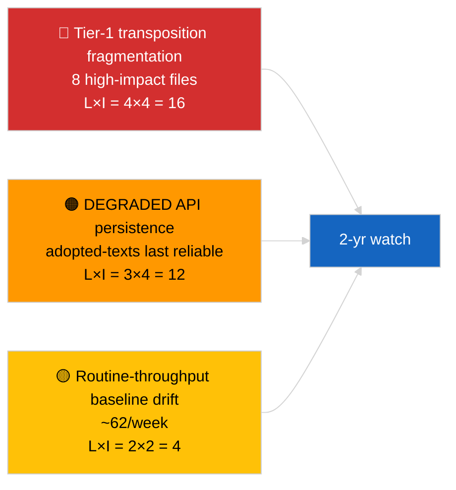

<!-- SPDX-FileCopyrightText: 2026 Hack23 AB -->
<!-- SPDX-License-Identifier: Apache-2.0 -->

# 집행 브리핑 — 속보 (채택 텍스트 심층 분석) | 2026-04-04

**분류:** OSINT | 공개 의회 기록
**신뢰도:** 🟢 높음 (DEGRADED API 상태에서 1주간 85건 표본)
**작성일:** 2026-04-04T00:00:00Z (소급 작성)
**기사 유형:** 속보 — 채택 텍스트 심층 분석
**출처:** 유럽의회 공개 데이터 포털

---

## 🎯 BLUF

**채택 텍스트 주간 피드는 3개의 서로 다른 의회 활동 기간에 걸쳐 85건을 반환했습니다 — 현재 EP10 2026 회기에서 70건, 나머지는 이전 기간에서 이월된 건입니다.** 2026-04-03/breaking-2에서 확인된 DEGRADED API 상태에서, 채택 텍스트 피드는 여전히 가장 신뢰할 수 있는 실질적 데이터 소스입니다(1주 폴백으로 85건 반환). 지배적인 1등급 클러스터는 2026년 3월 스트라스부르+브뤼셀 산출물입니다: 부패방지(TA-10-2026-0094), ECB 부총재(TA-10-2026-0060), HDV 배출량(TA-10-2026-0084), 미국 관세(TA-10-2026-0096), 브라운 면책(TA-10-2026-0088), 더 나은 입법(TA-10-2026-0063), 문서 접근(TA-10-2026-0065), 조지아(TA-10-2026-0083). 나머지 약 62건은 중요도가 낮은 정례 채택입니다. 85건 수량과 지배적 클러스터 식별에 대해 **🟢 높은 신뢰도**.

---

## 🧭 이 브리핑이 지원하는 3가지 결정

| # | 결정 | 결정자 | 기한 | 근거 |
|:-:|-----|-------|:---:|------|
| 1 | **편집:** Q1 채택 텍스트 장문 요약을 앵커 기사로 발행 | 편집자 | +48시간 | 85건 인벤토리 + 1등급 8건 |
| 2 | **모니터링:** DEGRADED 상태에서 채택 텍스트 피드를 주요 데이터 경로로 우선시 | 데이터 파이프라인 | 복원 시까지 | 가장 신뢰할 수 있는 엔드포인트 |
| 3 | **선행 감시:** 상위 3개 1등급 항목에 대한 이행 상태 보고 | 분석가 | 분기별 | 실시 감독 |

---

## 📰 60초 읽기

- 🔴 주간 피드 표본에서 **채택 텍스트 85건**; EP10 2026에서 70건; 나머지는 이전 기간 이월. (🟢 높음)
- 🟠 **2026년 3월 집중된 1등급 8건** — 부패방지, ECB 부총재, HDV 배출량, 미국 관세, 브라운 면책, 더 나은 입법, 문서 접근, 조지아. (🟢 높음)
- 🟢 **채택 텍스트 피드 = DEGRADED 상태의 가장 신뢰할 수 있는** 엔드포인트. (🟢 높음)
- 🟡 **~62건의 중요도 낮은 정례 채택** (전형적인 EP 처리량 기준선). (🟢 높음)
- 🔵 **경제적 맥락:** 1등급 8건 클러스터는 산업-경제적(HDV, 관세), 기관적(ECB, 더 나은 입법), 법치주의적(부패방지, 브라운) 축을 중심으로 전개됩니다. (🟢 높음)
- 🟣 **교차 참조:** 형제 브리핑 `breaking-2`가 파이프라인 추상화 수준에서 동일한 인벤토리를 재현. (🟢 높음)
- 🩷 **교란 벡터:** ECB / 미국 관세 파일이 외부 거시경제 충격에 가장 노출됨. (🟡 중간)
- ⚪ **이월:** Q3–Q4 2026 및 2027/2028에 대한 분기별 이행 상태 보고서 필요.

---

## 🗂️ 주요 문서 / 절차 표

| 순위 | EP 참조 | 제목 (단축) | 중요도 | 신뢰도 |
|:---:|--------|------------|:-----:|:-----:|
| 1 | TA-10-2026-0094 | 부패방지 지침 | 9.0 | 🟢 높음 |
| 2 | TA-10-2026-0060 | ECB 부총재 | 8.0 | 🟢 높음 |
| 3 | TA-10-2026-0096 | 미국 관세 | 7.5 | 🟢 높음 |
| 4 | TA-10-2026-0084 | HDV 배출량 크레딧 | 7.0 | 🟢 높음 |
| 5 | TA-10-2026-0088 | 브라운 면책 | 7.0 | 🟢 높음 |
| 6 | TA-10-2026-0083 | 조지아 정치범 | 7.0 | 🟢 높음 |
| 7 | TA-10-2026-0063 | 더 나은 입법 | 7.0 | 🟢 높음 |
| 8 | TA-10-2026-0065 | 공개 문서 접근 | 7.0 | 🟢 높음 |

---

## ⚠️ 리스크 & 위협 스냅샷

| 리스크 | L | I | 점수 | 트리거 | 출처 | 제독 등급 |
|------|:-:|:-:|:---:|-------|------|:--------:|
| 1등급 이행 분절화 | 4 | 4 | 16 | 국가적 이탈 | TA-10-2026-0094, TA-10-2026-0084 | A1 |
| 채택 텍스트 피드 회귀 | 3 | 4 | 12 | 마지막 신뢰할 수 있는 엔드포인트 손실 | 형제 `breaking-2` | A2 |
| 정례 처리량 드리프트 | 2 | 2 | 4 | 지속적 <40건/주 | 피드 표본 | B3 |

---

## 🔮 주요 선행 트리거

**1등급 8건 클러스터에 대한 분기별 이행 주기(Q3 2026 → Q1 2028).** 회원국 준수 대시보드는 EP Q1 산출물이 지속적인 EU 전역의 효과로 전환되는지 여부를 나타낼 것입니다.

---

## 🛡️ 소스 품질 평가

- **주요 출처:** EP `get_adopted_texts_feed` 주간 창 (85건).
- **신뢰도:** 🟢 인벤토리에 대해 높음; 🟡 롱테일 항목별 분류에 대해 중간.

---

## 📎 링크

| 링크 | 경로 |
|-----|------|
| 기사 | `./article.md` |
| 형제 실행 | `analysis/daily/2026-04-04/breaking/`, `breaking-2/`, `breaking-3/`, `week-in-review/` |
| 매니페스트 | `./manifest.json` |

---

**문서 관리**
- **템플릿:** `/analysis/templates/executive-brief.md`
- **아티팩트 경로:** `analysis/daily/2026-04-04/breaking-4/executive-brief.md`
- **분류:** 공개
- **소급 작성:** 백필 세션.
