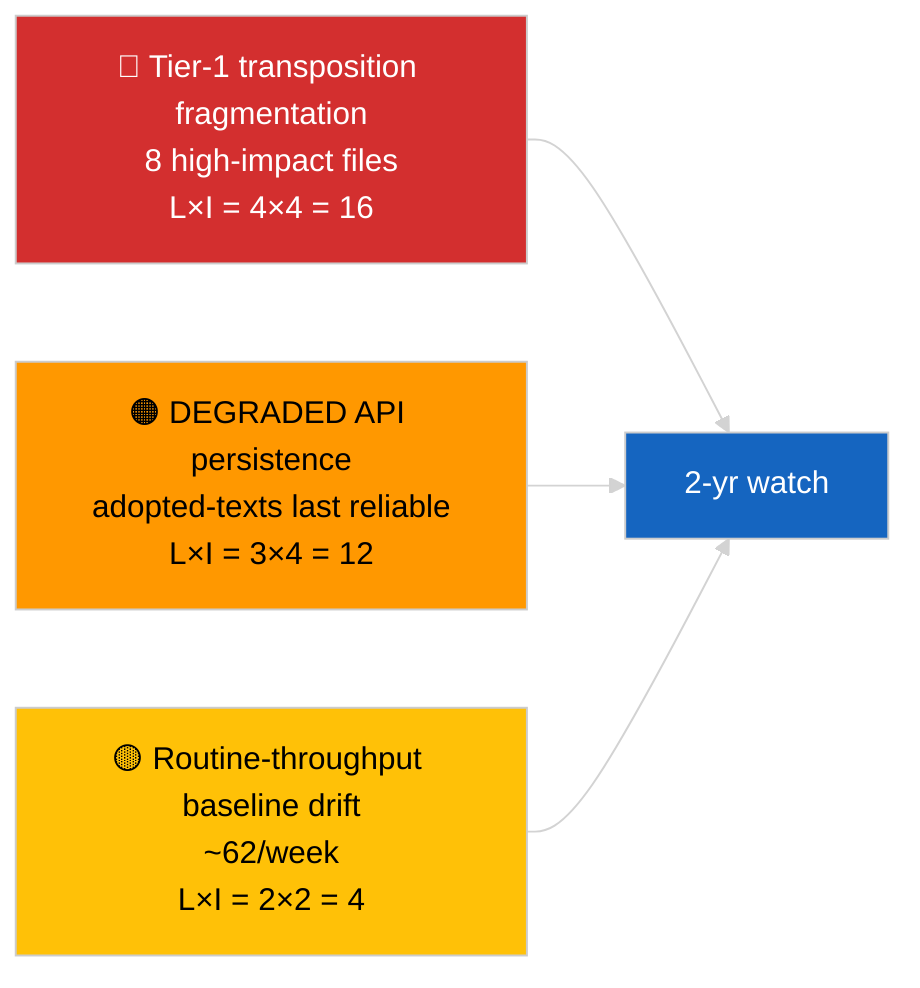

<!-- SPDX-FileCopyrightText: 2026 Hack23 AB -->
<!-- SPDX-License-Identifier: Apache-2.0 -->

# Uitvoerend rapport — Breaking (Diepgaande analyse van aangenomen teksten) | 2026-04-04

**Classificatie:** OSINT | Openbaar parlementair register
**Betrouwbaarheid:** 🟢 Hoog (steekproef van 85 items over één week in DEGRADED API-status)
**Gegenereerd:** 2026-04-04T00:00:00Z (retrospectief)
**Artikeltype:** Breaking — Diepgaande analyse van aangenomen teksten
**Bron:** Open dataportal van het Europees Parlement

---

## 🎯 BLUF

**De wekelijkse feed voor aangenomen teksten retourneerde 85 items verdeeld over drie afzonderlijke perioden — 70 items uit de huidige EP10 2026-sessie, de rest uit eerdere vensters.** In de DEGRADED API-status bevestigd door 2026-04-03/breaking-2 blijft de feed voor aangenomen teksten de meest betrouwbare substantiële gegevensbron (één week fallback retourneert 85 items). Het dominante tier-1-cluster is de output van maart 2026 Straatsburg + Brussel: anticorruptie (TA-10-2026-0094), ECB-vicepresident (TA-10-2026-0060), HDV-emissies (TA-10-2026-0084), Amerikaanse tarieven (TA-10-2026-0096), Braun-immuniteit (TA-10-2026-0088), Betere regelgeving (TA-10-2026-0063), documenttoegang (TA-10-2026-0065), Georgië (TA-10-2026-0083). De resterende ~62 items zijn routine-aannames van lagere significantie. **🟢 HOGE betrouwbaarheid** voor het aantal van 85 items en de identificatie van het dominante cluster.

---

## 🧭 3 Beslissingen die dit rapport ondersteunt

| # | Beslissing | Wie beslist | Deadline | Bewijs |
|:-:|-----------|------------|:--------:|--------|
| 1 | **Redactioneel:** publiceer Q1-samenvatting van aangenomen teksten als ankerartikel | Redacteur | +48u | Inventaris van 85 items + 8 tier-1 |
| 2 | **Monitoring:** prioriteer de feed voor aangenomen teksten als primair datapad in DEGRADED-status | Datapipeline | tot herstel | Meest betrouwbaar eindpunt |
| 3 | **Vooruitblik:** transposiestatus-rapportage voor top-3 tier-1 items | Analist | driemaandelijks | Implementatietoezicht |

---

## 📰 60-secondenlezing

- 🔴 **85 aangenomen teksten** in het wekelijkse feedsteekproef; 70 uit EP10 2026; rest carry-over oudere vensters. (🟢 Hoog)
- 🟠 **8 tier-1 items geconcentreerd in maart 2026** — anticorruptie, ECB VP, HDV-emissies, Amerikaanse tarieven, Braun-immuniteit, Betere regelgeving, documenttoegang, Georgië. (🟢 Hoog)
- 🟢 **Feed voor aangenomen teksten = meest betrouwbaar** eindpunt in DEGRADED-status. (🟢 Hoog)
- 🟡 **~62 routine-aannames van lagere significantie** (typische EP-doorvoerbasislijn). (🟢 Hoog)
- 🔵 **Economische context:** het 8-tier-1-cluster draait om industrieel-economische (HDV, tarieven), institutionele (ECB, Betere regelgeving) en rechtsstaatlijke (anticorruptie, Braun) assen. (🟢 Hoog)
- 🟣 **Kruisverwijzing:** zusteranalyse `breaking-2` reproduceert dezelfde inventaris op pipeline-abstractieniveau. (🟢 Hoog)
- 🩷 **Verstoringsvektor:** ECB / Amerikaanse tarieven-bestanden meest blootgesteld aan externe macroschokken. (🟡 Gemiddeld)
- ⚪ **Carry-forward:** driemaandelijkse transposiestatusrapporten nodig voor Q3–Q4 2026 en 2027/2028.

---

## 🗂️ Topbestanden / Proceduretabel

| Rang | EP-referentie | Titel (kort) | Significantie | Betrouwbaarheid |
|:----:|-------------|---------------|:-------------:|:---------------:|
| 1 | TA-10-2026-0094 | Anticorruptierichtlijn | 9,0 | 🟢 HOOG |
| 2 | TA-10-2026-0060 | ECB-vicepresident | 8,0 | 🟢 HOOG |
| 3 | TA-10-2026-0096 | Amerikaanse douanetarieven | 7,5 | 🟢 HOOG |
| 4 | TA-10-2026-0084 | HDV-emissiekredieten | 7,0 | 🟢 HOOG |
| 5 | TA-10-2026-0088 | Braun-immuniteit | 7,0 | 🟢 HOOG |
| 6 | TA-10-2026-0083 | Georgische politieke gevangenen | 7,0 | 🟢 HOOG |
| 7 | TA-10-2026-0063 | Betere regelgeving | 7,0 | 🟢 HOOG |
| 8 | TA-10-2026-0065 | Publieke toegang tot documenten | 7,0 | 🟢 HOOG |

---

## ⚠️ Risico & Dreigingsoverzicht

| Risico | L | I | Score | Trigger | Bron | Admiraliteit |
|--------|:-:|:-:|:-----:|---------|------|:------------:|
| Tier-1 transposiefragmentatie | 4 | 4 | 16 | Nationale divergentie | TA-10-2026-0094, TA-10-2026-0084 | A1 |
| Feed-regressie aangenomen teksten | 3 | 4 | 12 | Verlies van laatste betrouwbaar eindpunt | Zuster `breaking-2` | A2 |
| Routine doorvoerdrift | 2 | 2 | 4 | Aanhoudend <40/week | Feedsteekproef | B3 |

---

## 🔮 Belangrijkste vooruitblikkende trigger

**Driemaandelijkse transposiecyclus voor het 8-tier-1-cluster (Q3 2026 → Q1 2028).** Nalevingsdashboards van lidstaten zullen aantonen of EP Q1-output zich vertaalt in blijvend EU-breed effect.

---

## 🛡️ Beoordeling van bronkwaliteit

- **Primaire bronnen:** EP `get_adopted_texts_feed` wekelijks venster (85 items).
- **Betrouwbaarheid:** 🟢 HOOG voor inventaris; 🟡 GEMIDDELD voor item-voor-item classificatie van de lange staart.

---

## 📎 Links

| Link | Pad |
|------|-----|
| Artikel | `./article.md` |
| Zusterruns | `analysis/daily/2026-04-04/breaking/`, `breaking-2/`, `breaking-3/`, `week-in-review/` |
| Manifest | `./manifest.json` |

---

**Documentcontrole**
- **Sjabloon:** `/analysis/templates/executive-brief.md`
- **Artefactpad:** `analysis/daily/2026-04-04/breaking-4/executive-brief.md`
- **Classificatie:** Openbaar
- **Retrospectieve generatie:** Backfill-sessie.
