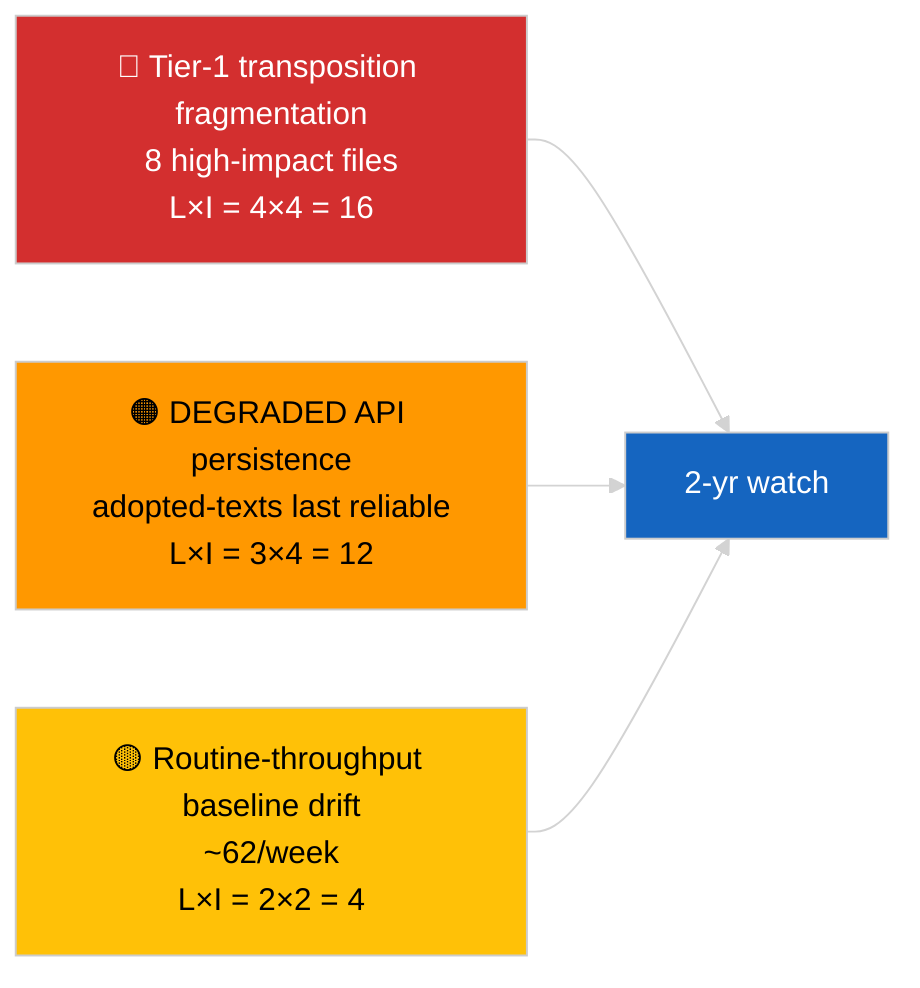

<!-- SPDX-FileCopyrightText: 2026 Hack23 AB -->
<!-- SPDX-License-Identifier: Apache-2.0 -->

# Eksekutivrapport — Breaking (Dybdedykk i vedtatte tekster) | 2026-04-04

**Klassifisering:** OSINT | Offentlig parlamentarisk protokoll
**Konfidens:** 🟢 Høy (85-elements ukeutvalg under DEGRADED API-tilstand)
**Generert:** 2026-04-04T00:00:00Z (retrospektivt)
**Artikkeltype:** Breaking — Vedtatte tekster dybdedykk
**Kilde:** Europaparlamentets åpne dataportal

---

## 🎯 BLUF

**Den ukentlige feedet for vedtatte tekster returnerte 85 elementer fordelt på tre distinkte perioder — 70 elementer fra den nåværende EP10 2026-sesjonen, resten fra tidligere vinduer.** Under den DEGRADED API-tilstanden bekreftet av 2026-04-03/breaking-2, er vedtatte-teksters-feeden den mest pålitelige substansielle datakilden (en ukes fallback returnerer 85 elementer). Det dominerende tier-1-klynget er mars 2026 Strasbourg + Brussel-output: antikorrupsjon (TA-10-2026-0094), ECB-visepresident (TA-10-2026-0060), HDV-utslipp (TA-10-2026-0084), amerikanske toll (TA-10-2026-0096), Braun-immunitet (TA-10-2026-0088), Bedre lovgivning (TA-10-2026-0063), dokumenttilgang (TA-10-2026-0065), Georgia (TA-10-2026-0083). Resterende ~62 elementer er lavere-signifikante rutinevedtak. **🟢 HØY konfidens** på 85-elementers-antallet og dominerende klyngidentifisering.

---

## 🧭 3 Beslutninger denne rapporten støtter

| # | Beslutning | Hvem beslutter | Frist | Dokumentasjon |
|:-:|-----------|----------------|:-----:|---------------|
| 1 | **Redaksjonelt:** publiser Q1 vedtatte tekster lang oppsummering som ankerstykke | Redaktør | +48t | 85-elementers inventar + 8 tier-1 |
| 2 | **Overvåking:** prioriter vedtatte-teksters-feeden som primær datavei under DEGRADED-tilstand | Datapipeline | til gjenoppretting | Mest pålitelig sluttpunkt |
| 3 | **Fremtidsovervåking:** transposisjonsstatus for topp-3 tier-1 elementer | Analytiker | kvartalsvis | Implementeringstilsyn |

---

## 📰 60-sekunders lesing

- 🔴 **85 vedtatte tekster** i ukefeedutvalget; 70 fra EP10 2026; resten carry-over eldre vinduer. (🟢 Høy)
- 🟠 **8 tier-1 elementer konsentrert i mars 2026** — antikorrupsjon, ECB VP, HDV-utslipp, amerikanske toll, Braun-immunitet, Bedre lovgivning, dokumenttilgang, Georgia. (🟢 Høy)
- 🟢 **Vedtatte-teksters-feed = mest pålitelig** sluttpunkt under DEGRADED-tilstand. (🟢 Høy)
- 🟡 **~62 lavere-signifikante rutinevedtak** (typisk EP-gjennomstrømmingsbaseline). (🟢 Høy)
- 🔵 **Økonomisk kontekst:** 8 tier-1-klynget dreier seg om industri-økonomi (HDV, toll), institusjonelle (ECB, Bedre lovgivning) og rettsstatlige (antikorrupsjon, Braun) akser. (🟢 Høy)
- 🟣 **Kryssreferanse:** søskenanalysen `breaking-2` gjengir samme inventar på pipeline-abstraksjonsnivå. (🟢 Høy)
- 🩷 **Forstyrelsesvektor:** ECB / US-toll-filer mest eksponert for eksterne makrosjokk. (🟡 Medium)
- ⚪ **Carry-forward:** kvartalsvise transposisjonsstatusrapporter nødvendige over Q3–Q4 2026 og inn i 2027/2028.

---

## 🗂️ Topp Dokumenter / Prosedyretabell

| Rang | EP-referanse | Tittel (kort) | Signifikans | Konfidens |
|:----:|-------------|---------------|:-----------:|:---------:|
| 1 | TA-10-2026-0094 | Antikorrupsjonsdirektiv | 9,0 | 🟢 HØY |
| 2 | TA-10-2026-0060 | ECB visepresident | 8,0 | 🟢 HØY |
| 3 | TA-10-2026-0096 | Amerikanske tolltariffer | 7,5 | 🟢 HØY |
| 4 | TA-10-2026-0084 | HDV-utslippskreditter | 7,0 | 🟢 HØY |
| 5 | TA-10-2026-0088 | Braun-immunitet | 7,0 | 🟢 HØY |
| 6 | TA-10-2026-0083 | Georgia politiske fanger | 7,0 | 🟢 HØY |
| 7 | TA-10-2026-0063 | Bedre lovgivning | 7,0 | 🟢 HØY |
| 8 | TA-10-2026-0065 | Offentlig tilgang til dokumenter | 7,0 | 🟢 HØY |

---

## ⚠️ Risiko & Trusselbilde

| Risiko | L | I | Score | Trigger | Kilde | Admiralitet |
|--------|:-:|:-:|:-----:|---------|--------|:-----------:|
| Tier-1 transposisjonsfragmentering | 4 | 4 | 16 | Nasjonal divergens | TA-10-2026-0094, TA-10-2026-0084 | A1 |
| Vedtatte-teksters-feed-regresjon | 3 | 4 | 12 | Tap av siste pålitelige sluttpunkt | Søsken `breaking-2` | A2 |
| Rutin gjennomstrømmingsdrift | 2 | 2 | 4 | Vedvarende <40/uke | Feedutvalg | B3 |

---

## 🔮 Topp fremtidstrigger

**Kvartalsvis transposisjonssyklus for 8 tier-1-klynget (Q3 2026 → Q1 2028).** Medlemsstatenes etterlevelsesdashbord vil vise om Q1 EP-output omsettes til varig EU-effekt.

---

## 🛡️ Vurdering av kildekvalitet

- **Primærkilder:** EP `get_adopted_texts_feed` ukentlig vindu (85 elementer).
- **Konfidens:** 🟢 HØY på inventar; 🟡 MEDIUM på langhalet element-for-element-klassifisering.

---

## 📎 Lenker

| Lenke | Sti |
|-------|-----|
| Artikkel | `./article.md` |
| Søskenkjøringer | `analysis/daily/2026-04-04/breaking/`, `breaking-2/`, `breaking-3/`, `week-in-review/` |
| Manifest | `./manifest.json` |

---

**Dokumentkontroll**
- **Mal:** `/analysis/templates/executive-brief.md`
- **Artefaktsti:** `analysis/daily/2026-04-04/breaking-4/executive-brief.md`
- **Klassifisering:** Offentlig
- **Retrospektiv generering:** Backfill-sesjon.
