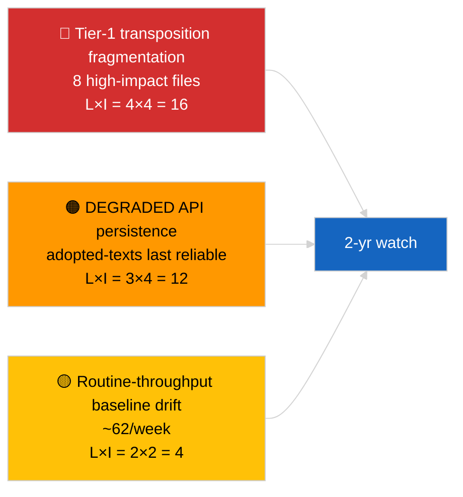

<!-- SPDX-FileCopyrightText: 2026 Hack23 AB -->
<!-- SPDX-License-Identifier: Apache-2.0 -->

# Exekutiv rapport — Bryta nyheter (Djupdykning i antagna texter) | 2026-04-04

**Klassificering:** OSINT | Offentligt parlamentariskt protokoll
**Konfidens:** 🟢 Hög (85-items urvecka under DEGRADED API-tillstånd)
**Genererad:** 2026-04-04T00:00:00Z (retrospektivt)
**Artikeltyp:** Breaking — Djupdykning i antagna texter
**Källa:** Europaparlamentets öppna dataportal

---

## 🎯 BLUF

**Adopterade texters feed för en vecka returnerade 85 poster fördelat på tre distinkta perioder — 70 poster från nuvarande EP10 2026-session, resterande från tidigare fönster.** Under det DEGRADED API-tillstånd som bekräftades av 2026-04-03/breaking-2 förblir adopted-texts-feeden den mest tillförlitliga substantiva datakällan (en veckas fallback returnerar 85 poster). Det dominerande tier-1-klustret är mars 2026 Strasbourg + Bryssel-output: antikorruption (TA-10-2026-0094), ECB-vice ordförande (TA-10-2026-0060), HDV-utsläpp (TA-10-2026-0084), amerikanska tullar (TA-10-2026-0096), Braun-immunitet (TA-10-2026-0088), Bättre lagstiftning (TA-10-2026-0063), tillgång till handlingar (TA-10-2026-0065), Georgien (TA-10-2026-0083). Återstående ~62 poster är rutinantagna med lägre signifikans. **🟢 HÖG konfidens** på 85-posters-antalet och dominerande klusteridentifiering.

---

## 🧭 3 Beslut som denna rapport stöder

| # | Beslut | Vem beslutar | Deadline | Bevis |
|:-:|--------|-------------|:--------:|-------|
| 1 | **Redaktionellt:** publicera Q1 antagna texter lång artikel som ankarinlägg | Redaktör | +48h | 85-posters inventering + 8 tier-1 |
| 2 | **Övervakning:** prioritera adopted-texts-feeden som primär dataväg under DEGRADED-tillstånd | Datapipeline | till återställning | Mest tillförlitlig slutpunkt |
| 3 | **Framåtbevakning:** transponeringsstatus för topp-3 tier-1 poster | Analytiker | kvartalsvis | Implementeringsöversyn |

---

## 📰 60-sekunders läsning

- 🔴 **85 antagna texter** i urveckans feed; 70 från EP10 2026; resterande carry-over äldre fönster. (🟢 Hög)
- 🟠 **8 tier-1 poster koncentrerade i mars 2026** — antikorruption, ECB VP, HDV-utsläpp, amerikanska tullar, Braun-immunitet, Bättre lagstiftning, tillgång till handlingar, Georgien. (🟢 Hög)
- 🟢 **Adopted-texts-feeden = mest tillförlitlig** slutpunkt under DEGRADED-tillstånd. (🟢 Hög)
- 🟡 **~62 lägre-signifikanta rutinantagna** (typisk EP-genomströmningsbas). (🟢 Hög)
- 🔵 **Ekonomisk kontext:** 8 tier-1-klustret kretsar kring industri-ekonomiska (HDV, tullar), institutionella (ECB, Bättre lagstiftning) och rättsstatliga (antikorruption, Braun) axlar. (🟢 Hög)
- 🟣 **Korsreferens:** syskon `breaking-2` återger samma inventering på pipeline-abstraktion. (🟢 Hög)
- 🩷 **Störningsvektor:** ECB / US-tullar-filer mest exponerade för externa makrochocker. (🟡 Medel)
- ⚪ **Carry-forward:** kvartalsvisa transponeringsstatus-rapporter behövs över Q3–Q4 2026 och in i 2027/2028.

---

## 🗂️ Topp Dokument / Procedurtabell

| Rank | EP-referens | Titel (kort) | Signifikans | Konfidens |
|:----:|------------|---------------|:-----------:|:---------:|
| 1 | TA-10-2026-0094 | Antikorruptionsdirektiv | 9,0 | 🟢 HÖG |
| 2 | TA-10-2026-0060 | ECB vice ordförande | 8,0 | 🟢 HÖG |
| 3 | TA-10-2026-0096 | Amerikanska tullsatser | 7,5 | 🟢 HÖG |
| 4 | TA-10-2026-0084 | HDV-utsläppskrediter | 7,0 | 🟢 HÖG |
| 5 | TA-10-2026-0088 | Braun-immunitet | 7,0 | 🟢 HÖG |
| 6 | TA-10-2026-0083 | Georgien politiska fångar | 7,0 | 🟢 HÖG |
| 7 | TA-10-2026-0063 | Bättre lagstiftning | 7,0 | 🟢 HÖG |
| 8 | TA-10-2026-0065 | Tillgång till handlingar | 7,0 | 🟢 HÖG |

---

## ⚠️ Risk & Hot-ögonblicksbild

| Risk | L | I | Poäng | Trigger | Källa | Admiralitet |
|------|:-:|:-:|:-----:|---------|--------|:-----------:|
| Tier-1 transponeringsfragmentering | 4 | 4 | 16 | Nationell divergens | TA-10-2026-0094, TA-10-2026-0084 | A1 |
| Adopted-texts-feed-regression | 3 | 4 | 12 | Förlust av sista tillförlitlig slutpunkt | Syskon `breaking-2` | A2 |
| Rutin genomströmningsdrift | 2 | 2 | 4 | Ihållande <40/vecka | Feed-urval | B3 |

---

## 🔮 Topp framåttrigger

**Kvartalsvisa transponeringscykel för 8 tier-1-klustret (Q3 2026 → Q1 2028).** Efterlevnadsinstrumentpaneler för medlemsstaterna visar om Q1 EP-output översätts till varaktig EU-effekt.

---

## 🛡️ Bedömning av källkvalitet

- **Primärkällor:** EP `get_adopted_texts_feed` en veckas fönster (85 poster).
- **Konfidens:** 🟢 HÖG på inventering; 🟡 MEDEL på lång svans post-för-post-klassificering.

---

## 📎 Länkar

| Länk | Sökväg |
|------|--------|
| Artikel | `./article.md` |
| Systerkörningar | `analysis/daily/2026-04-04/breaking/`, `breaking-2/`, `breaking-3/`, `week-in-review/` |
| Manifest | `./manifest.json` |

---

**Dokumentkontroll**
- **Mall:** `/analysis/templates/executive-brief.md`
- **Artefaktsökväg:** `analysis/daily/2026-04-04/breaking-4/executive-brief.md`
- **Klassificering:** Offentlig
- **Retrospektiv generering:** Backfill-session.
