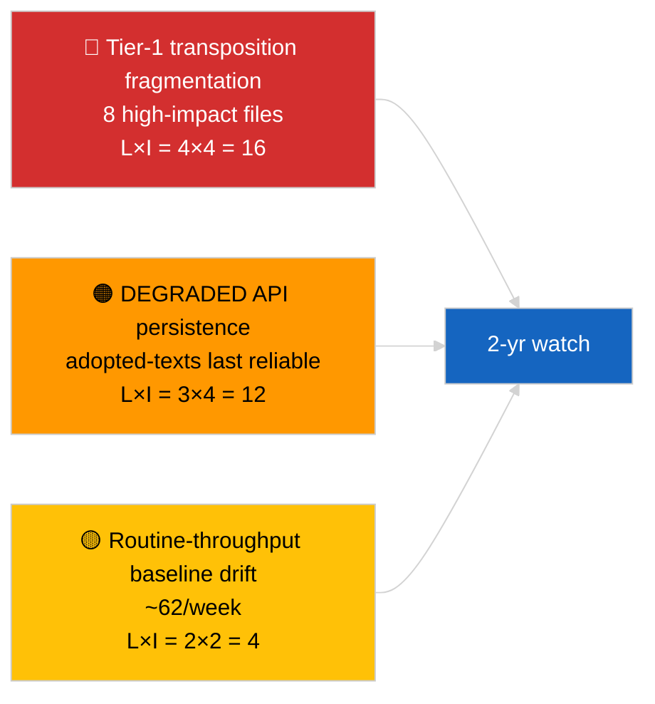

<!-- SPDX-FileCopyrightText: 2026 Hack23 AB -->
<!-- SPDX-License-Identifier: Apache-2.0 -->

# 执行简报 — 突发新闻（已采用文本深度分析）| 2026-04-04

**分类：** OSINT | 公开议会记录
**置信度：** 🟢 高（DEGRADED API状态下一周85件样本）
**生成日期：** 2026-04-04T00:00:00Z（追溯性）
**文章类型：** 突发新闻 — 已采用文本深度分析
**来源：** 欧洲议会开放数据门户

---

## 🎯 BLUF

**已采用文本的周度订阅源返回了85件，涵盖三个不同的议会活动时期——70件来自当前EP10 2026会期，其余为早期窗口的延续。** 在2026-04-03/breaking-2确认的DEGRADED API状态下，已采用文本订阅源仍是最可靠的实质性数据来源（一周回退返回85件）。主导的第一级别集群是2026年3月斯特拉斯堡+布鲁塞尔输出：反腐败（TA-10-2026-0094）、欧洲央行副行长（TA-10-2026-0060）、HDV排放（TA-10-2026-0084）、美国关税（TA-10-2026-0096）、布劳恩豁免权（TA-10-2026-0088）、更好立法（TA-10-2026-0063）、文件访问（TA-10-2026-0065）、格鲁吉亚（TA-10-2026-0083）。其余约62件是重要性较低的常规通过项。对85件数量和主导集群识别具有**🟢 高置信度**。

---

## 🧭 本简报支持的3项决策

| # | 决策 | 决策者 | 截止时间 | 依据 |
|:-:|------|-------|:-------:|------|
| 1 | **编辑：** 将Q1已采用文本长篇摘要作为锚定文章发布 | 编辑 | +48小时 | 85件清单 + 第一级别8件 |
| 2 | **监控：** 在DEGRADED状态下将已采用文本订阅源优先作为主要数据路径 | 数据管道 | 至恢复时止 | 最可靠的端点 |
| 3 | **前瞻监测：** 对前3项第一级别项目进行转置状态报告 | 分析师 | 每季度 | 实施监督 |

---

## 📰 60秒速读

- 🔴 周度订阅源样本中**85件已采用文本**；EP10 2026来源70件；其余为早期窗口延续。（🟢 高）
- 🟠 **2026年3月集中的第一级别8件** — 反腐败、欧洲央行副行长、HDV排放、美国关税、布劳恩豁免权、更好立法、文件访问、格鲁吉亚。（🟢 高）
- 🟢 **已采用文本订阅源 = DEGRADED状态下最可靠的**端点。（🟢 高）
- 🟡 **约62件重要性较低的常规通过项**（典型EP处理量基线）。（🟢 高）
- 🔵 **经济背景：** 第一级别8件集群围绕工业经济（HDV、关税）、机构（欧洲央行、更好立法）和法治（反腐败、布劳恩）轴展开。（🟢 高）
- 🟣 **交叉参考：** 兄弟分析 `breaking-2` 在管道抽象层面再现了相同清单。（🟢 高）
- 🩷 **干扰向量：** 欧洲央行/美国关税文件最易受外部宏观冲击影响。（🟡 中等）
- ⚪ **延续：** Q3–Q4 2026及2027/2028的季度转置状态报告是必要的。

---

## 🗂️ 主要文件/程序表

| 排名 | 欧洲议会参考号 | 标题（简称） | 重要性 | 置信度 |
|:---:|-------------|------------|:-----:|:-----:|
| 1 | TA-10-2026-0094 | 反腐败指令 | 9.0 | 🟢 高 |
| 2 | TA-10-2026-0060 | 欧洲央行副行长 | 8.0 | 🟢 高 |
| 3 | TA-10-2026-0096 | 美国关税 | 7.5 | 🟢 高 |
| 4 | TA-10-2026-0084 | HDV排放额度 | 7.0 | 🟢 高 |
| 5 | TA-10-2026-0088 | 布劳恩豁免权 | 7.0 | 🟢 高 |
| 6 | TA-10-2026-0083 | 格鲁吉亚政治犯 | 7.0 | 🟢 高 |
| 7 | TA-10-2026-0063 | 更好立法 | 7.0 | 🟢 高 |
| 8 | TA-10-2026-0065 | 公众文件访问 | 7.0 | 🟢 高 |

---

## ⚠️ 风险与威胁快照

| 风险 | L | I | 分数 | 触发因素 | 来源 | 海军评级 |
|-----|:-:|:-:|:---:|---------|------|:-------:|
| 第一级别转置碎片化 | 4 | 4 | 16 | 国家层面分歧 | TA-10-2026-0094, TA-10-2026-0084 | A1 |
| 已采用文本订阅源回归 | 3 | 4 | 12 | 最后可靠端点丧失 | 兄弟 `breaking-2` | A2 |
| 常规处理量漂移 | 2 | 2 | 4 | 持续 <40件/周 | 订阅源样本 | B3 |

---

## 🔮 主要前瞻触发因素

**第一级别8件集群的季度转置周期（Q3 2026 → Q1 2028）。** 成员国合规仪表板将显示EP Q1产出是否转化为持久的全欧盟效果。

---

## 🛡️ 数据来源质量评估

- **主要来源：** EP `get_adopted_texts_feed` 周度窗口（85件）。
- **置信度：** 🟢 清单部分为高；🟡 长尾逐项分类为中等。

---

## 📎 链接

| 链接 | 路径 |
|-----|------|
| 文章 | `./article.md` |
| 兄弟运行 | `analysis/daily/2026-04-04/breaking/`, `breaking-2/`, `breaking-3/`, `week-in-review/` |
| 清单 | `./manifest.json` |

---

**文件控制**
- **模板：** `/analysis/templates/executive-brief.md`
- **产出路径：** `analysis/daily/2026-04-04/breaking-4/executive-brief.md`
- **分类：** 公开
- **追溯性生成：** 回填会话。
