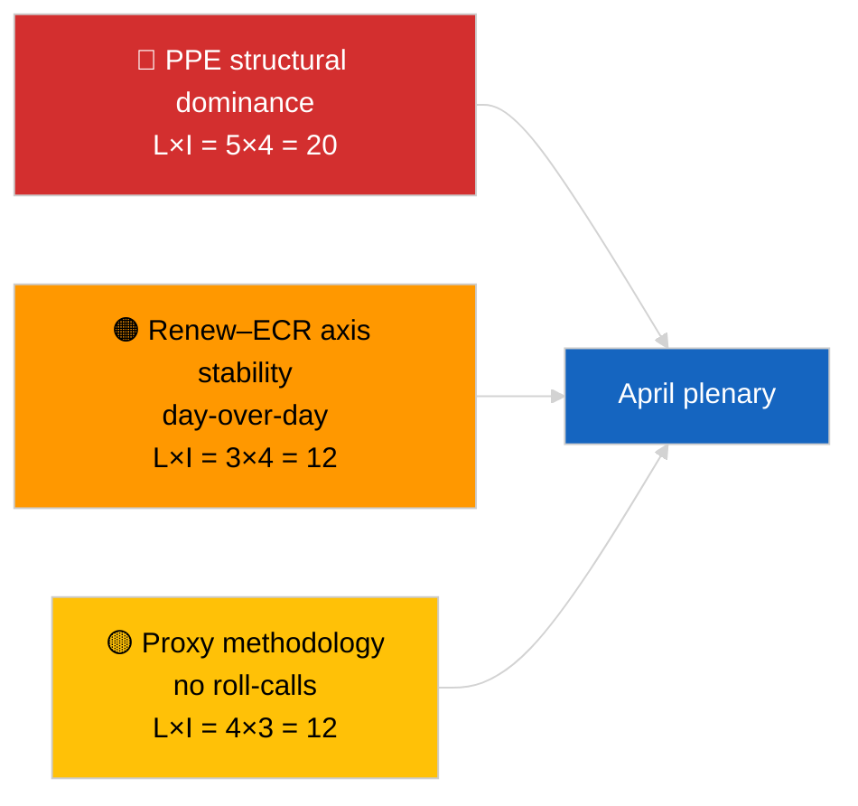

<!-- SPDX-FileCopyrightText: 2026 Hack23 AB -->
<!-- SPDX-License-Identifier: Apache-2.0 -->

# Executive Brief — Breaking (Coalition Dynamics) | 2026-04-04

**Classification:** OSINT | Public Parliamentary Record
**Confidence:** 🟡 Medium (structural cohesion update; no roll-call data)
**Generated:** 2026-04-04T00:00:00Z (retrospective brief)
**Article Type:** Breaking — Coalition Dynamics Assessment
**Source:** European Parliament Open Data Portal

---

## 🎯 BLUF

**Coalition arithmetic on 2026-04-04 confirms the previous day's structural picture: PPE 38% asymmetric dominance and the Renew–ECR cohesion signal (~0.95) continuing.** The article presents a fresh seat-ratio cohesion calculation with the same 28 pair matrix; results converge on yesterday's. Grand Coalition (PPE+S&D = 60%) remains the default; Super-Grand (PPE+S&D+Renew = 65%) provides cushion; Centre-Right alternative (PPE+ECR+PfE = 57%) still binds S&D to the centre via competitive pressure. The marginal new finding versus 2026-04-03 is the stability of the cohesion measures across a 24-hour window — consistent values support the structural-asymmetry hypothesis even if they cannot yet falsify the proxy. **🟡 MEDIUM confidence** — same structural-proxy caveat applies; roll-call validation still pending Q1 publication.

---

## 🧭 3 Decisions This Brief Supports

| # | Decision | Who Decides | Deadline | Evidence |
|:-:|----------|-------------|:--------:|----------|
| 1 | **Editorial:** SKIP daily re-publication; consolidate with 2026-04-03 coalition piece | Editor | +12h | Findings converge with prior day |
| 2 | **Monitoring:** maintain Renew–ECR cohesion watch through April plenary | Analyst | 2026-04-30 | Validation window |
| 3 | **Forward-watch:** integrate post-plenary roll-call data once Q1 votes publish (late May) | Analysis lead | 2026-05-31 | Falsification test |

---

## 📰 60-Second Read

- 🔴 **Renew–ECR 0.95 cohesion sustained** day-over-day; structural-axis hypothesis still on the table. (🟡 Medium)
- 🟠 **PPE 38% structural dominance** unchanged; all viable majorities require PPE. (🟢 High)
- 🟢 **Grand Coalition 60%, Super-Grand 65%, Centre-Right alternative 57%** remain the three viable majority pathways. (🟢 High)
- 🟡 **Fragmentation index ~4.4 effective parties** — stable. (🟡 Medium)
- 🔵 **Methodological caveat:** PPE pair scores still 0.00 by size-ratio model artifact. (🟢 High)
- 🟣 **Cross-reference:** sibling `breaking-2` covers EP10 Q1 legislative pipeline; `breaking-3` documents recess-period analytical limitations; `breaking-4` performs adopted-texts deep-dive. (🟢 High)
- 🩷 **Disruption vector:** Renew–ECR materialisation would reduce S&D leverage. (🟡 Medium)
- ⚪ **Carry-forward:** wait for late-May roll-call data to validate.

---

## 🗂️ Top Findings Table

| Rank | Finding | Cohesion / Share | Confidence | Status |
|:----:|---------|:----------------:|:----------:|--------|
| 1 | Renew–ECR cohesion (day-over-day stable) | 0.95 | 🟡 MEDIUM | Pending validation |
| 2 | Grand Coalition viability | 60% | 🟢 HIGH | Default |
| 3 | Super-Grand cushion | 65% | 🟢 HIGH | Available |
| 4 | Centre-Right alternative | 57% | 🟢 HIGH | Disciplinary lever on S&D |

---

## ⚠️ Risk & Threat Snapshot

| Risk | L | I | Score | Trigger | Source | Admiralty |
|------|:-:|:-:|:-----:|---------|--------|:---------:|
| PPE structural dominance | 5 | 4 | 20 | All viable majorities require PPE | Coalition arithmetic | A1 |
| Renew–ECR axis stability | 3 | 4 | 12 | Day-over-day cohesion | Cohesion matrix | B2 |
| Methodological proxy | 4 | 3 | 12 | No roll-calls available | EP API delay | A2 |

---

## 🔮 Top Forward Trigger

**Day-3 cohesion re-probe and ultimately April Strasbourg roll-call data (late May).** Sustained day-over-day stability strengthens the structural-axis hypothesis even without roll-calls.

---

## 🛡️ Source Quality Assessment

- **Primary sources:** EP MCP analytical tools (operational per `breaking-2` API health probe); 28-pair cohesion matrix.
- **Confidence on day-over-day stability:** 🟢 HIGH.
- **Confidence on axis interpretation:** 🟡 MEDIUM — same structural caveats as 2026-04-03/breaking.

---

## 📎 Links

| Link | Path |
|------|------|
| Article | `./article.md` |
| Sibling runs | `analysis/daily/2026-04-04/breaking-2/`, `breaking-3/`, `breaking-4/`, `week-in-review/` |
| Prior coalition assessment | `analysis/daily/2026-04-03/breaking/` |
| Manifest | `./manifest.json` |

---

**Document Control**
- **Template:** `/analysis/templates/executive-brief.md`
- **Artifact path:** `analysis/daily/2026-04-04/breaking/executive-brief.md`
- **Classification:** Public
- **Retrospective generation:** Back-fill session.
