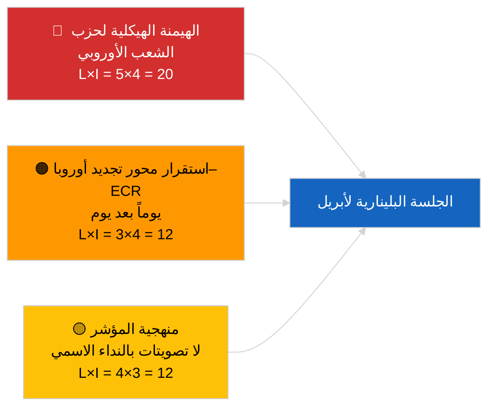

<!-- SPDX-FileCopyrightText: 2026 Hack23 AB -->
<!-- SPDX-License-Identifier: Apache-2.0 -->

# موجز تنفيذي — أخبار عاجلة (ديناميكيات الائتلاف) | 2026-04-04

**التصنيف:** OSINT | سجل برلماني عام
**مستوى الثقة:** 🟡 متوسط (تحديث تماسك هيكلي؛ لا توجد بيانات تصويت بالنداء الاسمي)
**تاريخ الإصدار:** 2026-04-04T00:00:00Z (موجز بأثر رجعي)
**نوع المقال:** عاجل — تقييم ديناميكيات الائتلاف
**المصدر:** بوابة البيانات المفتوحة للبرلمان الأوروبي

---

## 🎯 الخلاصة أولاً (BLUF)

**تؤكد حسابات الائتلاف في 4 أبريل 2026 الصورة الهيكلية لليوم السابق: هيمنة غير متماثلة لحزب الشعب الأوروبي بنسبة 38% واستمرار إشارة تماسك تجديد أوروبا–ECR (~0.95).** يقدم المقال حساباً جديداً للتماسك بنسبة المقاعد مع نفس المصفوفة المكوّنة من 28 زوجاً؛ تتقارب النتائج مع نتائج اليوم السابق. يبقى الائتلاف الكبير (حزب الشعب الأوروبي+S&D = 60%) هو الخيار الافتراضي؛ ويوفر الائتلاف الموسّع (حزب الشعب الأوروبي+S&D+تجديد أوروبا = 65%) هامشاً إضافياً؛ كما يستمر بديل الوسط اليميني (حزب الشعب الأوروبي+ECR+PfE = 57%) في ربط S&D بالوسط عبر ضغط تنافسي. الاستنتاج الجديد الهامشي مقارنةً بـ 3 أبريل 2026 هو استقرار مقاييس التماسك على مدى نافذة زمنية مدتها 24 ساعة — القيم المتسقة تدعم فرضية التباين الهيكلي حتى لو كانت غير قادرة بعد على دحض المؤشر. **🟡 ثقة متوسطة** — ينطبق نفس تحذير المؤشر الهيكلي؛ التحقق عبر بيانات التصويت بالنداء الاسمي لا يزال معلقاً على نشر بيانات الربع الأول.

---

## 🧭 3 قرارات يدعمها هذا الموجز

| # | القرار | من يقرر | الموعد النهائي | الأدلة |
|:-:|--------|---------|:------------:|--------|
| 1 | **تحريري:** تخطّي إعادة النشر اليومية؛ الدمج مع مقال الائتلاف بتاريخ 3 أبريل 2026 | المحرر | +12 ساعة | النتائج تتقارب مع اليوم السابق |
| 2 | **رصد:** الإبقاء على مراقبة تماسك تجديد أوروبا–ECR طوال جلسة أبريل البلينارية | المحلل | 2026-04-30 | نافذة التحقق |
| 3 | **رصد مستقبلي:** دمج بيانات التصويت بالنداء الاسمي بعد الجلسة البلينارية فور نشر أصوات الربع الأول (أواخر مايو) | قائد التحليل | 2026-05-31 | اختبار الدحض |

---

## 📰 قراءة الستين ثانية

- 🔴 **تماسك تجديد أوروبا–ECR 0.95 مستمر** يوماً بعد يوم؛ فرضية المحور الهيكلي لا تزال قائمة. (🟡 متوسط)
- 🟠 **الهيمنة الهيكلية لحزب الشعب الأوروبي عند 38%** دون تغيير؛ جميع الأغلبيات الممكنة تستلزم وجود حزب الشعب الأوروبي. (🟢 عالٍ)
- 🟢 **الائتلاف الكبير 60%، الموسّع 65%، بديل الوسط اليميني 57%** تبقى المسارات الثلاثة الممكنة للأغلبية. (🟢 عالٍ)
- 🟡 **مؤشر التشرذم ~4.4 حزب فعّال** — مستقر. (🟡 متوسط)
- 🔵 **تحفظ منهجي:** نقاط زوج حزب الشعب الأوروبي لا تزال 0.00 بسبب قصور نموذج نسبة الحجم. (🟢 عالٍ)
- 🟣 **إسناد متبادل:** يغطي `breaking-2` الشقيق خط أنابيب التشريع T1 للبرلمان الأوروبي؛ يوثّق `breaking-3` القيود التحليلية في فترة العطلة؛ ينجز `breaking-4` تحليلاً معمّقاً للنصوص المعتمدة. (🟢 عالٍ)
- 🩷 **متجه التعطيل:** تحقّق تجديد أوروبا–ECR سيُقلل نفوذ S&D. (🟡 متوسط)
- ⚪ **معلّق:** انتظار بيانات التصويت بالنداء الاسمي أواخر مايو للتحقق.

---

## 🗂️ جدول أبرز النتائج

| الترتيب | النتيجة | التماسك / الحصة | مستوى الثقة | الحالة |
|:------:|--------|:--------------:|:----------:|--------|
| 1 | تماسك تجديد أوروبا–ECR (مستقر يوماً بعد يوم) | 0.95 | 🟡 متوسط | في انتظار التحقق |
| 2 | قابلية تطبيق الائتلاف الكبير | 60% | 🟢 عالٍ | الخيار الافتراضي |
| 3 | هامش الائتلاف الموسّع | 65% | 🟢 عالٍ | متاح |
| 4 | بديل الوسط اليميني | 57% | 🟢 عالٍ | رافعة انضباطية على S&D |

---

## ⚠️ لقطة المخاطر والتهديدات

| المخاطرة | T | A | النتيجة | المحفز | المصدر | الأميرالية |
|---------|:-:|:-:|:------:|--------|--------|:----------:|
| الهيمنة الهيكلية لحزب الشعب الأوروبي | 5 | 4 | 20 | جميع الأغلبيات الممكنة تستلزم حزب الشعب الأوروبي | حسابات الائتلاف | A1 |
| استقرار محور تجديد أوروبا–ECR | 3 | 4 | 12 | تماسك يوماً بعد يوم | مصفوفة التماسك | B2 |
| المؤشر المنهجي | 4 | 3 | 12 | لا توجد بيانات تصويت بالنداء الاسمي | تأخر واجهة برمجة تطبيقات البرلمان | A2 |

---

## 🔮 أبرز المحفزات المستقبلية

**إعادة اختبار التماسك في اليوم الثالث وفي نهاية المطاف بيانات التصويت بالنداء الاسمي للجلسة البلينارية لأبريل (أواخر مايو).** الاستقرار المستمر يوماً بعد يوم يُعزز فرضية المحور الهيكلي حتى دون توافر بيانات التصويت بالنداء الاسمي.

---

## 🛡️ تقييم جودة المصادر

- **المصادر الأولية:** أدوات التحليل عبر بروتوكول MCP للبرلمان الأوروبي (في حالة تشغيل وفق اختبار صحة واجهة برمجة التطبيقات `breaking-2`)؛ مصفوفة التماسك من 28 زوجاً.
- **الثقة في الاستقرار اليومي:** 🟢 عالٍ.
- **الثقة في تفسير المحور:** 🟡 متوسط — نفس التحفظات الهيكلية المطبّقة على 2026-04-03/breaking.

---

## 📎 الروابط

| الرابط | المسار |
|--------|-------|
| المقال | `./article.md` |
| التقارير الشقيقة | `analysis/daily/2026-04-04/breaking-2/`، `breaking-3/`، `breaking-4/`، `week-in-review/` |
| تقييم الائتلاف السابق | `analysis/daily/2026-04-03/breaking/` |
| الملف التعريفي | `./manifest.json` |

---

**ضبط الوثيقة**
- **القالب:** `/analysis/templates/executive-brief.md`
- **مسار القطعة:** `analysis/daily/2026-04-04/breaking/executive-brief.md`
- **التصنيف:** عام
- **الإنتاج بأثر رجعي:** جلسة استكمالية.
