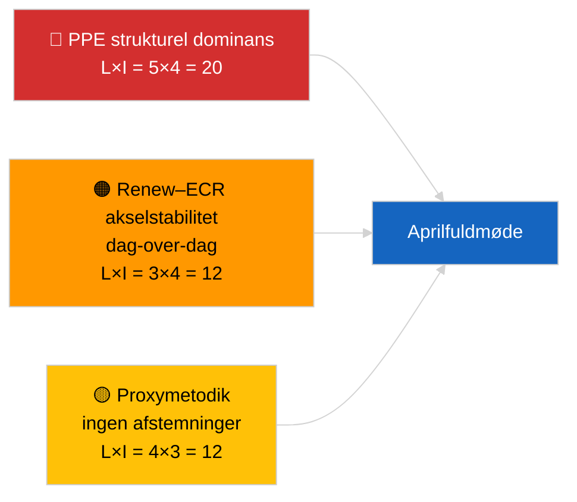

<!-- SPDX-FileCopyrightText: 2026 Hack23 AB -->
<!-- SPDX-License-Identifier: Apache-2.0 -->

# Ledelsesbriefing — Aktuelt (Koalitionsdynamik) | 2026-04-04

**Klassificering:** OSINT | Offentlig parlamentarisk fortegnelse
**Konfidensniveau:** 🟡 Middel (strukturel kohesionsopdatering; ingen afstemningsdata)
**Genereret:** 2026-04-04T00:00:00Z (retrospektiv briefing)
**Artikeltype:** Aktuelt — Koalitionsdynamikvurdering
**Kilde:** Europa-Parlamentets åbne dataportal

---

## 🎯 BLUF

**Koalitionernes aritmetik den 2026-04-04 bekræfter det foregående dags strukturbillede: PPE's asymmetriske dominans på 38 % og Renew–ECR-kohesionssignalet (~0,95) fortsætter.** Artiklen præsenterer en ny sædeandelsberegning med den samme 28-parmatrix; resultaterne konvergerer med gårsdagens. Storkoalitionen (PPE+S&D = 60 %) er standard; Superkoalitionen (PPE+S&D+Renew = 65 %) giver en buffer; det centerretslige alternativ (PPE+ECR+PfE = 57 %) binder fortsat S&D til centrum via konkurrencepres. Det marginalt nye fund sammenlignet med 2026-04-03 er stabiliteten af kohesionsmålingerne over et 24-timers vindue. **🟡 MIDDEL konfidensniveau** — samme strukturelle proxyforbehold; afstemningsvalidering afventer fortsat Q1-publikation.

---

## 🧭 3 beslutninger denne briefing understøtter

| # | Beslutning | Beslutningsstager | Deadline | Dokumentation |
|:-:|-----------|-------------------|:--------:|---------------|
| 1 | **Redaktionel:** SPRING daglig genpublicering over; konsolidér med koalitionsstykket 2026-04-03 | Redaktør | +12h | Resultater konvergerer med foregående dag |
| 2 | **Overvågning:** oprethold Renew–ECR-kohesionsovervågning gennem aprilfuldmødet | Analytiker | 2026-04-30 | Valideringsvindue |
| 3 | **Fremadrettet overvågning:** integrer afstemningsdata efter fuldmødet, når Q1-stemmer publiceres (sen maj) | Analyseleder | 2026-05-31 | Falsifikationstest |

---

## 📰 60-sekunders læsning

- 🔴 **Renew–ECR 0,95 kohesion opretholdt** dag-over-dag; hypotesen om strukturaksen er stadig åben. (🟡 Middel)
- 🟠 **PPE's strukturelle dominans på 38 %** uændret; alle levedygtige flertal kræver PPE. (🟢 Høj)
- 🟢 **Storkoalition 60 %, Superkoalition 65 %, centerretsligt alternativ 57 %** forbliver de tre levedygtige flertalsruter. (🟢 Høj)
- 🟡 **Fragmenteringsindeks ~4,4 effektive partier** — stabilt. (🟡 Middel)
- 🔵 **Metodologisk forbehold:** PPE-parscorer stadig 0,00 pga. størrelsesandelsmodellens artefakt. (🟢 Høj)
- 🟣 **Krydsreference:** søskende `breaking-2` dækker EP10 Q1 lovgivningspipeline; `breaking-3` dokumenterer analytiske begrænsninger i recessperioden; `breaking-4` udfører dybtgående gennemgang af vedtagne tekster. (🟢 Høj)
- 🩷 **Forstyrrelsesvektor:** Renew–ECR-materialisering ville reducere S&D's indflydelse. (🟡 Middel)
- ⚪ **Videreførelse:** afvent afstemningsdata i sen maj for validering.

---

## 🗂️ Tabel over vigtigste resultater

| Rang | Resultat | Kohesion/Andel | Konfidensniveau | Status |
|:----:|---------|:--------------:|:---------------:|--------|
| 1 | Renew–ECR kohesion (stabil dag-over-dag) | 0,95 | 🟡 MIDDEL | Afventer validering |
| 2 | Storkoalitionens levedygtighed | 60 % | 🟢 HØJ | Standard |
| 3 | Superkoalitionens buffer | 65 % | 🟢 HØJ | Tilgængelig |
| 4 | Centerretsligt alternativ | 57 % | 🟢 HØJ | Disciplinerende løftestang mod S&D |

---

## ⚠️ Risiko- og trusselsøjebliksbillede

| Risiko | L | I | Score | Udløser | Kilde | Admiralitet |
|--------|:-:|:-:|:-----:|---------|-------|:-----------:|
| PPE strukturel dominans | 5 | 4 | 20 | Alle levedygtige flertal kræver PPE | Koalitionsaritmetik | A1 |
| Renew–ECR akselstabilitet | 3 | 4 | 12 | Dag-over-dag kohesion | Kohesionsmatrix | B2 |
| Metodologisk proxy | 4 | 3 | 12 | Ingen afstemninger tilgængelige | EP API-forsinkelse | A2 |

---

## 🔮 Vigtigste fremtidige udløser

**Dag-3-kohesionsgenoprøvning og i sidste ende aprilafstemningsdata fra Strasbourg (sen maj).** Vedvarende dag-over-dag-stabilitet styrker hypotesen om strukturaksen selv uden afstemninger.

---

## 🛡️ Vurdering af kildekvalitet

- **Primære kilder:** EP MCP analytiske værktøjer (operationelle ifølge `breaking-2` API-sundhedsprøve); 28-parskohesionsmatrix.
- **Konfidensniveau dag-over-dag stabilitet:** 🟢 HØJ.
- **Konfidensniveau akselfortolkning:** 🟡 MIDDEL — samme strukturelle forbehold som 2026-04-03/breaking.

---

## 📎 Links

| Link | Sti |
|------|-----|
| Artikel | `./article.md` |
| Søskendekørsler | `analysis/daily/2026-04-04/breaking-2/`, `breaking-3/`, `breaking-4/`, `week-in-review/` |
| Tidligere koalitionsvurdering | `analysis/daily/2026-04-03/breaking/` |
| Manifest | `./manifest.json` |

---

**Dokumentkontrol**
- **Skabelon:** `/analysis/templates/executive-brief.md`
- **Artefaktsti:** `analysis/daily/2026-04-04/breaking/executive-brief.md`
- **Klassificering:** Offentlig
- **Retrospektiv generering:** Tilbagefyldningssession.
