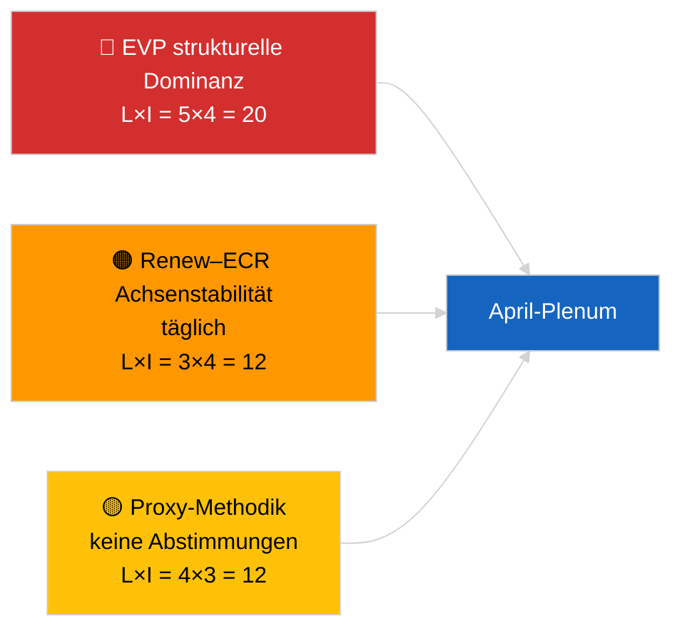

<!-- SPDX-FileCopyrightText: 2026 Hack23 AB -->
<!-- SPDX-License-Identifier: Apache-2.0 -->

# Führungsbriefing — Aktuelles (Koalitionsdynamik) | 2026-04-04

**Klassifizierung:** OSINT | Öffentliche parlamentarische Aufzeichnung
**Konfidenzniveau:** 🟡 Mittel (strukturelle Kohäsionsaktualisierung; keine namentlichen Abstimmungsdaten)
**Erstellt:** 2026-04-04T00:00:00Z (retrospektives Briefing)
**Artikeltyp:** Aktuelles — Koalitionsdynamikbewertung
**Quelle:** Offenes Datenportal des Europäischen Parlaments

---

## 🎯 BLUF

**Die Koalitionsarithmetik am 2026-04-04 bestätigt das Strukturbild des Vortages: Die asymmetrische Dominanz der EVP mit 38 % und das Renew–ECR-Kohäsionssignal (~0,95) halten an.** Der Artikel präsentiert eine neue Sitzanteilsberechnung mit derselben 28-Paar-Matrix; die Ergebnisse konvergieren mit denen des Vortages. Die Große Koalition (EVP+S&D = 60 %) ist Standard; die Super-Große Koalition (EVP+S&D+Renew = 65 %) bietet Puffer; die Mitte-Rechts-Alternative (EVP+ECR+PfE = 57 %) bindet S&D weiterhin über Wettbewerbsdruck an die Mitte. Der marginal neue Befund gegenüber dem 2026-04-03 ist die Stabilität der Kohäsionsmessungen über ein 24-Stunden-Fenster. **🟡 MITTLERES Konfidenzniveau** — gleicher struktureller Proxy-Vorbehalt; Abstimmungsvalidierung wartet noch auf die Q1-Veröffentlichung.

---

## 🧭 3 Entscheidungen, die dieses Briefing unterstützt

| # | Entscheidung | Entscheidungsträger | Frist | Nachweis |
|:-:|-------------|---------------------|:-----:|----------|
| 1 | **Redaktionell:** TÄGLICHE Wiederveröffentlichung ÜBERSPRINGEN; mit Koalitionsstück vom 2026-04-03 konsolidieren | Redakteur | +12h | Befunde konvergieren mit Vortag |
| 2 | **Monitoring:** Renew–ECR-Kohäsionsüberwachung durch die April-Plenarsitzung aufrechterhalten | Analyst | 2026-04-30 | Validierungsfenster |
| 3 | **Vorausschau:** Nach-Plenum-Abstimmungsdaten integrieren, wenn Q1-Abstimmungen veröffentlicht werden (Ende Mai) | Analyseleiter | 2026-05-31 | Falsifikationstest |

---

## 📰 60-Sekunden-Lektüre

- 🔴 **Renew–ECR 0,95 Kohäsion täglich aufrechterhalten**; die Strukturachs-Hypothese bleibt auf dem Tisch. (🟡 Mittel)
- 🟠 **EVP 38 % strukturelle Dominanz** unverändert; alle tragfähigen Mehrheiten erfordern die EVP. (🟢 Hoch)
- 🟢 **Große Koalition 60 %, Super-Große Koalition 65 %, Mitte-Rechts-Alternative 57 %** bleiben die drei tragfähigen Mehrheitswege. (🟢 Hoch)
- 🟡 **Fragmentierungsindex ~4,4 effektive Parteien** — stabil. (🟡 Mittel)
- 🔵 **Methodologischer Vorbehalt:** EVP-Paarwerte weiterhin 0,00 aufgrund des Artefakts des Größenanteilsmodells. (🟢 Hoch)
- 🟣 **Querverweise:** Geschwisterstück `breaking-2` deckt die EP10 Q1-Gesetzgebungspipeline ab; `breaking-3` dokumentiert analytische Einschränkungen in der Recessperiode; `breaking-4` führt eine eingehende Prüfung der angenommenen Texte durch. (🟢 Hoch)
- 🩷 **Störungsvektor:** Eine Renew–ECR-Materialisierung würde den Einfluss von S&D verringern. (🟡 Mittel)
- ⚪ **Weiterführung:** auf Abstimmungsdaten Ende Mai zur Validierung warten.

---

## 🗂️ Tabelle der wichtigsten Befunde

| Rang | Befund | Kohäsion/Anteil | Konfidenzniveau | Status |
|:----:|--------|:---------------:|:---------------:|--------|
| 1 | Renew–ECR Kohäsion (täglich stabil) | 0,95 | 🟡 MITTEL | Validierung ausstehend |
| 2 | Lebensfähigkeit der Großen Koalition | 60 % | 🟢 HOCH | Standard |
| 3 | Super-Große Koalition Puffer | 65 % | 🟢 HOCH | Verfügbar |
| 4 | Mitte-Rechts-Alternative | 57 % | 🟢 HOCH | Disziplinarischer Hebel gegen S&D |

---

## ⚠️ Risiko- und Bedrohungsübersicht

| Risiko | L | I | Score | Auslöser | Quelle | Admiralität |
|--------|:-:|:-:|:-----:|---------|--------|:-----------:|
| EVP strukturelle Dominanz | 5 | 4 | 20 | Alle tragfähigen Mehrheiten erfordern EVP | Koalitionsarithmetik | A1 |
| Renew–ECR Achsenstabilität | 3 | 4 | 12 | Tägliche Kohäsion | Kohäsionsmatrix | B2 |
| Methodologischer Proxy | 4 | 3 | 12 | Keine Abstimmungen verfügbar | EP API-Verzögerung | A2 |

---

## 🔮 Wichtigster Vorausauslöser

**Kohäsions-Nachprüfung am Tag 3 und letztendlich die April-Abstimmungsdaten aus Straßburg (Ende Mai).** Anhaltende tägliche Stabilität stärkt die Strukturachs-Hypothese auch ohne Abstimmungen.

---

## 🛡️ Bewertung der Quellqualität

- **Primäre Quellen:** EP MCP-Analysewerkzeuge (gemäß `breaking-2` API-Gesundheitsprüfung in Betrieb); 28-Paar-Kohäsionsmatrix.
- **Konfidenzniveau tägliche Stabilität:** 🟢 HOCH.
- **Konfidenzniveau Achseninterpretation:** 🟡 MITTEL — gleiche strukturelle Vorbehalte wie 2026-04-03/breaking.

---

## 📎 Links

| Link | Pfad |
|------|------|
| Artikel | `./article.md` |
| Geschwisterläufe | `analysis/daily/2026-04-04/breaking-2/`, `breaking-3/`, `breaking-4/`, `week-in-review/` |
| Frühere Koalitionsbewertung | `analysis/daily/2026-04-03/breaking/` |
| Manifest | `./manifest.json` |

---

**Dokumentenkontrolle**
- **Vorlage:** `/analysis/templates/executive-brief.md`
- **Artefaktpfad:** `analysis/daily/2026-04-04/breaking/executive-brief.md`
- **Klassifizierung:** Öffentlich
- **Retrospektive Erstellung:** Auffüllungssitzung.
