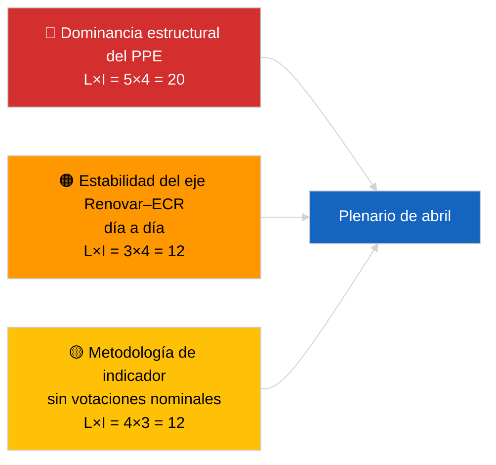

<!-- SPDX-FileCopyrightText: 2026 Hack23 AB -->
<!-- SPDX-License-Identifier: Apache-2.0 -->

# Informe Ejecutivo — Noticias de Última Hora (Dinámica de Coaliciones) | 2026-04-04

**Clasificación:** OSINT | Registro parlamentario público
**Confianza:** 🟡 Media (actualización de cohesión estructural; sin datos de votaciones nominales)
**Generado:** 2026-04-04T00:00:00Z (informe retrospectivo)
**Tipo de artículo:** Última hora — Evaluación de la dinámica de coaliciones
**Fuente:** Portal de datos abiertos del Parlamento Europeo

---

## 🎯 BLUF

**La aritmética de coaliciones del 4 de abril de 2026 confirma el panorama estructural del día anterior: dominancia asimétrica del PPE al 38% y la señal de cohesión Renovar–ECR (~0,95) continúa.** El artículo presenta un nuevo cálculo de cohesión por ratio de escaños con la misma matriz de 28 pares; los resultados convergen con los de ayer. La Gran Coalición (PPE+S&D = 60%) sigue siendo la opción por defecto; la Super-Gran Coalición (PPE+S&D+Renovar = 65%) proporciona margen; la alternativa Centro-Derecha (PPE+ECR+PfE = 57%) sigue vinculando al S&D al centro mediante presión competitiva. El hallazgo marginal nuevo respecto al 3 de abril de 2026 es la estabilidad de las medidas de cohesión en una ventana de 24 horas: los valores consistentes apoyan la hipótesis de asimetría estructural aunque todavía no puedan falsificar el indicador. **🟡 CONFIANZA MEDIA** — aplica la misma advertencia de indicador estructural; la validación mediante votaciones nominales sigue pendiente de publicación del T1.

---

## 🧭 3 Decisiones que apoya este informe

| # | Decisión | Quién decide | Plazo | Evidencia |
|:-:|----------|-------------|:-----:|-----------|
| 1 | **Editorial:** OMITIR republicación diaria; consolidar con el artículo de coalición del 3 de abril de 2026 | Editor | +12h | Los hallazgos convergen con el día anterior |
| 2 | **Seguimiento:** mantener la vigilancia de cohesión Renovar–ECR durante el plenario de abril | Analista | 2026-04-30 | Ventana de validación |
| 3 | **Seguimiento prospectivo:** integrar datos de votaciones nominales post-plenario una vez publicados los votos del T1 (finales de mayo) | Responsable de análisis | 2026-05-31 | Test de falsificación |

---

## 📰 Lectura de 60 segundos

- 🔴 **Cohesión Renovar–ECR de 0,95 sostenida** día a día; la hipótesis del eje estructural sigue en pie. (🟡 Media)
- 🟠 **Dominancia estructural del PPE al 38%** sin cambios; todas las mayorías viables requieren al PPE. (🟢 Alta)
- 🟢 **Gran Coalición 60%, Super-Gran 65%, alternativa Centro-Derecha 57%** siguen siendo las tres vías de mayoría viables. (🟢 Alta)
- 🟡 **Índice de fragmentación ~4,4 partidos efectivos** — estable. (🟡 Media)
- 🔵 **Advertencia metodológica:** las puntuaciones del par PPE siguen en 0,00 por artefacto del modelo de ratio de tamaño. (🟢 Alta)
- 🟣 **Referencia cruzada:** el informe hermano `breaking-2` cubre la cartera legislativa T1 del PE10; `breaking-3` documenta las limitaciones analíticas del periodo de receso; `breaking-4` realiza un análisis profundo de textos aprobados. (🟢 Alta)
- 🩷 **Vector de disrupción:** la materialización de Renovar–ECR reduciría el poder de negociación del S&D. (🟡 Media)
- ⚪ **Seguimiento pendiente:** esperar los datos de votaciones nominales de finales de mayo para validar.

---

## 🗂️ Tabla de principales hallazgos

| Rango | Hallazgo | Cohesión / Cuota | Confianza | Estado |
|:-----:|---------|:---------------:|:---------:|--------|
| 1 | Cohesión Renovar–ECR (estable día a día) | 0,95 | 🟡 MEDIA | Pendiente de validación |
| 2 | Viabilidad de la Gran Coalición | 60% | 🟢 ALTA | Por defecto |
| 3 | Margen Super-Gran | 65% | 🟢 ALTA | Disponible |
| 4 | Alternativa Centro-Derecha | 57% | 🟢 ALTA | Palanca disciplinaria sobre el S&D |

---

## ⚠️ Instantánea de riesgos y amenazas

| Riesgo | L | I | Puntuación | Disparador | Fuente | Almirantazgo |
|--------|:-:|:-:|:----------:|-----------|--------|:------------:|
| Dominancia estructural del PPE | 5 | 4 | 20 | Todas las mayorías viables requieren al PPE | Aritmética de coaliciones | A1 |
| Estabilidad del eje Renovar–ECR | 3 | 4 | 12 | Cohesión día a día | Matriz de cohesión | B2 |
| Indicador metodológico | 4 | 3 | 12 | Sin votaciones nominales disponibles | Retraso API del PE | A2 |

---

## 🔮 Principal disparador prospectivo

**Retest de cohesión al día 3 y en última instancia los datos de votaciones nominales del plenario de abril (finales de mayo).** La estabilidad sostenida día a día refuerza la hipótesis del eje estructural incluso sin votaciones nominales.

---

## 🛡️ Evaluación de la calidad de las fuentes

- **Fuentes primarias:** herramientas analíticas MCP del PE (operativas según el sondeo de salud API de `breaking-2`); matriz de cohesión de 28 pares.
- **Confianza sobre la estabilidad día a día:** 🟢 ALTA.
- **Confianza sobre la interpretación del eje:** 🟡 MEDIA — mismas advertencias estructurales que en 2026-04-03/breaking.

---

## 📎 Vínculos

| Vínculo | Ruta |
|---------|------|
| Artículo | `./article.md` |
| Análisis hermanos | `analysis/daily/2026-04-04/breaking-2/`, `breaking-3/`, `breaking-4/`, `week-in-review/` |
| Evaluación de coalición anterior | `analysis/daily/2026-04-03/breaking/` |
| Manifiesto | `./manifest.json` |

---

**Control del documento**
- **Plantilla:** `/analysis/templates/executive-brief.md`
- **Ruta del artefacto:** `analysis/daily/2026-04-04/breaking/executive-brief.md`
- **Clasificación:** Público
- **Generación retrospectiva:** Sesión de relleno.
