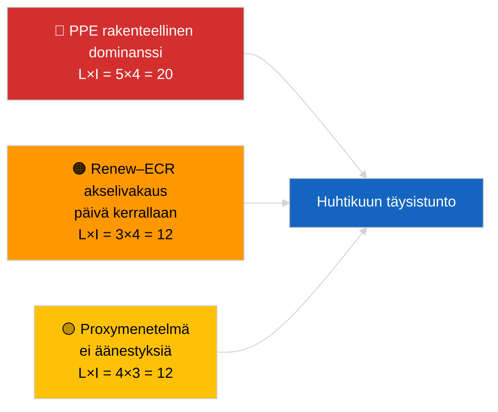

<!-- SPDX-FileCopyrightText: 2026 Hack23 AB -->
<!-- SPDX-License-Identifier: Apache-2.0 -->

# Johtokatsaus — Viimeisin (Koalitiodynamiikka) | 2026-04-04

**Luokittelu:** OSINT | Julkinen parlamentaarinen asiakirja
**Luottamustaso:** 🟡 Kohtalainen (rakenteellinen koheesiopäivitys; ei äänestystietoja)
**Luotu:** 2026-04-04T00:00:00Z (retrospektiivinen katsaus)
**Artikkelityyppi:** Viimeisin — Koalitiodynamiikan arvio
**Lähde:** Euroopan parlamentin avoin dataportti

---

## 🎯 BLUF

**Koalitioaritmetiikka 2026-04-04 vahvistaa edellisen päivän rakenteellisen kuvan: PPE:n epäsymmetrinen 38 prosentin dominanssi ja Renew–ECR-koheesiosignaali (~0,95) jatkuvat.** Artikkeli esittää tuoreen paikka-osuuslaskennan samalla 28 parin matriisilla; tulokset konvergoivat eilen nähtyyn. Suurkoalitio (PPE+S&D = 60 %) on oletusvaihtoehto; Superkokoomus (PPE+S&D+Renew = 65 %) tarjoaa puskurin; oikeistokeskustavaihtoehto (PPE+ECR+PfE = 57 %) sitoo S&D:n edelleen keskustaan kilpailupaineen kautta. Marginaalinen uusi löydös verrattuna 2026-04-03:een on koheesiomittareiden vakaus 24 tunnin ikkunalla. **🟡 KOHTALAINEN luottamustaso** — sama rakenteellinen proxyvaraus; äänestysvalidointi odottaa edelleen Q1-julkaisua.

---

## 🧭 3 päätöstä, joita tämä katsaus tukee

| # | Päätös | Päätöksentekijä | Määräaika | Näyttö |
|:-:|--------|-----------------|:---------:|--------|
| 1 | **Toimituksellinen:** OHITA päivittäinen uudelleenjulkaisu; yhdistä koalitioartikkeliin 2026-04-03 | Toimittaja | +12t | Löydökset konvergoivat edellisen päivän kanssa |
| 2 | **Seuranta:** ylläpidä Renew–ECR-koheesiovalvontaa huhtikuun täysistunnon läpi | Analyytikko | 2026-04-30 | Validointiikkuna |
| 3 | **Eteenpäin katsominen:** integroi täysistunnon jälkeiset äänestystiedot, kun Q1-äänet julkaistaan (myöhään toukokuussa) | Analyysipäällikkö | 2026-05-31 | Falsifikaatiotesti |

---

## 📰 60 sekunnin luku

- 🔴 **Renew–ECR 0,95 koheesio säilyy** päivä kerrallaan; rakenneakselin hypoteesi pöydällä edelleen. (🟡 Kohtalainen)
- 🟠 **PPE:n 38 prosentin rakenteellinen dominanssi** muuttumaton; kaikki toimivat enemmistöt vaativat PPE:n. (🟢 Korkea)
- 🟢 **Suurkoalitio 60 %, Superkokoomus 65 %, oikeistokeskustavaihtoehto 57 %** pysyvät kolmena toimivana enemmistöreittinä. (🟢 Korkea)
- 🟡 **Pirstoutumisindeksi ~4,4 tehollista puoluetta** — vakaa. (🟡 Kohtalainen)
- 🔵 **Metodologinen varaus:** PPE-paripisteytykset edelleen 0,00 kokoproxy-mallin artefaktin vuoksi. (🟢 Korkea)
- 🟣 **Ristiviittaus:** sisarartikkeli `breaking-2` kattaa EP10 Q1 lainsäädäntöputken; `breaking-3` dokumentoi analyyttiset rajoitteet taukoaikana; `breaking-4` suorittaa hyväksyttyjen tekstien syväanalyysin. (🟢 Korkea)
- 🩷 **Häiriövektori:** Renew–ECR-materialisoituminen pienentäisi S&D:n vaikutusvaltaa. (🟡 Kohtalainen)
- ⚪ **Jatkovaihe:** odota äänestystietoja myöhään toukokuussa validointia varten.

---

## 🗂️ Tärkeimpien löydösten taulukko

| Sija | Löydös | Koheesio/Osuus | Luottamustaso | Tila |
|:----:|--------|:--------------:|:-------------:|------|
| 1 | Renew–ECR koheesio (vakaa päivä kerrallaan) | 0,95 | 🟡 KOHTALAINEN | Validointia odottava |
| 2 | Suurkoalition toimivuus | 60 % | 🟢 KORKEA | Oletus |
| 3 | Superkokoomuksen puskuri | 65 % | 🟢 KORKEA | Saatavilla |
| 4 | Oikeistokeskustavaihtoehto | 57 % | 🟢 KORKEA | Kurinpidollinen vipu S&D:tä vastaan |

---

## ⚠️ Riski- ja uhkaluonnos

| Riski | L | I | Pisteet | Laukaisin | Lähde | Amiraalius |
|-------|:-:|:-:|:-------:|-----------|-------|:----------:|
| PPE rakenteellinen dominanssi | 5 | 4 | 20 | Kaikki toimivat enemmistöt vaativat PPE:n | Koalitioaritmetiikka | A1 |
| Renew–ECR akselivakaus | 3 | 4 | 12 | Päivä kerrallaan -koheesio | Koheesiomatriisi | B2 |
| Metodologinen proxy | 4 | 3 | 12 | Ei äänestyksiä saatavilla | EP API-viive | A2 |

---

## 🔮 Tärkein eteenpäin katsova laukaisin

**Päivä-3-koheesion uudelleentutkinta ja lopulta huhtikuun Strasbourgin äänestystiedot (myöhään toukokuussa).** Jatkuva päivä kerrallaan -vakaus vahvistaa rakenneakselin hypoteesia vaikka äänestyksiä ei olisikaan.

---

## 🛡️ Lähdenlaatuarvio

- **Ensisijaiset lähteet:** EP MCP analyyttiset työkalut (toiminnassa `breaking-2` API-terveysmittauksen mukaan); 28 parin koheesiomatriisi.
- **Luottamustaso päivä kerrallaan -vakaus:** 🟢 KORKEA.
- **Luottamustaso akselinon tulkinta:** 🟡 KOHTALAINEN — samat rakenteelliset varaukset kuin 2026-04-03/breaking.

---

## 📎 Linkit

| Linkki | Polku |
|--------|-------|
| Artikkeli | `./article.md` |
| Sisarsuoritukset | `analysis/daily/2026-04-04/breaking-2/`, `breaking-3/`, `breaking-4/`, `week-in-review/` |
| Edellinen koalitioarvio | `analysis/daily/2026-04-03/breaking/` |
| Manifesti | `./manifest.json` |

---

**Asiakirjan hallinta**
- **Malli:** `/analysis/templates/executive-brief.md`
- **Artefaktipolku:** `analysis/daily/2026-04-04/breaking/executive-brief.md`
- **Luokittelu:** Julkinen
- **Retrospektiivinen luominen:** Täyttöistunto.
