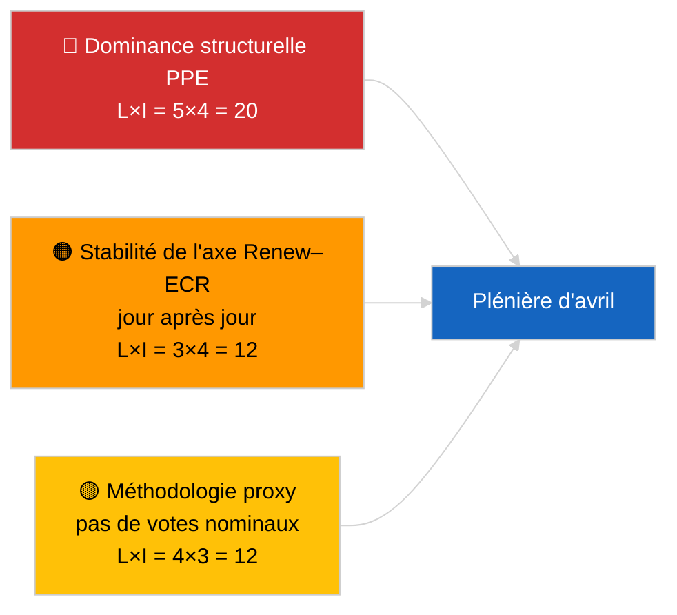

<!-- SPDX-FileCopyrightText: 2026 Hack23 AB -->
<!-- SPDX-License-Identifier: Apache-2.0 -->

# Briefing exécutif — Actualité (Dynamique de coalition) | 2026-04-04

**Classification :** OSINT | Archives parlementaires publiques
**Niveau de confiance :** 🟡 Moyen (mise à jour de cohésion structurelle ; pas de données de vote nominal)
**Généré :** 2026-04-04T00:00:00Z (briefing rétrospectif)
**Type d'article :** Actualité — Évaluation de la dynamique de coalition
**Source :** Portail de données ouvertes du Parlement européen

---

## 🎯 BLUF

**L'arithmétique des coalitions au 2026-04-04 confirme le tableau structurel de la veille : la dominance asymétrique du PPE à 38 % et le signal de cohésion Renew–ECR (~0,95) se maintiennent.** L'article présente un nouveau calcul de ratio de sièges avec la même matrice de 28 paires ; les résultats convergent avec ceux d'hier. La Grande Coalition (PPE+S&D = 60 %) est la solution par défaut ; la Super-Grande Coalition (PPE+S&D+Renew = 65 %) offre un filet de sécurité ; l'alternative Centre-Droite (PPE+ECR+PfE = 57 %) maintient S&D lié au centre par pression concurrentielle. Le résultat marginalement nouveau par rapport au 2026-04-03 est la stabilité des mesures de cohésion sur une fenêtre de 24 heures. **🟡 MOYEN niveau de confiance** — même réserve de proxy structurel ; la validation par vote nominal attend toujours la publication Q1.

---

## 🧭 3 décisions que ce briefing soutient

| # | Décision | Décideur | Délai | Preuves |
|:-:|---------|----------|:-----:|---------|
| 1 | **Éditorial :** IGNORER la republication quotidienne ; consolider avec l'article de coalition du 2026-04-03 | Rédacteur | +12h | Les résultats convergent avec la veille |
| 2 | **Surveillance :** maintenir la veille de cohésion Renew–ECR jusqu'à la plénière d'avril | Analyste | 2026-04-30 | Fenêtre de validation |
| 3 | **Veille prospective :** intégrer les données de vote après la plénière lorsque les votes Q1 seront publiés (fin mai) | Responsable d'analyse | 2026-05-31 | Test de falsification |

---

## 📰 Lecture en 60 secondes

- 🔴 **Cohésion Renew–ECR 0,95 maintenue** jour après jour ; l'hypothèse de l'axe structurel reste sur la table. (🟡 Moyen)
- 🟠 **Dominance structurelle du PPE à 38 %** inchangée ; toutes les majorités viables requièrent le PPE. (🟢 Élevé)
- 🟢 **Grande Coalition 60 %, Super-Grande Coalition 65 %, alternative Centre-Droite 57 %** restent les trois voies de majorité viables. (🟢 Élevé)
- 🟡 **Indice de fragmentation ~4,4 partis effectifs** — stable. (🟡 Moyen)
- 🔵 **Mise en garde méthodologique :** les scores de paires PPE toujours à 0,00 en raison de l'artefact du modèle de ratio de taille. (🟢 Élevé)
- 🟣 **Référence croisée :** le document frère `breaking-2` couvre le pipeline législatif EP10 Q1 ; `breaking-3` documente les limites analytiques pendant la période de récession ; `breaking-4` effectue une analyse approfondie des textes adoptés. (🟢 Élevé)
- 🩷 **Vecteur de perturbation :** la matérialisation de Renew–ECR réduirait l'influence de S&D. (🟡 Moyen)
- ⚪ **Report :** attendre les données de vote fin mai pour la validation.

---

## 🗂️ Tableau des principaux résultats

| Rang | Résultat | Cohésion/Part | Niveau de confiance | Statut |
|:----:|---------|:-------------:|:-------------------:|--------|
| 1 | Cohésion Renew–ECR (stable jour après jour) | 0,95 | 🟡 MOYEN | Validation en attente |
| 2 | Viabilité de la Grande Coalition | 60 % | 🟢 ÉLEVÉ | Défaut |
| 3 | Coussin Super-Grande Coalition | 65 % | 🟢 ÉLEVÉ | Disponible |
| 4 | Alternative Centre-Droite | 57 % | 🟢 ÉLEVÉ | Levier disciplinaire sur S&D |

---

## ⚠️ Instantané des risques et menaces

| Risque | L | I | Score | Déclencheur | Source | Amirauté |
|--------|:-:|:-:|:-----:|------------|--------|:--------:|
| Dominance structurelle PPE | 5 | 4 | 20 | Toutes les majorités viables requièrent le PPE | Arithmétique de coalition | A1 |
| Stabilité de l'axe Renew–ECR | 3 | 4 | 12 | Cohésion jour après jour | Matrice de cohésion | B2 |
| Proxy méthodologique | 4 | 3 | 12 | Pas de votes nominaux disponibles | Délai API PE | A2 |

---

## 🔮 Principal déclencheur prospectif

**Re-sondage de cohésion au jour 3 et, en dernier ressort, les données de vote d'avril à Strasbourg (fin mai).** Une stabilité quotidienne persistante renforce l'hypothèse de l'axe structurel même sans votes nominaux.

---

## 🛡️ Évaluation de la qualité des sources

- **Sources primaires :** Outils analytiques MCP du PE (opérationnels selon la sonde de santé API `breaking-2`) ; matrice de cohésion des 28 paires.
- **Niveau de confiance stabilité quotidienne :** 🟢 ÉLEVÉ.
- **Niveau de confiance interprétation de l'axe :** 🟡 MOYEN — mêmes réserves structurelles que 2026-04-03/breaking.

---

## 📎 Liens

| Lien | Chemin |
|------|--------|
| Article | `./article.md` |
| Exécutions sœurs | `analysis/daily/2026-04-04/breaking-2/`, `breaking-3/`, `breaking-4/`, `week-in-review/` |
| Évaluation de coalition précédente | `analysis/daily/2026-04-03/breaking/` |
| Manifeste | `./manifest.json` |

---

**Contrôle du document**
- **Modèle :** `/analysis/templates/executive-brief.md`
- **Chemin d'artefact :** `analysis/daily/2026-04-04/breaking/executive-brief.md`
- **Classification :** Public
- **Génération rétrospective :** Session de remplissage.
